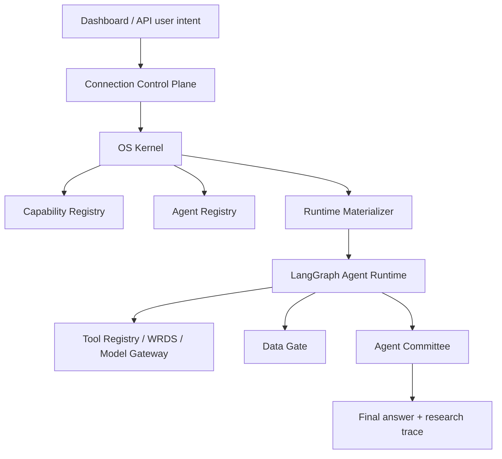

# Current State

This document records the current implementation shape of the AI-as-OS agent
committee platform. It is intentionally concrete: it should help a contributor
understand what exists today, what is still provisional, and which seams are
safe extension points.

## Product Shape

The system has moved from a fixed investment-analysis app toward an AI-as-OS
runtime:

The user supplies intent and credentials. The OS layer infers required
capabilities, checks active connections, auto-enables low-risk local
capabilities, requests confirmation for risky capabilities, materializes the
runtime context, and then lets the graph execute the task.

## Backend Framework

- API framework: FastAPI.
- Runtime graph: LangGraph.
- Tests: pytest.
- Package/install command: `.venv/bin/pip install -e ".[dev]"`.
- Main API routes:
  - `/agents/run`
  - `/platform/connections/*`
  - `/platform/capability-catalog`
  - `/platform/capabilities/*`
  - `/platform/agents`
  - `/platform/os/plan`
  - `/wrds/*`

## Frontend Framework

The dashboard is a static vanilla frontend:

- `static/index.html`
- `static/styles.css`
- `static/app.js`

It renders:

- connection intake and redacted connection status,
- OS capability catalog,
- OS plan,
- agent plugin picker,
- run trace, committee debate, metrics, data gate, and final output.

## Implemented Modules

### Connection Control Plane

Implemented in:

- `runtime/connection_control.py`
- `runtime/secret_store.py`
- `runtime/model_gateway.py`

It supports provider inference, redacted connection records, local encrypted
secret storage, Vault KV-v2 secret storage, active connection listing,
model-provider routing, and WRDS connection metadata.

### Capability Registry

Implemented in `runtime/capability_registry.py`.

Current manifest support:

- id, name, version, description,
- capability types,
- permissions and risk level,
- required connections,
- tools, skills, data packages,
- entrypoints,
- agents path,
- UI metadata,
- permission diagnostics.

Capabilities live in `capabilities/<id>/capability.json`.

### Agent Registry

Implemented in `runtime/agent_registry.py`.

Agent manifests live under `capabilities/<id>/agents/*.json`. The registry can
discover, validate, sort, filter by enabled capability, return committee specs,
and validate user-selected agent keys.

### OS Kernel

Implemented in `runtime/os_kernel.py`.

It infers intent, required capability types, connection requirements, permission
decisions, auto-enabled capabilities, runtime readiness, and selected/default
committee plans. The current taxonomy includes investment analysis, portfolio
review, financial data retrieval, web research, code development, document
writing, data analysis, and general chat.

The kernel does not fetch WRDS data, call models for domain analysis, or write
reports.

### Runtime Materializer

Implemented in `runtime/runtime_context.py`.

Every run can build a tenant-scoped `RuntimeContext` from active connections,
enabled capabilities, selected agent plugins, permission grants, tool registry,
model gateway, data-source registry, skill registry, and OS plan.

`RuntimeContext.validate()` returns dashboard-safe validation issues.

### WRDS / Data Gate

Implemented across:

- `tools/wrds_tools.py`
- `runtime/wrds_planner.py`
- `runtime/data_gate.py`

Investment research is WRDS-first / WRDS-only by default and avoids web search
unless explicitly requested outside the investment path.

The deterministic Metric Registry now covers core Compustat annual/quarterly
financials plus CRSP market data, Capital IQ profile markers, OptionMetrics
security snapshots, IBES estimates/actuals, Compustat segment rows, and
same-industry peer comparison metrics. Data Gate exposes scoped conclusion
permissions such as `forward_valuation_allowed`, `segment_claims_allowed`, and
`peer_valuation_allowed` so Writer/Final Judge cannot turn missing packages
into formal claims.

### Graph Runtime

LangGraph orchestration is implemented in `runtime/graph.py`, but business-heavy
nodes and investment committee helpers are delegated to capability/runtime-node
modules.

Generic mode remains lightweight. Investment mode uses WRDS, metric registry,
data gate, committee opening/discussion, investment committee aggregation,
critic, writer, and final judge. Committee members are now sourced from agent
manifests when a runtime context is available. The value-investing capability
owns Data Gate, deterministic research/quant, committee opening/discussion, and
CIO decision nodes. It also owns `support.py`, which contains committee
selection, context construction, parsing, scorecard normalization, fallback
decision, and WRDS-only deterministic research/quant support. `runtime/graph.py`
keeps compatibility wrappers for tests and legacy imports, but the business
logic lives with the capability. The WRDS capability owns direct WRDS retrieval action
planning, action normalization, redacted argument rendering, and retrieval-only
output.

The graph no longer carries a second hard-coded copy of the default investment
committee. If a run has no dashboard-provided `committee_agent_catalog`, it
loads default committee members from `AgentRegistry` and the
`value-investing-research` capability manifests.

### Swarm Governance Layer

Implemented in `runtime/swarm/`.

The current pass adds a typed pheromone field to each run. Data Gate, Permission
Policy, Critic, and committee synthesis can now emit structured signals:

- `constraint`
- `permission`
- `risk`
- `stop_signal`
- `quorum`

The most important stop-signals are now canonical targets:
`gate:data_gate`, `decision:report_publication`,
`decision:formal_valuation`, `tool:web_search`, and
confirmation-required permissions.
The run response and dashboard trace now expose `pheromone_trace`,
`stop_signals`, `constraint_signals`, `quorum_trace`, and `swarm_metrics`.
PatrollerGate is now a formal graph node after the orchestrator, and
response-threshold allocation can dynamically suppress low-demand committee
members when an OS plan is present. Committee agents can also propose
`emitted_signals`; the graph validates those proposals against agent manifest
permissions and exposes `agent_signal_diagnostics` for accepted/rejected
proposals. A deterministic signal verifier can promote contested agent
stop-signal proposals only when Data Gate, Critic, or an existing system
stop-signal supports the same target.

The swarm layer also includes canonical target semantics and an Evidence Graph:

- `runtime/swarm/target_registry.py` maps legacy targets like
  `formal_valuation`, `valuation`, and `target price` to
  `decision:formal_valuation`.
- `runtime/swarm/authority.py` assigns governance authority levels. Ordinary
  committee agents can propose contested signals, but only system authorities
  and deterministic verifiers can create facts or blockers.
- `runtime/swarm/lifecycle.py`, `runtime/swarm/contracts.py`, and
  `runtime/swarm/event_log.py` define signal lifecycle, blocking/resolved/
  rejected states, and `pheroos.event.v1` trace event contracts.
- `runtime/swarm/trace_store.py` persists PheroOS timeline, blockers, quorum
  decisions, evidence graph nodes/edges, and allocation records to SQLite.
- `runtime/swarm/evidence_graph.py` separates facts, proposals, blockers,
  deterministic metrics, output permissions, quorum candidates, critic findings,
  and the Writer contract. `/agents/run` returns `evidence_graph`, and the
  dashboard Swarm panel renders its summary.
- `runtime/swarm/encounter_rate.py`,
  `runtime/swarm/bottleneck_recruitment.py`,
  `runtime/swarm/arousal.py`, `runtime/swarm/lane_scheduler.py`,
  `runtime/swarm/trust_badge.py`, `runtime/swarm/social_immunity.py`,
  `runtime/swarm/policing.py`, `runtime/swarm/homeostasis.py`,
  `runtime/swarm/maturity.py`, `runtime/swarm/independent_scout.py`, and
  `runtime/swarm/artifact_cues.py` add insect-inspired protocol primitives for
  local return-rate regulation, receiver recruitment, verification arousal,
  lane control, colony identity, quarantine, worker policing, global stability,
  staged authority, anti-correlated quorum, and artifact-centered coordination.
  Their reports are returned as part of `/agents/run`; selected reports also
  feed response-threshold allocation and quorum candidate metadata.

## Incomplete Modules / Gaps

- Tool permissions are declared at the capability level, but built-in
  `ToolRegistry` still registers some base tools by default. A future pass
  should make every tool registration capability-scoped.
- Runtime trace events exist mostly through run result fields and audit logs.
  The first SQLite-backed PheroOS trace store exists, but full run storage,
  pagination, migrations, and production retention policies are still gaps.
- Swarm Governance has local JSONL persistence, local SQLite persistence, local
  agent profiles, and an Evidence Graph, but not production PostgreSQL-backed
  event sourcing yet.
- SaaS-grade secret storage is abstracted and now has a Vault KV-v2 adapter in
  addition to the local encrypted file store. Production still needs
  deployment-level auth/RBAC, secret rotation policy, backup/restore procedures,
  and operations monitoring around the external manager.
- WRDS coverage depends on the user's account permissions. The system performs
  capability discovery and deterministic package adapters for the first WRDS
  package set, but foreign-company coverage and table-specific fallback planning
  remain incremental.
- The dashboard is functional and simpler than before, but it is still a static
  frontend rather than a full componentized app.
- Persistence is JSONL/local-file based. SQLite/PostgreSQL run storage remains
  a future milestone.

## Critical Risks

- If a new tool bypasses `ToolRegistry`, permission policy and trace guarantees
  are weakened.
- If a new agent receives raw data source output directly, Data Gate can be
  bypassed.
- If writer prompts are changed to accept unsupported facts, WRDS-only caveats
  can be lost.
- If raw credentials are passed into model prompts for "AI configuration help",
  the core security model is broken.

## Recommended Implementation Sequence

1. Keep tightening capability-scoped tool registration.
2. Continue splitting `runtime/graph.py` into node, workflow, swarm-pipeline,
   writer-guardrail, and final-judge-guardrail modules.
3. Move run/audit/swarm persistence from local JSONL/SQLite to PostgreSQL for
   SaaS deployments.
5. Add more financial data adapters behind the same `FinancialDataSource`
   protocol.
6. Add a plugin authoring test harness so third-party capabilities can be
   validated without running the whole app.
7. Continue simplifying the dashboard around three user surfaces: Connect,
   Compose Committee, and Research Trace.
