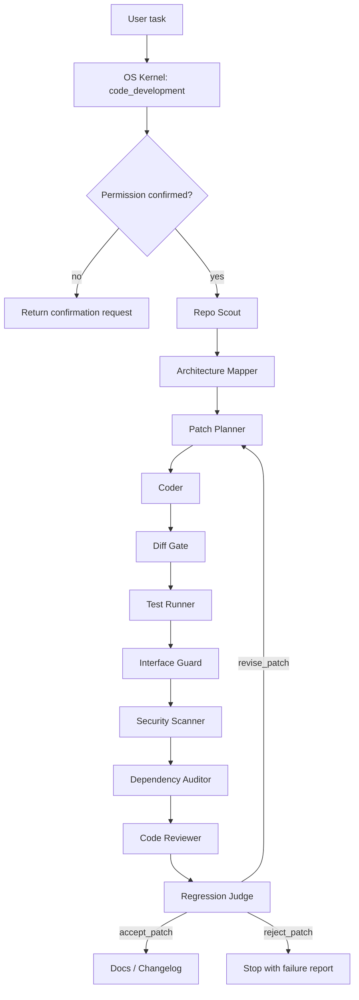
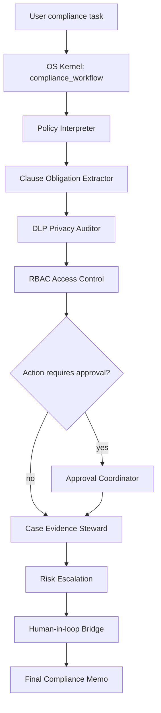
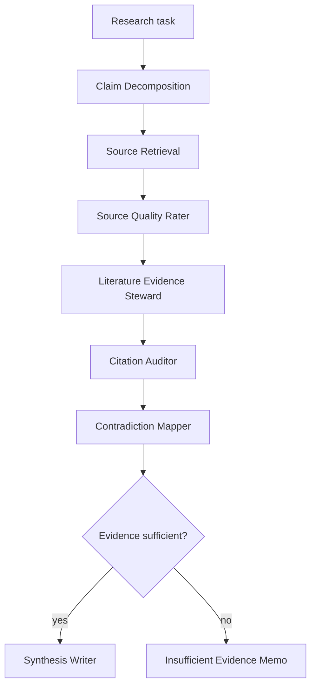

# Capability Agent Roadmap

你现在**不应该继续往投资研究 capability 里加很多 agent**。你当前已经有投资分析委员和 PheroOS 治理 actor：投资委员包括 Data Auditor、Fundamental Analyst、Quant Research、Industry Strategy、Market Execution、Risk Manager、Red Team、CIO；治理 actor 包括 Swarm Scheduler、Receiver Normalizer、Evidence Steward、Quorum Marshal、Social Immunity、Protocol Police、Tool Health Sentinel、Outcome Memory Steward、Capability Sandbox Auditor、Independent Scout。

所以结论是：

> **为了实现 1–5，你现在主要还需要新增两个 capability 的 agent：`code-development` 和 `compliance-workflow`。**
> 投资研究和 PheroOS 核心治理层已经基本够；缺的是 coding 和 enterprise compliance 的 domain execution agents。

## 1. 现在不需要再加的 agent

你现在这几类已经够了：

```text
投资研究：
Data Auditor
Fundamental Analyst
Quant Research
Industry Strategy
Market Execution
Risk Manager
Red Team
CIO

PheroOS 治理：
Swarm Scheduler
Receiver Normalizer
Evidence Steward
Quorum Marshal
Social Immunity
Protocol Police
Tool Health Sentinel
Outcome Memory Steward
Capability Sandbox Auditor
Independent Scout
```

这些已经覆盖：

```text
投资判断
数据审查
证据归一化
claim-evidence 绑定
quorum 提交
stop-signal 阻断
prompt injection / secret-like text 检测
agent 越权检测
tool health 监控
agent 过程可靠性学习
```

你的 PheroOS 也已经不只是 trace，而是会影响执行：Data Gate 可以发出 formal valuation / report publication stop-signal，Quorum Marshal 可以强制 Insufficient Data，Evidence Steward 可以阻止 unsupported claim 进入 final，Protocol Police 可以检测 writer bypass、raw WRDS leak、WRDS-only web search，并且 Writer / Final Judge guardrails 会阻断正式估值、目标价、raw WRDS 泄漏等问题。

所以，**不要再优先加更多投资 analyst**。继续加 Fundamental Analyst 2、Macro Analyst、Moat Analyst 这类角色，短期收益不如补 coding / compliance capability。

## 2. 必须新增的 Capability 1：`code-development`

你现在 OS Kernel 已经能识别 `code_development`，系统也有 `fastapi-api` capability，但当前 agent 结构仍主要服务投资研究和 PheroOS 治理。

如果要真正实现“受约束 coding agent”，需要新增：

```text
capabilities/code-development/
  capability.json
  agents/*.json
  workflow.py
  data_contract.py
  evidence_adapter.py
  ui.schema.json
```

### 2.1 必须新增的 coding agents

#### 1. `repo_scout_agent`

作用：

```text
读取 repo 结构
识别语言、框架、测试系统
定位相关文件
发现 README / AGENTS.md / pyproject / package.json / test config
```

类比昆虫角色：scout / patroller。

它不写代码，只负责侦察。

#### 2. `architecture_mapper_agent`

作用：

```text
识别模块边界
识别 public API
识别依赖关系
识别 forbidden files / sensitive files
识别哪些文件不能改
```

这个 agent 很重要，因为受约束 coding 的核心不是“会不会改”，而是“知道不能乱改什么”。

#### 3. `interface_guard_agent`

作用：

```text
检查 public API 是否被破坏
检查函数签名是否变化
检查 backward compatibility
检查禁止目录是否被修改
检查 import / exported symbols 是否变化
```

这个 agent 可以部分 deterministic 化，结合 AST / git diff / API snapshot。

它对应 PheroOS 的 stop-signal：

```text
public API changed → stop_signal
forbidden file changed → stop_signal
backward compatibility broken → stop_signal
```

#### 4. `test_runner_agent`

作用：

```text
运行 pytest / npm test / typecheck / lint
收集失败日志
把测试结果变成 evidence signal
把失败路径变成 negative signal
```

这个不应该主要用 LLM，应该是 deterministic tool actor。

#### 5. `patch_planner_agent`

作用：

```text
根据 repo scout + architecture mapper + failing tests 制定最小 patch plan
明确要改哪些文件
明确不改哪些文件
明确验证命令
```

它输出的是 plan，不直接写代码。

#### 6. `coder_agent`

作用：

```text
执行 patch
尽量最小 diff
遵守 patch_plan
不改 forbidden files
不删测试
不绕过 guardrail
```

这个才是真正写代码的 agent。

#### 7. `code_reviewer_agent`

作用：

```text
审查 diff
检查重复代码
检查可维护性
检查异常处理
检查是否 hack test
检查是否过度修改
```

它类似 Red Team，但面向代码质量。

#### 8. `security_scanner_agent`

作用：

```text
检查 secret leak
检查 unsafe eval / exec
检查 shell injection
检查 SQL injection
检查 dependency risk
检查 hardcoded credential
```

它可以和 Social Immunity / Protocol Police 联动。

#### 9. `dependency_auditor_agent`

作用：

```text
检查是否新增依赖
检查 license / version / security risk
检查 dependency 是否违反用户约束
检查 lockfile 是否一致
```

特别适合用户说：

```text
不要新增依赖
不要升级主框架
不要引入外部服务
```

#### 10. `regression_judge_agent`

作用：

```text
综合测试结果、diff、约束、review、security scan
判断 patch 是否可提交
决定 committed_candidate:
  accept_patch
  revise_patch
  reject_patch
  insufficient_context
```

它对应投资系统里的 Quorum Marshal / Final Judge，但面向 patch acceptance。

#### 11. `docs_changelog_agent`

作用：

```text
更新 README / docs / changelog
生成简洁变更说明
记录测试命令
记录未解决风险
```

它不是必须第一批做，但对完整 coding workflow 很有用。

### 2.2 coding capability 最小必做 agent 组合

如果你不想一次加 11 个，最小可行组合是 6 个：

```text
repo_scout_agent
architecture_mapper_agent
test_runner_agent
coder_agent
interface_guard_agent
regression_judge_agent
```

这 6 个就能实现：

```text
读 repo
理解边界
执行 patch
跑测试
检查接口约束
决定是否接受
```

### 2.3 coding capability 对应的 gate

除了 agent，还需要这些 gate / artifact：

```text
Test Gate
Diff Gate
Interface Gate
Dependency Gate
Security Gate
```

映射到 PheroOS：

```text
Data Gate              → Test Gate / Build Gate
Metric Registry        → Code Facts / Test Results / Diff Summary
Evidence Graph         → Claim-to-code / Claim-to-test graph
Stop-Signal            → 禁止改 public API / 禁止删测试 / 禁止改 forbidden files
Protocol Police        → 检查绕过测试 / 删除断言 / 假修复
Quorum Marshal         → patch 是否 accepted
```

## 3. 必须新增的 Capability 2：`compliance-workflow`

如果你要做企业内部合规 / 知识工作流，现在还不够。你有 Permission Policy、ToolRegistry、SecretStore、Social Immunity、Protocol Police，但缺 enterprise domain agents。当前系统的能力插件边界已经支持 capability manifest、agents、workflow/data/evidence/ui entrypoints，这正适合新增合规 capability。

建议新增：

```text
capabilities/compliance-workflow/
  capability.json
  agents/*.json
  workflow.py
  policy_contract.py
  evidence_adapter.py
  ui.schema.json
```

### 3.1 必须新增的 compliance agents

#### 1. `policy_interpreter_agent`

作用：

```text
解释公司政策、制度、SOP、法规要求
把自然语言政策转成 rule / obligation / exception
```

它不直接做最终裁决，只提供 policy interpretation。

#### 2. `clause_obligation_extractor_agent`

作用：

```text
从合同、政策、邮件、流程文档中抽取：
义务
责任人
截止日期
禁止事项
审批条件
违约风险
```

这是合规工作流的 Receiver Normalizer。

#### 3. `dlp_privacy_auditor_agent`

作用：

```text
识别 PII
识别商业秘密
识别敏感财务信息
识别客户/员工数据
识别不能外发的内容
```

这个是企业场景的 P0 agent。

没有它，合规工作流不能上线。

#### 4. `rbac_access_control_agent`

作用：

```text
判断用户 / agent / capability 是否有权限访问某类文档或数据
判断是否需要脱敏
判断是否需要 manager / legal / finance approval
```

它和 Permission Policy 联动。

#### 5. `approval_coordinator_agent`

作用：

```text
识别哪些 action 需要人工审批
生成 approval request
记录审批状态
阻断未经批准的高风险操作
```

适合：

```text
发送邮件
写数据库
导出文件
向外部系统提交
执行交易
访问敏感 HR / finance data
```

#### 6. `case_evidence_steward_agent`

作用：

```text
把每个合规判断绑定到：
政策条款
合同条款
邮件证据
审批记录
数据来源
```

这相当于企业版 Evidence Steward。

#### 7. `risk_escalation_agent`

作用：

```text
判断哪些事项必须升级给人类
判断风险等级
生成 escalation memo
禁止 agent 自行处理高风险事项
```

#### 8. `records_retention_agent`

作用：

```text
管理审计记录
判断哪些 trace 要保留
判断保留多久
判断是否允许删除
判断是否需要 legal hold
```

这是生产级企业系统需要的。

#### 9. `human_in_loop_agent`

作用：

```text
当系统需要确认时，生成清晰的人类确认请求
解释为什么需要确认
列出确认后会执行什么
记录确认结果
```

它不是真正“agent 自主执行”，而是 human approval bridge。

### 3.2 compliance capability 最小必做 agent 组合

最小可行组合是 5 个：

```text
policy_interpreter_agent
clause_obligation_extractor_agent
dlp_privacy_auditor_agent
rbac_access_control_agent
approval_coordinator_agent
```

有这 5 个，企业合规 / 知识工作流才有基本边界。

## 4. 建议新增 Capability 3：`evidence-research`

你现在第 3 类“多 agent 审计型研究”在投资/商业场景内够，但如果要扩展到学术、政策、市场、技术研究，需要一个独立 research capability。

建议新增：

```text
capabilities/evidence-research/
```

### 4.1 必须新增的 research agents

#### 1. `source_retrieval_agent`

作用：

```text
检索论文、网页、PDF、政策文件、报告
记录 source metadata
不直接生成结论
```

#### 2. `citation_auditor_agent`

作用：

```text
检查引用是否真实存在
检查 source 是否支持 claim
检查是否 fake citation
检查是否引用错页 / 错表
```

这个非常关键。

#### 3. `claim_decomposition_agent`

作用：

```text
把研究问题拆成 atomic claims
把 final report 拆成可审计 claim units
```

#### 4. `contradiction_mapper_agent`

作用：

```text
识别不同 source / agent 之间的冲突
生成 contested signal
强制 Writer 加 caveat
```

#### 5. `literature_evidence_steward_agent`

作用：

```text
把 claim 绑定到 source passage / table / figure
区分 evidence / speculation / background
```

#### 6. `source_quality_rater_agent`

作用：

```text
判断 source 质量
区分 peer-reviewed / official / blog / forum / marketing material
给 evidence 权重
```

### 4.2 research capability 最小组合

```text
source_retrieval_agent
citation_auditor_agent
claim_decomposition_agent
literature_evidence_steward_agent
contradiction_mapper_agent
```

这能防止：

```text
假引用
幻觉论文
多个 agent 复述同一错误 source
无证据强结论
```

## 5. 你现在真正还缺的 agent 总表

按优先级排序。

### P0：为了实现 4 和 5，必须加

```text
code-development:
1. repo_scout_agent
2. architecture_mapper_agent
3. test_runner_agent
4. coder_agent
5. interface_guard_agent
6. regression_judge_agent

compliance-workflow:
7. policy_interpreter_agent
8. clause_obligation_extractor_agent
9. dlp_privacy_auditor_agent
10. rbac_access_control_agent
11. approval_coordinator_agent
```

这 11 个是最核心的缺口。

### P1：强烈建议加

```text
code-development:
12. code_reviewer_agent
13. security_scanner_agent
14. dependency_auditor_agent
15. docs_changelog_agent

compliance-workflow:
16. case_evidence_steward_agent
17. risk_escalation_agent
18. records_retention_agent
19. human_in_loop_agent

evidence-research:
20. citation_auditor_agent
21. claim_decomposition_agent
22. literature_evidence_steward_agent
23. contradiction_mapper_agent
```

### P2：后续增强

```text
evidence-research:
24. source_retrieval_agent
25. source_quality_rater_agent

investment-research:
26. accounting_quality_agent
27. capital_allocation_agent
28. moat_assessment_agent
29. management_quality_agent
30. macro_regime_agent
```

这些是增强深度，不是当前实现 1–5 的必要条件。

## 6. 不建议你现在新增的 agent

不要现在加这些：

```text
More CIO Agent
More Red Team Agent
More Fundamental Analyst Agent
More General Debate Agent
Generic Planner Agent 2
Generic Critic Agent 2
```

原因很简单：你的当前系统不缺“发表意见的人”。你的系统缺的是：

```text
coding 执行者
test gate
interface guard
compliance policy interpreter
DLP / RBAC / approval
citation / source verification
```

也就是说，缺的是 **domain-specific execution caste**，不是更多讨论型 agent。

## 7. 最佳落地顺序

### Sprint 1：先实现 `code-development` 最小 capability

新增 6 个 agent：

```text
repo_scout_agent
architecture_mapper_agent
test_runner_agent
coder_agent
interface_guard_agent
regression_judge_agent
```

原因：coding capability 最容易用测试验收。

对应测试：

```text
test_coding_agent_cannot_modify_forbidden_file
test_coding_agent_cannot_change_public_api
test_test_runner_blocks_patch_when_tests_fail
test_regression_judge_requires_tests_and_diff
test_coder_cannot_delete_tests_to_pass
```

### Sprint 2：实现 `compliance-workflow` 最小 capability

新增 5 个 agent：

```text
policy_interpreter_agent
clause_obligation_extractor_agent
dlp_privacy_auditor_agent
rbac_access_control_agent
approval_coordinator_agent
```

对应测试：

```text
test_dlp_blocks_pii_in_external_output
test_rbac_blocks_unauthorized_document_access
test_approval_required_for_email_send
test_policy_claim_requires_policy_clause
test_sensitive_case_requires_human_approval
```

### Sprint 3：实现 `evidence-research` capability

新增 5 个 agent：

```text
source_retrieval_agent
citation_auditor_agent
claim_decomposition_agent
literature_evidence_steward_agent
contradiction_mapper_agent
```

对应测试：

```text
test_fake_citation_blocked
test_claim_requires_source_support
test_contradictory_sources_create_contested_signal
test_writer_cannot_use_unverified_web_source
```

## 8. 最终建议

你现在已经有足够的 **PheroOS governance actor**。继续添加治理 actor 的收益已经下降。下一阶段真正要加的是：

```text
1. code-development capability 的执行 agent
2. compliance-workflow capability 的合规 agent
3. evidence-research capability 的 source / citation agent
```

最小新增清单就是：

```text
repo_scout_agent
architecture_mapper_agent
test_runner_agent
coder_agent
interface_guard_agent
regression_judge_agent
policy_interpreter_agent
clause_obligation_extractor_agent
dlp_privacy_auditor_agent
rbac_access_control_agent
approval_coordinator_agent
citation_auditor_agent
claim_decomposition_agent
literature_evidence_steward_agent
contradiction_mapper_agent
```

这 15 个 agent 加上你已有的投资委员会和 PheroOS 治理层，就能把系统从：

> **投资研究专用 PheroOS**

推进到：

> **覆盖投资研究、受控 coding、企业合规、证据型研究的 AI-as-OS + PheroOS runtime。**

## 9. 当前系统覆盖矩阵

这份 roadmap 的前提不是“从零开始加 agent”，而是在当前 AI-as-OS / PheroOS 基座上补缺。当前基座已经具备：

| 层级 | 当前已有 | 证据/对应模块 | 是否需要重做 |
| --- | --- | --- | --- |
| OS Kernel | intent 识别、capability gap analysis、低风险 capability auto-enable、connection requirement | `runtime/os_kernel.py` | 不重做，只扩 taxonomy |
| Capability Registry | 扫描 `capabilities/*/capability.json`、校验 manifest、暴露 tools/skills/agents/ui | `runtime/capability_registry.py` | 不重做，只新增 capability |
| Agent Registry | 从 capability agents 目录发现 agent manifest，支持用户选择委员 | `runtime/agent_registry.py` | 不重做，只新增 agents |
| Runtime Materializer | tenant scoped runtime context、tool allowlist、model gateway、data source registry | `runtime/runtime_context.py` | 不重做，新增 capability tool names |
| Tool Boundary | ToolRegistry 权限和连接 gate | `runtime/tool_registry.py` | 不绕过，所有新工具进 registry |
| PheroOS Signal | target canonicalization、authority、lifecycle、quorum、stop-signal、policing | `runtime/swarm/*` | 不重做，只新增 target / signal mapping |
| Investment Committee | 投资委员 + PheroOS governance actors | `capabilities/value-investing-research/agents/*.json` | 不继续堆投资角色 |
| WRDS / Public Data | WRDS + SEC/FRED/Stooq/Kenneth French capability | `capabilities/wrds-financial-data/`、`capabilities/public-financial-data/` | 作为数据源，不作为新 analyst |

缺口集中在三条 domain capability：

```text
code-development      → 受控工程修改
compliance-workflow   → 企业合规/审批/隐私
evidence-research     → 通用证据型研究/引用审计
```

## 10. 统一 Capability Contract

三个新增 capability 都必须遵守同一套结构，避免重新把逻辑写回 `graph.py`：

```text
capabilities/<capability-id>/
  capability.json
  agents/*.json
  workflow.py
  data_contract.py 或 policy_contract.py
  evidence_adapter.py
  ui.schema.json
  SKILL.md optional
```

### 10.1 Manifest 必填标准

```json
{
  "id": "code-development",
  "name": "Controlled Code Development",
  "version": "0.1.0",
  "description": "Perform constrained repo edits through scout, plan, patch, test, review, and regression gates.",
  "capability_types": [
    "code_development",
    "repo_analysis",
    "patch_planning",
    "test_gate",
    "interface_guard"
  ],
  "permissions": [
    "skill:read",
    "data:read",
    "tool:deterministic-read",
    "filesystem:write",
    "shell:execute"
  ],
  "risk_level": "medium",
  "requires_confirmation": true,
  "connections": ["model_provider"],
  "required_connections": ["model_provider"],
  "tools": [
    "list_files",
    "read_file",
    "write_file",
    "run_pytest"
  ],
  "skills": ["code-development"],
  "data_packages": [
    "repo_manifest",
    "architecture_map",
    "diff_summary",
    "test_results",
    "interface_snapshot"
  ],
  "agents_path": "agents",
  "entrypoints": {
    "workflow": "capabilities/code-development/workflow.py:build_workflow_descriptor",
    "data_contract": "capabilities/code-development/data_contract.py:build_data_contract_descriptor",
    "evidence_adapter": "capabilities/code-development/evidence_adapter.py:build_evidence_adapter_descriptor",
    "ui_schema": "capabilities/code-development/ui.schema.json"
  },
  "swarm": {
    "required_protocols": ["test_gate", "diff_gate", "stop_signal", "quorum"],
    "allowed_signal_types": ["evidence", "risk", "negative", "quorum", "stop_signal", "policing"]
  },
  "ui": {
    "icon": "code",
    "accent": "blue"
  }
}
```

注意：

- `code-development` 需要 `filesystem:write` 和 `shell:execute`，因此必须 `requires_confirmation=true`。
- `compliance-workflow` 第一版可以只读，不提供 email/database/export/trade 这类工具；如果后续接入外部动作，必须进入 human approval。
- `evidence-research` 可以启用 `network:approved-provider`；任意 web / 任意 URL 仍然要走 Web Research capability 和 PermissionPolicy。

### 10.2 Agent Manifest 必填标准

每个 agent 必须包含：

```json
{
  "key": "repo_scout_agent",
  "name": "Repo Scout Agent",
  "description": "Inspects repo structure, project conventions, test commands, and relevant files without editing code.",
  "agent_type": "code_development_member",
  "committee_role": "scout",
  "focus": ["repo_structure", "test_system", "relevant_files"],
  "model_attr": "research_agent",
  "default_enabled": true,
  "order": 10,
  "tags": ["code", "scout", "read-only"],
  "required_capabilities": ["code_development"],
  "required_tools": ["list_files", "read_file"],
  "risk_level": "low",
  "swarm": {
    "signal_emit_permissions": ["evidence", "risk"],
    "quorum_weight": 0.5,
    "can_block": false
  },
  "ui": {
    "accent": "blue"
  }
}
```

Agent manifest 中不允许出现：

```text
api_key
password
secret
token
raw credential
direct provider endpoint with secret
```

## 11. `code-development` 完整规格

### 11.1 Capability 目标

`code-development` 的目标不是“让模型随便改代码”，而是让 AI-as-OS 执行受约束的软件工程流程：

```text
User coding request
→ OS Kernel 识别 code_development
→ capability permission confirmation
→ Repo Scout 侦察
→ Architecture Mapper 建边界
→ Patch Planner 出最小变更计划
→ Coder 执行 patch
→ Test Runner 跑验证
→ Interface / Security / Dependency gates
→ Regression Judge 判定 accept/revise/reject
→ Writer 输出变更摘要和风险
```

### 11.2 Workflow



### 11.3 Code Facts / Metric Registry

Coding workflow 不应把 LLM 文本当成事实来源。必须先生成 deterministic code facts：

```json
{
  "repo_manifest": {
    "languages": ["python", "javascript"],
    "frameworks": ["fastapi", "langgraph"],
    "package_managers": ["pip", "npm"],
    "test_commands": [".venv/bin/pytest -q"],
    "important_files": ["pyproject.toml", "AGENTS.md"]
  },
  "architecture_map": {
    "public_modules": ["runtime/tool_registry.py", "runtime/os_kernel.py"],
    "forbidden_paths": [".local/", ".venv/", "logs/"],
    "tool_boundary": "runtime/tool_registry.py",
    "model_boundary": "runtime/llm.py"
  },
  "diff_summary": {
    "files_changed": [],
    "added_lines": 0,
    "deleted_lines": 0,
    "public_api_changed": false
  },
  "test_results": {
    "commands": [],
    "passed": false,
    "failures": []
  }
}
```

### 11.4 Agent Contracts

| Agent | Input | Output | May Use Tools | May Emit Stop-Signal | Cannot Do |
| --- | --- | --- | --- | --- | --- |
| `repo_scout_agent` | task, repo manifest, file list | relevant files, test commands, risks | `list_files`, `read_file` | no | edit files |
| `architecture_mapper_agent` | repo scout output, AGENTS.md, config files | module boundaries, forbidden paths, public API map | `read_file` | no | patch code |
| `patch_planner_agent` | task, architecture map, current failures | minimal patch plan, expected tests | no direct write | no | execute patch |
| `coder_agent` | approved patch plan | patch result, files changed | `read_file`, `write_file` | no | delete tests, bypass plan |
| `test_runner_agent` | patch result, test plan | test evidence, failure logs | `run_pytest` | yes, if tests fail | alter files |
| `interface_guard_agent` | diff summary, architecture map | API compatibility verdict | deterministic diff/AST tools | yes | ignore public API change |
| `security_scanner_agent` | diff, code facts | security findings | read-only scan tools | yes | suppress findings |
| `dependency_auditor_agent` | dependency files, diff | dependency verdict | read-only scan tools | yes | install packages silently |
| `code_reviewer_agent` | diff, tests, gates | maintainability review | no tools required | no | override gates |
| `regression_judge_agent` | all evidence | committed_candidate | no tools required | yes | accept without evidence |
| `docs_changelog_agent` | accepted diff, tests | docs/changelog notes | `read_file`, optional `write_file` | no | change product behavior |

### 11.5 Stop-Signal Targets

Canonical targets:

```text
code:public_api
code:forbidden_path
code:test_suite
code:dependency_policy
code:security
code:patch_acceptance
```

Alias mapping:

```text
public api / exported api / interface → code:public_api
tests / pytest / test suite → code:test_suite
dependency / package / lockfile → code:dependency_policy
secret / injection / eval / shell → code:security
```

### 11.6 Required Tests

P0 tests:

```text
test_code_development_manifest_loads
test_code_development_requires_confirmation_for_write_and_shell
test_repo_scout_is_read_only
test_coder_cannot_modify_forbidden_path
test_coder_cannot_delete_tests_to_pass
test_test_runner_blocks_patch_when_tests_fail
test_interface_guard_blocks_public_api_change
test_regression_judge_requires_diff_and_test_evidence
test_writer_reports_failed_patch_without_claiming_success
```

P1 tests:

```text
test_dependency_auditor_blocks_unapproved_dependency
test_security_scanner_blocks_hardcoded_secret
test_patch_planner_rejects_unbounded_file_scope
test_docs_changelog_runs_only_after_accept_patch
test_code_trace_links_final_summary_to_diff_and_tests
```

### 11.7 Acceptance Criteria

`code-development` 完成必须满足：

```text
1. Dashboard 可列出 code-development capability 和 agents。
2. OS Kernel 对 coding task 自动匹配 code_development，但因写文件/跑 shell 请求确认。
3. 用户确认后 RuntimeContext 注册允许的 coding tools。
4. Repo Scout / Architecture Mapper 先运行，Coder 不能跳过。
5. Coder 修改必须有 patch_plan。
6. Test Runner 失败会 emit blocking signal。
7. Interface Guard / Security Scanner / Dependency Auditor 任一 hard fail 时 Regression Judge 不能 accept。
8. Writer 只能输出 patch evidence 支持的内容。
9. Trace 展示 diff、tests、gates、judge verdict。
10. 所有 tests 通过。
```

## 12. `compliance-workflow` 完整规格

### 12.1 Capability 目标

`compliance-workflow` 的目标是让 AI-as-OS 可以处理企业内部政策、合同、审批、隐私和访问控制问题，同时确保高风险 action 需要人工确认。

第一版只做 read-only compliance reasoning，不接 email/database/write/export。后续如果接入外部动作，必须由 PermissionPolicy + approval workflow 共同 gate。

### 12.2 Workflow



### 12.3 Policy Contract

`policy_contract.py` 应输出：

```json
{
  "policy_scope": "internal_policy | contract | regulation | mixed",
  "allowed_actions": ["summarize", "classify", "draft_internal_memo"],
  "restricted_actions": ["external_send", "database_write", "credential_export"],
  "sensitive_data_classes": ["pii", "customer_data", "employee_data", "material_nonpublic_information"],
  "approval_required_for": ["external_send", "legal_advice", "trade_execute", "hr_action"],
  "retention_policy": {
    "trace_required": true,
    "default_retention_days": 365,
    "legal_hold_supported": true
  }
}
```

### 12.4 Agent Contracts

| Agent | Input | Output | May Emit Stop-Signal | Cannot Do |
| --- | --- | --- | --- | --- |
| `policy_interpreter_agent` | policy text, task | rules, obligations, exceptions | no | invent policy |
| `clause_obligation_extractor_agent` | document text | obligations, owners, deadlines | no | decide final compliance |
| `dlp_privacy_auditor_agent` | input/output artifacts | PII/sensitive classes, redaction needs | yes | reveal sensitive spans in final |
| `rbac_access_control_agent` | user role, document class, capability request | allow/deny/mask decision | yes | grant access by itself |
| `approval_coordinator_agent` | requested action, policy contract | approval request, pending/approved/rejected | yes | execute unapproved action |
| `case_evidence_steward_agent` | policy clauses, findings | claim-to-policy evidence map | no | cite non-existent clause |
| `risk_escalation_agent` | risk signals | escalation memo, severity | yes | suppress high-risk issue |
| `records_retention_agent` | trace, policy | retention decision | no | delete trace unilaterally |
| `human_in_loop_agent` | pending confirmation | user-facing confirmation request | no | fake approval |

### 12.5 Stop-Signal Targets

```text
compliance:pii
compliance:rbac
compliance:approval_required
compliance:policy_gap
compliance:external_action
compliance:legal_advice
compliance:retention
```

### 12.6 Required Tests

P0 tests:

```text
test_compliance_manifest_loads
test_dlp_blocks_pii_in_external_output
test_rbac_blocks_unauthorized_document_access
test_approval_required_for_email_send
test_policy_claim_requires_policy_clause
test_sensitive_case_requires_human_approval
test_compliance_writer_redacts_sensitive_spans
test_human_in_loop_cannot_forge_approval
```

P1 tests:

```text
test_records_retention_marks_trace_required
test_risk_escalation_blocks_high_risk_autonomy
test_policy_interpreter_labels_uncertain_policy_gap
test_case_evidence_steward_links_each_finding_to_clause
```

### 12.7 Acceptance Criteria

`compliance-workflow` 完成必须满足：

```text
1. OS Kernel 能识别 policy / compliance / privacy / approval task。
2. capability 默认 read-only auto-enable；外部 action capability 必须确认。
3. DLP / RBAC / Approval Coordinator 能 emit blocking signals。
4. Final memo 中每个合规判断都有 policy/evidence link。
5. 未授权访问、PII 外发、未审批外部动作会被阻断。
6. Dashboard 展示 approval pending / blocked reason / evidence clauses。
7. Trace 不泄露敏感原文；需要时只显示 redacted spans。
```

## 13. `evidence-research` 完整规格

### 13.1 Capability 目标

`evidence-research` 是通用证据研究能力，用于学术、政策、技术、市场和法律前置研究。它和 `web-research` 的区别是：

```text
web-research         → 查找信息
evidence-research    → 验证 claim 是否被 source 支持
```

它的核心产物不是“报告文本”，而是可审计的 claim-evidence graph。

### 13.2 Workflow



### 13.3 Evidence Contract

```json
{
  "claim_id": "claim-001",
  "claim": "The report makes a factual assertion.",
  "claim_type": "fact | interpretation | estimate | recommendation",
  "support_status": "supported | partially_supported | contradicted | unsupported",
  "sources": [
    {
      "source_id": "src-001",
      "url": "https://example.com",
      "title": "Source title",
      "source_type": "official | peer_reviewed | report | blog | forum",
      "passage": "short excerpt or table reference",
      "quality_score": 0.8
    }
  ],
  "required_caveat": "What the writer must say if support is partial."
}
```

### 13.4 Agent Contracts

| Agent | Input | Output | May Emit Stop-Signal | Cannot Do |
| --- | --- | --- | --- | --- |
| `claim_decomposition_agent` | user task, draft | atomic claims | no | judge truth |
| `source_retrieval_agent` | research questions | source candidates | no | draw final conclusion |
| `source_quality_rater_agent` | source metadata | quality score, source type | no | fabricate source metadata |
| `literature_evidence_steward_agent` | claims, sources | claim-evidence links | yes, if unsupported | write final report |
| `citation_auditor_agent` | citations, links | citation validity verdict | yes | accept fake citation |
| `contradiction_mapper_agent` | claim graph | contested claims, conflicts | yes | hide contradiction |

### 13.5 Stop-Signal Targets

```text
research:fake_citation
research:unsupported_claim
research:contradiction
research:source_quality
research:evidence_gap
```

### 13.6 Required Tests

P0 tests:

```text
test_evidence_research_manifest_loads
test_fake_citation_blocked
test_claim_requires_source_support
test_contradictory_sources_create_contested_signal
test_writer_cannot_use_unverified_web_source
test_low_quality_source_requires_caveat
```

P1 tests:

```text
test_claim_decomposition_generates_atomic_claims
test_source_retrieval_does_not_write_conclusion
test_citation_auditor_detects_dead_or_mismatched_source
test_evidence_graph_links_final_claim_to_verified_source
```

### 13.7 Acceptance Criteria

```text
1. Research tasks can request evidence-research independent of investment research.
2. Source retrieval and citation audit are separate roles.
3. Unsupported claims cannot enter final output without caveat.
4. Fake or unverifiable citation triggers stop-signal.
5. Dashboard can show claim-evidence graph and contested claims.
6. Final output separates facts, interpretations, estimates, and unresolved gaps.
```

## 14. OS Kernel Taxonomy Changes

新增 capability 后，OS Kernel 的 task taxonomy 应扩展为：

```text
code_development:
  triggers:
    - implement / fix / refactor / test / debug / endpoint / component
  required_capabilities:
    - chat_model
    - code_development
    - skill:code-development
  confirmation:
    - required if filesystem:write or shell:execute is enabled

compliance_workflow:
  triggers:
    - compliance / policy / approval / privacy / pii / rbac / audit / retention
  required_capabilities:
    - chat_model
    - compliance.workflow
    - skill:compliance-workflow
  confirmation:
    - required for external action, write, email, export, database mutation

evidence_research:
  triggers:
    - citation / evidence / source / literature / policy research / verify claims
  required_capabilities:
    - chat_model
    - evidence.research
    - skill:evidence-research
  confirmation:
    - depends on retrieval source and network permission
```

OS Kernel 仍然只做：

```text
intent → required capability types → capability match → permission check → runtime plan
```

它不能：

```text
直接改文件
直接跑测试
直接访问敏感文档
直接验证 citation
直接写报告
```

## 15. Dashboard / Product Surface

这三个 capability 落地后，Dashboard 不应该只展示“agent 聊天记录”，而应该展示 decision debugger：

### 15.1 Code Development View

```text
Repo Map
Patch Plan
Files Changed
Diff Gate
Test Gate
Interface Gate
Security Gate
Dependency Gate
Regression Judge
Final Patch Summary
```

### 15.2 Compliance View

```text
Policy Scope
Sensitive Data Classes
RBAC Decision
Approval Requests
Blocked Actions
Evidence Clauses
Escalation Memo
Retention Decision
```

### 15.3 Evidence Research View

```text
Research Questions
Atomic Claims
Sources
Source Quality
Claim-Evidence Graph
Contradictions
Unsupported Claims
Citation Audit
Final Caveats
```

## 16. Trace Event Requirements

新增 capability 必须写入统一 trace event，而不是只写自然语言日志：

```text
code.repo_scout.completed
code.architecture_map.created
code.patch_plan.created
code.patch.applied
code.diff_gate.completed
code.test_gate.completed
code.interface_gate.completed
code.security_scan.completed
code.dependency_audit.completed
code.regression_judge.completed

compliance.policy_interpreted
compliance.obligations_extracted
compliance.dlp.completed
compliance.rbac.completed
compliance.approval.requested
compliance.approval.resolved
compliance.evidence_mapped
compliance.escalation.created
compliance.retention.decided

research.claims.decomposed
research.sources.retrieved
research.sources.rated
research.evidence_mapped
research.citations_audited
research.contradictions_mapped
research.evidence_gate.completed
```

每个事件必须包含：

```json
{
  "event_id": "...",
  "run_id": "...",
  "timestamp": "...",
  "event_type": "...",
  "actor": "...",
  "summary": "...",
  "payload": {},
  "redaction_status": "redacted | no_secrets_detected"
}
```

## 17. Implementation Backlog

当前实现状态：

```text
Phase A Manifest and Agent Stubs: DONE
Phase B OS Kernel Routing: DONE
Phase C Runtime Materialization: DONE for roadmap foundation, code/compliance/evidence tool allowlists and agent/runtime descriptors materialize into RuntimeContext
Phase D Workflow Integration: DONE for roadmap foundation, descriptors expose graph-node routing bridges, domain execution traces, and specialized deterministic node bodies
Phase E PheroOS Governance: DONE for roadmap foundation, with code/compliance/research targets, blocking authority, lifecycle aliases, domain event types, and policing checks
Phase F Dashboard: DONE for roadmap foundation, capability-grouped agent plugin chooser, Domain Workflow trace panel, why-blocked display, and explicit approval request UI exist
```

Verification snapshot:

```text
2026-06-01:
- Python regression: .venv/bin/pytest -q -> 328 passed, 1 Python 3.14/Pydantic compatibility warning.
- Browser visual regression: npm run test:visual -> 6 passed across desktop and mobile Chromium.
```

### Phase A：Manifest and Agent Stubs

```text
1. [x] 新增 capabilities/code-development/capability.json
2. [x] 新增 11 个 code-development agent manifests
3. [x] 新增 capabilities/compliance-workflow/capability.json
4. [x] 新增 9 个 compliance agent manifests
5. [x] 新增 capabilities/evidence-research/capability.json
6. [x] 新增 6 个 evidence-research agent manifests
7. [x] 测试 AgentRegistry 能发现和排序这些 agents
```

### Phase B：OS Kernel Routing

```text
1. [x] 新增 code/compliance/evidence task hints
2. [x] 新增 required capability type mapping
3. [x] 验证 code-development 高风险权限不会 auto-run
4. [x] 验证 compliance read-only 可 auto-enable，高风险 action 需要确认
5. [x] 验证 evidence-research 能进入 evidence-research capability plan
```

### Phase C：Runtime Materialization

```text
1. [x] RuntimeContext 暴露 selected agents / enabled capability agents
2. [x] Tool allowlist 根据 capability tools 生成
3. [x] Code workflow 注册 read/write/test tools，但必须确认后使用
4. [x] Compliance workflow 默认不注册 email/database/export
5. [x] Evidence workflow 注册 retrieval / citation audit 所需工具，但 arbitrary network 默认 denied
```

### Phase D：Workflow Integration

```text
1. [x] runtime/workflows/code_development.py
2. [x] runtime/workflows/compliance_workflow.py
3. [x] runtime/workflows/evidence_research.py
4. [x] graph.py 只做 workflow routing，不写 domain 细节
5. [x] Writer / Final Judge guardrails 读取 gate output
6. [x] capability workflow descriptor 可声明 graph_nodes，同时保留 ordered_nodes 作为 domain trace
7. [x] 受控 patch mutation / compliance evidence extraction / citation retrieval 的专用 node bodies
```

### Phase E：PheroOS Governance

```text
1. [x] target_registry 增加 code/compliance/research canonical targets
2. [x] authority.py 定义哪些 agent 可 block
3. [x] lifecycle.py 支持 pending_approval / rejected_by_gate / accepted_patch
4. [x] event_log.py 增加 trace event type
5. [x] policing.py 检查 writer/coder/researcher 越权
```

### Phase F：Dashboard

```text
1. [x] capability catalog 显示新增三类 capability
2. [x] agent plugin chooser 支持按 capability 分组/过滤
3. [x] run trace 增加 Domain Workflow 面板展示 code/compliance/evidence workflow nodes、gates、agents、execution plan
4. [x] blocked reason 用 why-blocked 面板解释
5. [x] approval request 用明确 human confirmation UI 展示
```

## 18. Global Acceptance Checklist

新增 capability 不算完成，除非满足：

```text
Capability Registry:
  [x] manifest valid
  [x] permission diagnostics ok
  [x] security diagnostics ok or explicitly confirmed
  [x] required connections listed
  [x] tools listed but not directly executed

Agent Registry:
  [x] all agent manifests valid
  [x] default_enabled 合理
  [x] order deterministic
  [x] selected agents validate keys
  [x] dashboard serialization safe

Permission Policy:
  [x] low-risk read-only auto-enable
  [x] write/shell/email/database/export/trade require confirmation
  [x] unknown permission denied or confirmation-required

Runtime:
  [x] RuntimeContext has no secrets
  [x] tools registered only after permission/connection gate
  [x] model calls through ModelGateway
  [x] tool calls through ToolRegistry

PheroOS:
  [x] canonical targets used
  [x] stop-signals cannot be bypassed via alias
  [x] only authorized agents can block
  [x] quorum uses verified/contested signal lifecycle

Writer / Final Judge:
  [x] cannot bypass gate failure
  [x] cannot claim success when tests fail
  [x] cannot expose raw sensitive data
  [x] must include caveats for unsupported evidence

Tests:
  [x] capability tests pass
  [x] agent registry tests pass
  [x] OS Kernel tests pass
  [x] runtime materializer tests pass
  [x] workflow tests pass
  [x] security / redaction tests pass
```

## 19. Final Non-Negotiables

1. 不再向 investment capability 继续堆重复 analyst，除非已有 Data Gate / Metric Registry / Evidence Graph 证明确实缺某个专业判断。
2. Coding capability 的 `coder_agent` 永远不能绕过 `patch_planner_agent`、`test_runner_agent`、`interface_guard_agent`。
3. Compliance capability 的任何外部动作必须 human approval；agent 不能伪造审批。
4. Evidence research 的 citation 必须能被审计；假引用必须阻断。
5. 所有新增 capability 都必须以 manifest / agents / workflow / gate / tests 的形式落地，不能只加 prompt。
6. PheroOS governance actor 是系统层，不是每个 domain capability 都重新造一套治理层。
7. Dashboard 必须显示“为什么启用这个 capability、为什么选这些 agents、为什么 blocked、为什么 accepted”。

这份 roadmap 的最终定义不是“添加更多 agent”，而是：

> **把 AI-as-OS 的 extension boundary 做实，让不同 domain 的 agent 以 capability plugin 的形式加入，并让 PheroOS 对它们执行统一的证据、权限、quorum、stop-signal 和审计治理。**
