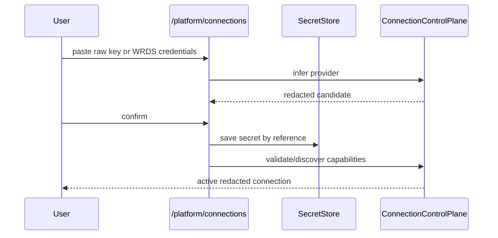

# Connection Control Plane

The connection control plane lets users bring their own model providers and
financial data credentials without editing `.env` files.



## Security Contract

- Raw credentials are accepted only by infer/confirm endpoints.
- Raw credentials are never returned to frontend.
- Raw credentials are never inserted into agent prompts.
- Connection APIs return `configured`, `last4`, provider, status, and
  capabilities.
- Local OSS uses `LocalEncryptedSecretStore`.
- Production can set `PLATFORM_SECRET_STORE_BACKEND=vault` to use the
  `VaultKVSecretStore` adapter. The connection record stores only a `vault:*`
  `secret_ref` plus `last4`; plaintext credentials stay in Vault.

## Main Endpoints

- `POST /platform/connections/infer`
- `POST /platform/connections/confirm`
- `GET /platform/connections`
- `POST /platform/connections/{id}/test`
- `POST /platform/connections/{id}/discover`
- `POST /platform/connections/{id}/disable`
- `POST /platform/connections/{id}/revoke`
- `DELETE /platform/connections/{id}`

## Runtime Use

`RuntimeMaterializer` reads active connections for each run. The runtime receives
safe handles and capability metadata, not raw credential values. Disabled
connections are excluded from the active capability index and from tool/model
materialization.

## Lifecycle Operations

- `disable`: preserves the redacted connection record and stored secret handles
  but removes the connection from active runtime use.
- `revoke`: disables the record, deletes all associated secrets from
  `SecretStore`, clears discovered capabilities, and keeps a redacted audit
  record.
- `delete`: removes the connection record and deletes all associated secrets.

All lifecycle operations are tenant-scoped and must not return raw credentials.

## Secret Store Backends

Supported backends:

| Backend | Config | Use |
| --- | --- | --- |
| `local` / unset | `PLATFORM_SECRET_STORE_PATH`, `PLATFORM_SECRET_KEY_PATH`, optional `PLATFORM_SECRET_KEY` | Local OSS/self-host development |
| `vault` / `vault-kv` | `VAULT_ADDR`, `VAULT_TOKEN`, optional `VAULT_KV_MOUNT`, `VAULT_KV_PREFIX`, `VAULT_NAMESPACE` | SaaS / production secret manager |

The Vault adapter targets HashiCorp Vault KV-v2. It writes secrets to:

```text
<mount>/data/<prefix>/<tenant>/<connection.field>/<uuid>
```

and returns a reference shaped like:

```text
vault:<mount>:<encoded-path>
```

The encoded path is not a credential. API responses still expose only
`configured=true`, `last4`, provider, status, capabilities, and connection id.
If Vault is selected but `VAULT_ADDR` or `VAULT_TOKEN` is missing, startup/use
fails closed with an actionable configuration error.
