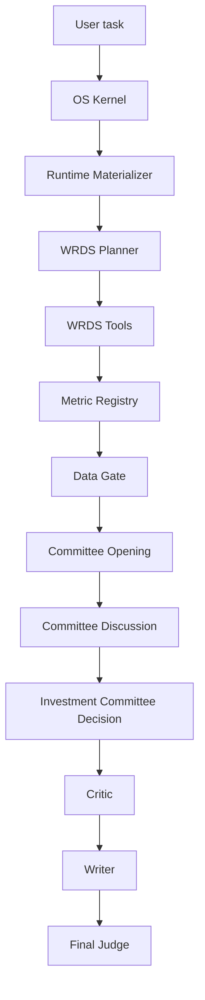

# Investment Research Workflow

Investment research is WRDS-first / WRDS-only by default when WRDS is connected.
The workflow intentionally avoids web search unless the user explicitly asks
outside the investment path.

## Data Discipline

- WRDS raw data must not go directly into final prose.
- Report-ready metrics should come from deterministic calculations.
- Data Gate decides whether formal valuation conclusions are allowed.
- Writer must include required caveats and must not fabricate missing valuation
  data.
- Forward estimates, segment claims, and peer-relative valuation claims are
  separately gated. IBES, Compustat segment, and peer comparison rows must be
  converted into `street_eps` / `segment_*` / `peer_*` metrics before any agent
  can cite them.

## Deterministic Data Packages

The current WRDS-only path supports these report-ready package adapters:

- `crsp_market_data`: deterministic price, return, volume, split-factor, and
  market-cap metrics from CRSP rows.
- `capital_iq_profile`: profile availability and business-description coverage
  markers.
- `optionmetrics_security`: security match, borrow-rate, and historical
  volatility snapshots when the account can see OptionMetrics.
- `ibes_estimates`: `street_eps`, IBES mean estimate, actual EPS, and estimate
  count with estimate/actual separation.
- `compustat_segments`: `segment_sales`, `segment_operating_profit`,
  `segment_assets`, and `segment_capex`.
- `peer_comparison`: same-industry Compustat peer candidates plus deterministic
  `peer_pe`, `peer_ev_ebitda`, `peer_fcf_margin`, and peer-median metrics.

If a requested package is missing from the metric registry, Data Gate emits a
specific evidence gap and disables the corresponding conclusion permission,
for example `peer_valuation_allowed=false`.

## Committee Discipline

Committee agents may disagree, challenge, and vote. They may not bypass
Executor/WRDS/Data Gate or receive raw secrets.

The investment committee workflow is capability-owned:

- `capabilities/value-investing-research/runtime_nodes.py` owns Data Gate,
  deterministic research/quant, committee opening, debate moderation, and CIO
  decision nodes.
- `capabilities/value-investing-research/support.py` owns committee selection,
  prompt-context assembly, strict JSON salvage/parsing, scorecard fallback, and
  deterministic WRDS-only research/quant payloads.
- `runtime/graph.py` keeps LangGraph routing and compatibility wrappers only;
  investment-specific helper behavior is loaded from the capability entrypoints.
