# PheroOS Production Readiness Hardening — Goal Execution Plan

状态：Core Goal local execution complete（WP-00 至 WP-11 completed；exact
`v0.1.0` pre-promotion rehearsal 绑定 candidate `88a117b` 并完成独立 staging
verification；WP-07B、WP-12、WP-13 保持 `planned`，未执行远程
promotion/release/merge）

审计基线：2026-07-20，`0.1.0` Draft ABI

适用仓库：PheroOS protocol-core；独立 reference runtime 仅作为跨仓交付物

性质：本文是非规范性的 Goal 模式执行计划。协议真值仍由 `SPEC.md`、版本化 ABI 文档、
checked-in schemas、TCK 和 Conformance 决定。本文负责实施顺序、工程约束、验收证据和完成定义，
不得演化成第二套协议规范。

配套文档：

- [API lifecycle](api-lifecycle.md)
- [Schema migration](schema-v1-v2-migration.md)
- [Removal ledger](removal-ledger.md)
- [Release checklist](release-checklist.md)
- [Runtime integration](../protocol/runtime-integration.md)
- [Conformance suite](../conformance/conformance-suite.md)
- [Security policy](../../SECURITY.md)

## 1. 执行结论

PheroOS 当前已经是高保证、强 Conformance 的 Draft protocol-core，但还不是生产级多租户 authority
control plane，也不是输入模型 API key 即可运行的 multi-agent 产品。

下一阶段停止横向增加协议对象，集中完成以下七项纵向结果：

1. 把“可信宿主调用 Governance”提升为明确、scope-bound、可验证的 authority trust root；
2. 把 process-local replay/window/certificate authority 迁移为 StateStore-backed durable authority；
3. 修复 commit 已持久化但 head 后移后被误报为 `INVALID` 的 finalize 语义；
4. 在 727 个 facade 导出中定义小而完整的 Stable Core，而不是冻结整个 Draft 面；
5. 降低 authority-critical validator/evaluator 的复杂度，并补齐 Ruff、Mypy、coverage、mutation 门禁；
6. 启用正式 GitHub 合并和发布治理，发布 exact attested artifacts；
7. 在独立仓库交付真实 reference runtime，证明 provider、持久化、并发、取消、恢复和最终 output。

本计划不是最小补丁。任何工作包都不能通过 silent fallback、assurance downgrade、兼容层冒充新实现、
skip/N/A、提高性能上限或减少测试来宣称完成。

## 2. 审计基线

以下数字是 2026-07-20 的工程基线，不是永久架构目标：

| 指标 | 当前值 | 结论 |
| --- | ---: | --- |
| Core Python files / LOC | 270 / 约 87,462 | package 边界清楚，但 core 已明显偏大 |
| Governance LOC | 约 53,303 | authority 能力完整，域内维护成本高 |
| Conformance LOC | 约 21,112 | 证明能力强，存在第二套实现风险 |
| 全量测试 | `1365 passed, 1 warning` | 行为测试很强 |
| Public facade exports | 727 | 对外聚合面过宽 |
| Stable / Draft / Deprecated exports | 0 / 715 / 12 | 仍是完整 Draft ABI |
| Governance exports | 527 | 不适合一次性冻结 |
| Compatibility surfaces | 44 | 迁移成本已可观 |
| 默认 Ruff findings | 约 1,016 | 主要是 facade/import 结构，但包含真实 F601/F811/F841 |
| 全包 Mypy errors | 约 1,150 | 当前 CI 只检查 5 个文件 |
| C901 > 10 | 约 160 个函数 | 高复杂度集中在 trust boundary |
| Runtime dependencies | 0 | 必须继续保持 |
| GitHub release/tag | 0 / 0 | 没有正式发布证据 |
| `main` protection | 未启用 | CI 可被绕过进入 main |

关键风险与工作包映射：

| 风险 | 优先级 | 关闭工作包 |
| --- | --- | --- |
| Enum、布尔值或公开 issuer 可在可信进程内形成基础 authority | 条件性 P0 | WP-01、WP-03、WP-04 |
| Process-local registry 和 sentinel 无法形成跨进程 durable authority | P1 | WP-02、WP-05 |
| Commit 与 finalize 之间 head 后移导致已提交结果误报 invalid | P1 | WP-02 |
| Baseline output authority 明显弱于 Optimal Commit | P1 | WP-04 |
| 727 个导出且 0 Stable | P1 | WP-07 |
| Schema、typed reader、semantic validator、Conformance 多处同步 | P1/P2 | WP-08 |
| 关键 validator/evaluator 复杂度过高 | P1/P2 | WP-09 |
| Ruff/Mypy/coverage 门禁不足 | P1/P2 | WP-10 |
| Main 无保护、无正式 Release | P1/P2 | WP-00、WP-11 |
| 无真实 provider/store/agent/output 集成证明 | P2 | WP-06、WP-12 |

## 3. 不可退让的边界

### 3.1 Core 必须继续拥有

- Protocol、Kernel、Governance、Driver、Trace ABI；
- provider-neutral Store contracts；
- deterministic reference semantics；
- versioned schema、wire、Trace、TCK、Conformance；
- provider-free、network-free examples；
- thin local CLI；
- tests 和供应链验证。

### 3.2 Core 永远不拥有

- 模型 provider SDK 或 API key 解析；
- SQLite、PostgreSQL、Redis、ORM 或数据库 migration runtime；
- agent loop、worker pool、queue、scheduler 或 daemon；
- HTTP/FastAPI/RPC gateway、dashboard 或 frontend；
- secret manager、OAuth、KMS 或证书私钥管理；
- provider routing、应用工作流或领域策略；
- 把 Python 进程伪装成恶意代码安全沙箱的保护框架。

### 3.3 No-degradation invariants

整个执行期必须持续满足：

- Frozen v1 schemas 和 TCK roots 不改变；新语义使用新版本、profile 和 exact dispatch；
- baseline manifest 不被强制升级为 swarm、Hybrid 或 Optimal Commit；
- Hybrid Pheromone、Optimal Commit、certified/distributed finality 不被删除或降级；
- attention、pheromone、model result、Trace 和 delivery receipt 都不能创建 evidence 或 authority；
- 每个 active profile 声明或实际可产生的 Governance-issued terminal outcome 都可 delivery；
  publish/execute 始终是独立 current action；
- 缺少 publish authority 不得让 run 无限 pending，也不得吞掉 safe fallback 或 diagnostic；
- active profile 的 required check 只能 PASS/FAIL，不能 skip、N/A 或 no-op PASS；
- core runtime dependencies 继续为零；
- 不提高 locked performance ceiling 来换取绿色；
- 不得通过删除或弱化 assertions、coverage、mutation 或 Conformance 降低门槛；允许合并重复测试，
  但必须记录 invariant/branch/mutation evidence 的等价或增强映射；
- `pheroos.trace.TraceEvent` 继续是唯一 canonical Trace ABI；
- 新抽象必须直接保护 ABI invariant、Trace、Conformance 或 deterministic behavior。

## 4. Goal 模式执行协议

### 4.1 推荐拆分

不要用一个跨仓、跨发布、跨远程权限的无限大 Goal。推荐按顺序创建三个 Goal：

1. **Core Authority and Stable ABI Candidate Goal**：WP-00 至 WP-11；
2. **Reference Runtime Goal**：WP-12，仅在独立仓库路径和权限明确后创建；
3. **Release and Merge Goal**：WP-13，远程 ruleset/repository settings、immutable releases
   activation、tag、GitHub Release 或 PyPI 操作需要显式授权。

每个 Goal 都必须完成完整 Definition of Done；拆分范围不是降级实现。

### 4.2 Core Goal objective

可直接用于 Goal 模式：

```text
严格按照 docs/process/production-readiness-hardening-goal-plan.md 完成
PheroOS protocol-core 的 WP-00 至 WP-11：建立明确 authority threat model、
scope-bound issuer capability、StateStore-backed historical finality、portable replay、
baseline output v2、runtime integration TCK、Stable Core ABI candidate、schema/validator catalog、
复杂度重构、全量 Ruff/Mypy/coverage/mutation 门禁和 release-candidate 供应链。
不得向 core 引入 provider、数据库、agent runtime、HTTP server 或 secret management；
不得使用 silent fallback、assurance downgrade、最小占位实现、skip/N/A 或提高性能上限。
只有所有工作包的测试、TCK、Conformance、迁移和完成证据全部满足时才标记 Goal complete。
```

### 4.3 Reference Runtime Goal objective

```text
在独立仓库实现与 PheroOS Stable Core 候选兼容的完整 reference runtime：
provider-neutral engine、deterministic fake adapter、至少一个真实 model adapter、
SQLite 与 PostgreSQL stores、并发 agent coordinator、隔离 Governance coordinator、
取消/超时/重试、crash recovery、transactional output outbox，以及 baseline、swarm、
Hybrid、Optimal Commit local/certified/distributed E2E。不得把 runtime 代码或依赖回流到
protocol-core；只有 active profiles 声明或可产生的全部 Governance terminal outcome 可可靠 delivery、
publish/execute 始终受 current
authority 约束、跨重启/并发/篡改矩阵和 core/runtime TCK 全部通过时才标记 complete。
```

### 4.4 每轮执行规则

Goal agent 每轮必须：

1. 读取当前 Goal、本文、`git status`、最近提交和上轮 evidence；
2. 选择依赖已满足的第一个未完成工作包；
3. 行为或协议不变量变更先写或确认失败测试，再修改 owner implementation；纯文档或机械生成更新使用
   对应 link、drift 或 byte-identity gate；
4. 保持最多一个主工作包为 `in_progress`；可并行委派只读分析和独立测试；
5. 保留用户已有脏文件，不覆盖、不格式化无关变更；
6. 每个 vertical slice 独立验证并记录命令、结果、commit 和 artifact roots；
7. 发现 ABI/安全语义歧义时停止该 slice，先完成版本/迁移决策，不猜测；
8. 外部远程设置、创建仓库、发布 tag/Release/PyPI、使用 live secret 前取得明确授权；
9. 失败时返回 typed blocker 和剩余可做工作，不把部分完成标成 complete；
10. 只有对应 Goal 的 Definition of Done 全部满足后才关闭该 Goal。

### 4.5 状态与证据表

Core 工作包在本文末尾的 Evidence Ledger 追加证据；WP-12 只在这里记录 runtime version、commit、
report URL/hash 和 compatibility result，完整 runtime evidence 由 runtime 仓自己的 ledger 保存。状态只允许：

- `planned`
- `in_progress`
- `blocked`
- `completed`

初始状态：

| 工作包 | 初始状态 | 完成依赖 |
| --- | --- | --- |
| WP-00 Baseline 与 merge-protection policy | planned | 无 |
| WP-01 Threat model 与版本决策 | planned | WP-00 |
| WP-02 StateStore v2 与 historical finality | planned | WP-01 |
| WP-03 Scope-bound issuer capability | planned | WP-01、WP-02 |
| WP-04 Baseline Output v2 | planned | WP-02、WP-03 |
| WP-05 Durable replay 与 Stable path legacy exit | planned | WP-02、WP-03 |
| WP-06 Runtime integration ABI/TCK | planned | WP-02、WP-03、WP-05 |
| WP-07 Stable Core ABI candidate/promotion | planned | WP-04、WP-05、WP-06 |
| WP-08 Schema/validator catalog | planned | WP-01；可与 WP-02 至 WP-05 部分并行 |
| WP-09 复杂度与 Conformance 重构 | planned | WP-00、行为 golden 已冻结 |
| WP-10 Static quality/coverage/mutation | planned | WP-00；分阶段贯穿全部工作包 |
| WP-11 RC dry-run、workflow 与供应链 | planned | WP-02 至 WP-10、WP-07A candidate |
| WP-12 独立 reference runtime | planned | WP-06、WP-07A、WP-11 candidate artifacts |
| WP-13 Final audit / GA / merge | planned | WP-11、WP-12 |

当前执行状态（2026-07-24）：

| 工作包 | 当前状态 | 证据/下一门 |
| --- | --- | --- |
| WP-00 Baseline 与 merge-protection policy | completed | Evidence Ledger `WP-00`；远程 ruleset 保持 disabled，激活属于 WP-13 |
| WP-01 Threat model 与版本决策 | completed | Evidence Ledger `WP-01`；独立审计无 P0/P1；local v2 profile 已 active Draft，authenticated production promotion 仍 gated |
| WP-02 StateStore v2 与 historical finality | completed | Evidence Ledger `WP-02`；Draft Store slice 已独立审计；authenticated profile 与正式 promotion 仍 gated |
| WP-03 Scope-bound issuer capability | completed | Evidence Ledger `WP-03`；public Draft Authority Session v2 与双 Store Conformance 已闭环；local profile active Draft，authenticated profile 仍需 external verifier |
| WP-04 Baseline Output v2 | completed | Evidence Ledger `WP-04`；Protocol v3、Baseline Output v2、六事件 Trace、双适配器 Conformance 与 provider-free example 已闭环 |
| WP-05 Durable replay 与 Stable path legacy exit | completed | Evidence Ledger `WP-05`；production path 已迁入 Store-backed v2，legacy v1 精确分级 Deprecated，物理删除继续由 D-06/versioned migration 控制 |
| WP-06 Runtime integration ABI/TCK | completed | Evidence Ledger `WP-06`；DriverInvocationStore、ScopedTraceStore、runtime compatibility manifest、reference/independent expected-free transcript TCK 与 external-CWD fixture 已闭环；真实 provider/runtime 仍属于独立 WP-12 |
| WP-07A Stable Core ABI candidate | completed | Evidence Ledger `WP-07A` 与 `WP-07A/WP-10 hardening`；37 roots/122 closure、Governance 11/37 的六包候选保持 Draft `promotion_candidate`，`formal_stable=false`；高聚合写入 journey 与独立外部 Store harness 已闭环 |
| WP-07B 正式 Stable promotion | planned | 仅可在 WP-13 经 external runtime、final RC、protected-main PR 与明确远程授权完成；当前 Stable lifecycle 仍为 0 |
| WP-08 Schema/validator catalog | completed | Evidence Ledger `WP-08`；21 个 schema artifact 唯一登记，generator/CLI/parity/frozen-root 门禁闭环 |
| WP-09 复杂度与 Conformance 重构 | completed | Evidence Ledger `WP-09`；86 个静态 trust-path functions、8 个模块和 repository C901 目标均通过，独立 oracle 边界保留 |
| WP-10 Static quality/coverage/mutation | completed | Evidence Ledger `WP-10`；Ruff/Mypy/PEP 561、12-shard branch coverage、changed-source、8-family P0 mutation、complexity、performance 与 Python 3.12–3.14 全量门禁通过 |
| WP-11 RC dry-run、workflow 与供应链 | completed | exact `v0.1.0` local pre-promotion rehearsal 绑定 clean candidate `88a117b` / tree `521b367`；staging rebuild-free verify、subject/comparison byte identity、source/wheel/sdist transcript、SBOM 与 SHA-256 manifest 全部通过；`publication_allowed=false` |
| WP-12 独立 reference runtime | planned | 等待独立 runtime 仓 owner/license/package 授权；消费 WP-11 candidate `88a117b` 的 exact wheel/sdist，不得在 protocol-core 内实现 |
| WP-13 Final audit / GA / merge | planned | 等待 WP-11、WP-12 与明确远程授权 |

## 5. 目标架构与信任边界

```mermaid
flowchart LR
    Agent["Untrusted agent / model output"] -->|proposal, report, signal| Runtime["External runtime"]
    Adapter["Provider / tool adapter"] -->|result + provenance| Runtime
    Runtime -->|immutable step snapshot| Coordinator["Trusted authority coordinator"]
    Coordinator -->|scope-bound session| Governance["PheroOS Governance"]
    Governance -->|atomic authority state + critical Trace + receipt| StateStore["External GovernanceStateStore"]
    StateStore -->|committed transition / inclusion proof| Governance
    StateStore -->|committed history| Projector["Crash-safe projector / reconciler"]
    Projector -->|idempotent derived lineage| TraceStore["External Scoped TraceStore"]
    Projector -->|stable delivery identity| Outbox["External delivery outbox"]
    Outbox --> Client["Client / sink"]
```



核心信任规则：

- Agent、scout、model、tool adapter 都是不可信 proposal source；
- trusted coordinator 持有 StateStore writer 和本地 issuer capability；
- StateStore 是部署选定的 durable authority trust root；
- StateStore atomic batch 是 authority state、receipt 和 authority-critical Trace 的唯一原子真值；
- 独立 ScopedTraceStore 只保存可从 committed history 幂等重建的查询/归档投影，投影失败不能撤销 commit；
- delivery outbox 必须与 runtime 持久化共享明确事务边界，或从 committed inclusion proof 做 crash-safe
  reconciliation；stable delivery id 绑定 `scope_ref + transition_id + outcome/action ref`；
- TraceStore 和 outbox 都不签发 authority；
- hash 证明完整性，不单独证明身份真实性；
- arbitrary untrusted Python 若可执行，必须与 coordinator/StateStore writer 进程隔离；
- capability hardening 是 ABI/object-capability 边界，不声称阻止同进程任意反射、monkeypatch 或内存攻击。

## 6. WP-00 — Baseline、红测与仓库保护

目标：建立不可回退、机器可读的工程基线，并在大规模重构前阻止未经验证的代码进入 `main`。

### 6.1 交付物

候选文件：

- `docs/process/engineering-baseline-v1.json`
- `scripts/check_engineering_baseline.py`
- `tests/ci/test_engineering_baseline.py`
- `.github/workflows/tests.yml`
- `.github/CODEOWNERS`
- `docs/process/release-checklist.md`

### 6.2 实施任务

1. 记录 facade exports、lifecycle、schema IDs/hashes、TCK roots、diagnostics、complexity、Ruff、Mypy、
   coverage、test count 和 performance；
2. baseline 生成器支持 `--check`；`--write` 必须要求 reason，并保证连续两次输出字节一致；
3. 新增三个 characterization reproductions：
   - v1 公开 issuer 只能被描述为 trusted-host compatibility，不是 production credential；
   - baseline v1 接受 caller-provided publication boolean；
   - commit 后 head 前进会导致 v1 finalize mismatch；
4. characterization 只记录现状，不将弱行为提升为 Stable 保证；
5. CI 增加固定名字的 `quality-gate`，使用 `if: always()` 汇总所有 PR 必跑 job；
6. fork PR 允许 provenance 合法 skip，但普通测试、TCK、ABI、schema、performance 不得 skip；
7. 生成并验证 proposed `main` ruleset：PR-only、required `quality-gate`、禁止 force-push/delete；实际
   activation 属于 WP-13，且任何 implementation PR merge 前必须先启用；
8. 单维护者仓库不设置会永久锁仓的强制他人审批；CODEOWNERS 与 required status 分开配置。

### 6.3 验收门

- Baseline 连续运行两次输出相同；
- 任一 Ruff/Mypy/C901/dependency 指标不得增加；
- Frozen schema/TCK/public owner bytes 不漂移；
- 本地 policy fixture 能证明 proposed ruleset 将拒绝缺失或失败的 `quality-gate`；真正的临时 PR
  block/unblock 验证只在 WP-13 激活 ruleset 后执行；
- proposed ruleset artifact 和 workflow policy tests通过；WP-13 能无歧义地激活为 `active`；
- 本工作包不改变协议输出、diagnostic 或公共 ABI。

## 7. WP-01 — Authority threat model 与 vNext 决策

目标：在写 authority v2 代码前冻结“谁可以签发、提交、恢复和发布”的规范边界。

### 7.1 必须定义的不变量

- `AH-001`：Agent data 永远只能是 proposal；
- `AH-002`：`AuthorityLevel` 是分类标签，不是 credential；
- `AH-003`：每个能签发 commit、改变 replay currentness 或授权外部 action 的 vNext authority envelope，
  绑定 scope、operation、issuer/grant、target/action、ledger 和 required Trace lineage；
- `AH-004`：portable payload 只有经选定 StateStore 验证 inclusion 后才能重新获得本地 authority；
- `AH-005`：historical validity 与 current actionability 分开表示；
- `AH-006`：合法后继 transition 不得让已提交 receipt 变成 `INVALID`；
- `AH-007`：每个 active profile 声明或可产生的 Governance terminal outcome 可 delivery，
  publish/execute 独立授权；
- `AH-008`：capability/record 不能跨 scope、target、action、epoch 或 payload 复用；
- `AH-009`：issuer capability 非 portable、最小权限、可过期/撤销；
- `AH-010`：domain retirement 禁止新写入，但保留历史 proof；
- `AH-011`：布尔值、digest、同形 dataclass 和 receipt id 本身都不是 authority；
- `AH-012`：replay advance 必须 CAS、append-only、可跨重启恢复；
- `AH-013`：正常拒绝、冲突、stale 和 unavailable 使用 total typed result，不靠异常字符串区分。
- `AH-014`：output authorization 与其他 authority commit 必须在同一 atomic commit 中验证完整 canonical
  authority read-set；禁止“先读 current、后单独提交”的 TOCTOU 路径。

### 7.2 版本与迁移决策

在 implementation 前形成 ADR，至少决定：

- authority profile、StateStore、TraceStore、wire、schema 和 Conformance 的精确 version IDs；
- 旧 manifest 如何显式保持 legacy v1；
- 新 manifest 如何 opt in scoped authority；
- 哪些 v1 APIs Deprecated、replacement 和 earliest removal；
- Stable candidate 是否要求 external attestation verifier；
- local trusted-host reference profile 与 production authenticated profile 的保证差异；
- historical commit、current head、superseded result、retired domain 的状态机；
- authority read-set 的 canonical 编码与原子前置条件。v2 ABI 必须允许有限个
  `(stream_ref, expected_revision, expected_root)`；reference store 可在内部折叠为一个串行 authority
  stream，external adapter 也可实现 multi-head transaction，但对外必须具备相同的全量原子验证语义；
- schema vNext 新文件名和 `$id`，不得改写任何既有 `$id` 的 bytes 或 meaning。

现有 `PROTOCOL_SCHEMA_V2` 和 `CAPABILITY_SCHEMA_V2` 是服务 `pheroos.protocol.v1` 的严格
schema-document version，不是本计划的 authority semantic v2。不得修改、复用或重新解释其 `$id`；
新 authority profile 必须有新的 exact ID/dispatch，具体命名由 ADR 决定。

候选文档：

- `docs/protocol/authority-trust-model-v2.md`
- `docs/protocol/authority-v2-migration.md`
- `SECURITY.md`
- `docs/protocol/runtime-integration.md`
- `docs/process/removal-ledger.md`

本文中的类型名均为候选，不是规范决定。最终名称必须经过 lifecycle、schema 和 migration review。

### 7.3 验收门

- 威胁模型能明确回答四个问题：谁签发、谁提交、谁恢复、谁执行外部 action；
- 每个 denial path 都绑定一个不变量、stable diagnostic 和 negative test；`DENIED` 不产生 authority
  receipt、inclusion、position 或 committed transition。只有 scope/session 已建立且协议要求审计时，
  implementation 才必须通过独立幂等的非 authority audit operation 做一次 canonical denial `TraceEvent`
  append attempt，并把结果作为独立 audit telemetry 暴露；该 audit 的成功/失败不改变 denial，不能使用或
  伪装成 `pheroos-governance-trace-batch-v2` authority commit，pre-auth malformed input 不得强制
  StateStore/Trace 写入；
- 文档明确 arbitrary same-process Python 不在隔离保证内；
- 没有引入 generic security/capability manager；
- ADR、schema/profile 版本和迁移方向完成审查后才进入 WP-02/03。

## 8. WP-02 — StateStore v2、historical finality 与 typed failures

目标：让 receipt 证明“transition 已进入权威链”，不再依赖它仍是当前 head；同时消除异常字符串协议。

### 8.1 候选 ABI

候选小型对象：

- `GovernanceStateReaderV2`
- `GovernanceStateWriterV2`
- `GovernanceStateStoreV2`
- `GovernanceReadPreconditionV2`
- `GovernanceAuthorityReadSetV2`
- `GovernanceCommitBatchV2`
- `GovernanceCommitReceiptV2`
- `GovernanceCommitInclusionProofV2`
- `GovernanceCommitAttemptV2`
- `GovernanceCommittedTransitionV2`
- `GovernanceCommitViewV2`
- `GovernanceCommitPositionObservationV2`
- `GovernanceCommitDispositionV2`
- `GovernanceCommitPositionV2`
- `GovernanceDomainSealV2`
- `GovernanceFailureV2`
- `AuthorityDiagnosticCodeV2`

候选入口：

```python
atomic_commit_v2(batch) -> GovernanceCommitAttemptV2
load_commit_view_v2(
    scope_ref,
    stream_ref,
    transition_id,
    *,
    expected_receipt_root=None,
) -> GovernanceCommitViewV2
```

`atomic_commit_v2()` 是 total operation。`GovernanceCommitAttemptV2` 总是带 disposition；
`disposition=COMMITTED` 时 `failure is None`，且 `committed_transition` 与 position observation 都存在。
任何非 `COMMITTED` disposition 必须带一个由 stable diagnostic 与 canonical path 组成的
`GovernanceFailureV2`，且不得伪造 receipt、position 或 authority。成功不是 failure，不能为了填字段增加
虚假的 success diagnostic。正常 CAS、seal、identity、unavailable 和 invalid input 都由该结果表达；
只把进程级故障或违反 Python 调用契约保留为异常。

每个 commit batch 包含按 canonical 顺序编码的有限 authority read-set。StateStore 必须在同一原子边界内
验证全部 expected revision/root、写 authority state、authority-critical Trace 和 receipt；任何一个
precondition 漂移都不允许 partial commit。adapter 如何用单 stream 或数据库 multi-row transaction 实现
属于内部细节，Conformance 只验证可观察原子语义。

`load_commit_view_v2()` 是公开的 total、单次一致性快照读取。它返回 immutable detached batch、receipt、
inclusion proof、动态 position observation 和 observed head/revision/root；可达 disposition 只有
`COMMITTED`、`INVALID` 与 `FINALITY_UNAVAILABLE`。`COMMITTED` 才能携带 committed transition 与
position；明确不存在、proof mismatch 或 tamper 返回
`INVALID/governance_committed_transition_invalid`；Store 无法可靠回答返回
`FINALITY_UNAVAILABLE/governance_finality_unavailable`。`expected_receipt_root=None` 支持 commit 已发布但
响应丢失后的 transition-id reconciliation；传入 root 时必须精确绑定。position observation 是读取时刻的
不可变事实，不能嵌入并反向修改 historical proof。分离式 optional historical loader 和 bare position-enum
reader 只能作为 Store 私有 helper，不属于公开 v2 ABI。

编码前先在 `docs/protocol/authority-store-v2.md` 冻结并用 golden tests 锁定：batch、receipt、inclusion、
position observation、failure、attempt/view 与 seal 的 exact discriminator/domain separator；v2 genesis head
root；`expected_root` 只表示 stream head root；transition id 在 scope 内唯一；普通 batch 为 bounded
multi-read/single-write；seal 的 lifecycle CAS/root；以及上述 total view 互斥字段规则。未知细节不得靠 shape
inference、随机 implicit id、异常字符串或新 wire state 补齐。

### 8.2 状态语义

Commit disposition、position 和 preparation failure 是正交维度。

WP-01 已冻结 `GovernanceCommitDispositionV2` 为以下 closed wire set：

- `COMMITTED`
- `DENIED`
- `RETRY_REQUIRED`
- `FINALITY_UNAVAILABLE`
- `INVALID`

`GovernanceCommitPositionV2` 的 closed wire set 为：

- `CURRENT`
- `SUPERSEDED`
- `SEALED`

`AuthorityDiagnosticCodeV2` 使用 WP-01 迁移合同冻结的 17 项 exact registry，唯一 canonical type owner 是
`pheroos.protocol.authority_v2.AuthorityDiagnosticCodeV2`。Protocol reader 可直接发射其
profile/shape diagnostics；Governance 导入并
消费同一 enum，可在 public facade 重导出同一对象但不得重新定义。diagnostic 到
`GovernanceCommitDispositionV2` 的映射由 Governance 拥有。WP-02 只发射其中与
scope/binding/read-set/transition/seal/finality/inclusion/Trace 有关的子集，WP-03/04 复用同一 enum，
不得再建第二套 Store failure-code registry。authority-v2 dispatch 尚未建立前的 schema-document 错误继续
使用现有 Protocol diagnostic，不得重标成已成功选择 v2 profile。

`CONFLICT`、`STALE`、`UNAVAILABLE` 和 `MALFORMED` 只作为 failure/reason category，
不是额外的 disposition。已知 stale read-set 映射为 `RETRY_REQUIRED`；同一 transition id
对应不同 canonical bytes 映射为 `INVALID`；未知 finality 映射为
`FINALITY_UNAVAILABLE`。一个历史观察必须能够同时表达
`disposition=COMMITTED` 和 `position=SUPERSEDED`。

约束：

- `SUPERSEDED` 表示历史 commit 仍有效，但不自动拥有 current publish/execute authority；
- 已知合法旧 parent/read-set 漂移返回 `RETRY_REQUIRED` 与
  `governance_read_set_stale`，不能与 tamper/fork 的 `INVALID` 混为一类；
- `INVALID` 只表示不存在、损坏、冲突、cross-scope 或证明不完整；
- `FINALITY_UNAVAILABLE` 表示当前无法证明 durable outcome；它既不是 committed authority，也不是
  not-committed proof。调用方必须按 transition id reconciliation，不能盲目重试外部 effect；
- normal CAS/identity/retirement errors 使用 typed code，不解析异常 message。

### 8.3 Commit/finalize 序列

新路径：

```text
prepare
-> atomic_commit_v2 (atomically validate full authority read-set)
-> consume total attempt with exact committed transition + position observation
-> finalize delivery and current action authority separately
```

崩溃恢复路径：

```text
load_commit_view_v2(scope_ref, stream_ref, transition_id, expected_receipt_root=...)
-> atomically verify batch + receipt + inclusion + Trace and observe position
-> recover COMMITTED + CURRENT/SUPERSEDED/SEALED, or return typed INVALID/FINALITY_UNAVAILABLE
```

不得再用“receipt 必须等于当前 head”判断 commit 是否发生。

### 8.4 Retirement

WP-02 在 Store 层把 domain retirement 表达为一个原子 seal transition：

- 永久拒绝新 commit；
- seal 自身绑定 lifecycle read precondition、critical Trace、receipt 与 inclusion proof；与普通 commit 竞争时
  只有一个合法线性化结果：普通 commit 先发布时，seal 因完整 read-set 漂移返回
  `RETRY_REQUIRED/governance_read_set_stale`；seal 先发布时，普通 commit 观察到终态并返回
  `DENIED/governance_domain_sealed`；
- 保存足以验证 seal 前 committed transitions 的 canonical proof material；adapter 可使用 append-only
  log、index 或 inclusion proof，但 ABI 不规定数据库结构；
- seal 前的 committed transition 仍可只读验证；
- snapshot/checkpoint rehydrate 后 seal 和 proof 完全一致。

WP-03 决定哪个 scope-bound operation 可请求 seal；WP-05 负责把 legacy replay/window/certificate/retire
调用方迁到该 Store 原语，并退出 process-local currentness。WP-05 不重新定义 seal，v1 `retire()` 语义在
迁移门关闭前保持原样。

### 8.5 主要 owner

- `pheroos/protocol/authority_v2.py`（read-set contract、canonicalization、唯一 diagnostic enum owner）
- `pheroos/governance/authority_store_v2.py`（v2 public contracts；不重定向 v1 symbols）
- `pheroos/governance/_authority_v2/`（reference validation、ledger 与 snapshot owners）
- `pheroos/conformance/checks/authority_store_v2_contract.py`
- 独立的 stdlib test adapter，只依赖 public v2 facade，不导入 reference/private owner

现有 `authority_domain.py`、`_authority/ledger.py`、`atomic_evaluation.py` 与
`authority_ledger_contract.py` 保持 v1 bytes/semantics；WP-02 只增加 differential tests，不在这些 owner 内
“修复” frozen v1 behavior。

### 8.6 测试矩阵

- same batch exact retry 返回同一 receipt；
- same transition id + different bytes 冲突；
- 32 个 same-batch worker 只形成一个 commit；
- 32 个 conflicting genesis batch 只有一个 winner；
- A commit、B 合法推进、A finalize 得到 `SUPERSEDED` 而非 `INVALID`；
- crash-after-commit-before-response 可从 fresh process 恢复；
- checkpoint/snapshot 后历史 receipt 仍可验证；
- retired domain 的旧 proof 可验证，新写入被拒；
- state、Trace、receipt 任一阶段失败都无 partial publish；
- 任一 multi-stream read-set root 在 prepare 后变化，整个 commit typed-fail 且零 partial write；
- receipt、batch、state root、trace root、scope、stream、revision 任一 mutation 均失败；
- external adapter 只依赖公开 Protocol/TCK，不导入 reference ledger。

### 8.7 验收门

- 当前 `governance_receipt_mismatch` race 有固定回归测试；
- descendant transition 永远不能抹掉历史 commit；
- crash 后不会重复 commit、action authorization 或 idempotency identity；
- reference store 与一个不共享 reference owner logic 的 independent stdlib model/test adapter 通过
  exact-version Conformance；SQLite/PostgreSQL 等生产 adapter 验收属于 WP-12；
- Store v1 wire 不被无版本改变。

## 9. WP-03 — Scope-bound issuer capability

目标：让 vNext authority 由 store-bound、least-privilege session 签发，而不是由公开函数加 Enum 产生。

### 9.1 设计组合

```text
trusted StateStore writer possession
+ explicit AuthorityDomain
+ trusted-host selected issuer grant verification（production profile）
+ least-privilege local capability
+ durable state+Trace commit
```

候选类型：

- `GovernanceIssuerOperation`
- `GovernanceIssuerGrant`
- `GovernanceIssuerCapability`
- `GovernanceAuthoritySession`

候选 operation 保持小型 closed enum：

- `VERIFY_SIGNAL`
- `EVALUATE_QUORUM`
- `QUALIFY_EVIDENCE`
- `RESOLVE_STOP`
- `ADVANCE_REPLAY`
- `ISSUE_ACTION_PERMISSION`
- `AUTHORIZE_OUTPUT`
- `RETIRE_DOMAIN`

不要使用任意字符串 permission 或动态 registry。

### 9.2 Capability 绑定

Capability 至少绑定：

- `scope_ref`
- issuer/grant reference
- trusted deployment selected stable ledger/domain identity
- allowed operations
- optional target/action bounds
- issued revision/epoch
- expiry/revocation reference
- stable、non-secret `grant_binding_ref`

Capability 本身：

- 没有 portable `to_dict()`；
- 不进入 manifest、checkpoint、Trace 或 wire；
- restart 后由 trusted runtime 重新 bind；
- durable records 和 canonical truth roots 只保存稳定的 issuer grant、ledger/domain、scope、operation 与
  `grant_binding_ref`；ephemeral session/capability handle identity 永不进入可重放 root；
- 撤销阻止新 issuance，但不抹掉历史 committed proof；
- 不能出现在 agent-facing `RuntimeContext` 或 Driver exposure 中。

若实现内部保留名为 `capability_ref` 的字段，它只能是上述确定性、非 credential 的 grant binding alias，
不能是每次 bind 改变的 nonce、对象地址或 handle id。重启可以产生新的本地 handle，但相同 committed input
的 canonical state/Trace/output roots 必须保持一致。

Production authenticated profile 只有在 trusted host-selected `IssuerGrantVerifier` 验证 grant 后才能
bind session；verifier 不能来自同一个不可信 request。Local reference profile 只以 selected writer
possession 为 trust root，不得宣称外部身份认证。Durable record 保存验证结果和 grant reference，
reference 字符串本身不是 credential。Stable ledger/domain identity 不得使用 `id(store)` 或 caller
自报字符串作为 durable identity。

### 9.3 API 迁移

vNext issuer 接受 `GovernanceAuthoritySession`，不接受 `AuthorityLevel` 作为 credential。`AuthorityLevel`
可保留为 record classification，但消费端不能仅据此判断 authority。

v1 公开 issuer：

- 继续满足既有 Draft compatibility；
- lifecycle 标记 trusted-host/Deprecated；
- 不进入 Stable Core；
- vNext consumer 绝不接受其 issuance；
- migration 和 remove-after 必须明确。

### 9.4 防伪矩阵

- 直接构造、字段重建、pickle/反序列化、跨 store/process 重绑定；
- copy/deepcopy 只能保持同一 opaque store-bound handle，不能产生新 authority identity 或扩大权限；
- wrong scope/target/action/operation；
- expired/revoked capability；
- reader 冒充 writer；
- store A capability 在 store B 使用；
- 只传 `AuthorityLevel.GOVERNANCE`；
- 修改 capability/grant ref；
- capability 跨 run 重放；
- agent payload 携带同形 class/dict；
- capability 泄漏到 Trace、error 或 Driver result。

全部必须 fail closed，且失败产生稳定 typed diagnostic，不泄漏 secret。只有已建立 scope/session 且
协议要求审计时才提交 canonical Trace；pre-auth malformed input 不能自行创建 authority Trace。

### 9.5 验收门

- 未持有选定 store-bound session 的调用者无法产生 vNext durable authority；
- vNext consumer 不依赖 v1 sentinel predicate 作为最终 trust root；
- arbitrary same-process code 的限制在 Security 和 runtime guide 中明确；
- core 不管理密钥、IdP、KMS 或网络认证。

## 10. WP-04 — Baseline Output v2

目标：不强迫 baseline manifest 采用完整 Optimal Commit，同时消除当前 baseline 四个弱 gate。

### 10.1 激活与兼容

- 新 authority/output profile 必须使用新 versioned policy/schema；
- 旧 manifest 保持 legacy v1，不静默改变；
- 新 provider-free example 显式 opt in scoped vNext；
- scoped vNext 不接受 v1 QuorumDecision 或 publication boolean 直接满足 gate；raw evidence、stop、signal
  可以作为 proposal input，但必须经 declared policy 验证后形成 authority binding；
- 启用 scoped output 不强迫声明 swarm 或 `collective_commit_policy`。

现有 schema IDs 已公开，不能原地添加 authority-critical 字段。现有 `PROTOCOL_SCHEMA_V2` /
`CAPABILITY_SCHEMA_V2` 也不是 authority v2。ADR 必须选择新的 schema document 和 exact reader
dispatch。

### 10.2 高聚合入口

Stable 候选只应暴露一个 request/result journey，例如：

```python
evaluate_and_commit_baseline_output_v2(
    request,
    *,
    authority_session,
) -> BaselineOutputResultV2
```

该入口必须：

1. 从 active manifest 重算 target、candidate declaration 和 safe fallback；
2. 按声明的 quorum/direct governance policy 评估，不接受 caller-precommitted decision；
3. 绑定 evidence、claim、candidate、provenance 和 Trace roots；
4. 评估完整 target/action-scoped stop verification；
5. 同时验证有效 issuer session 与独立的 current、scope/target/action/decision/output-bound
   `ActionPermissionV2`；issuer capability 不能自行充当业务 publication permission；
6. 绑定 exact output payload fingerprint；
7. 把 active manifest、decision、evidence、stop resolution、issuer grant/revocation epoch、
   `ActionPermissionV2` 和当前 authority head 的 exact revision/root 全部放入 commit read-set；
8. 在 StateStore 的同一原子边界验证该 read-set并提交 state、Trace 和 authorization；
   不允许验证 current permission 后再单独 commit；
9. 只从 durable committed result 暴露 current publication/execute authority。

保持记录数量小：优先一个 request、一个 total result、一个 durable authorization envelope；不要把每个
内部 gate 都公开成新的长期 ABI。

### 10.3 Output 可达性

- terminal delivery 与 publish/execute 分离；
- active profile 声明或实际可产生的每个 terminal status 都形成 delivery-eligible
  `BaselineOutputResultV2`；独立 reference runtime 在 WP-12 将其映射为 `RunResult`；
- publish denial 不得隐藏治理终态；
- CAS conflict 返回有界 `RETRY_REQUIRED`，core 不 sleep/poll/自动循环；
- 不因 vNext 失败静默回落到 legacy v1；
- 不因缺少 certificate 静默降低 assurance。

### 10.4 Adversarial tests

- `commit_candidate()` 的 v1 result 不能进入 vNext output；
- caller-created committed decision 被拒；
- publication boolean 不存在于 vNext API；
- raw stop/evidence/signal 可以被接收为 proposal，但不能直接满足 gate；缺 provenance、未验证 binding、
  cross-target/candidate/action/payload 被拒；
- exact retry 幂等；
- safe fallback 可 delivery；
- blocked/invalid/unavailable 可 delivery 但不能 publish；
- successor head 产生 `SUPERSEDED`，不产生虚假 invalid；
- legacy toy/e2e manifests 和原 Conformance 保持通过。

### 10.5 验收门

- scoped vNext output authority 必有 scope、manifest/policy root、receipt/inclusion 和 scoped Trace；
- baseline 无需 Optimal Commit certificate 即可安全运行；
- active profile 声明或实际可产生的每个 terminal status 都有 output reachability test；
- 新 profile active checks 无 skip/N/A。

## 11. WP-05 — Durable replay、rehydration 与 Stable path legacy exit

目标：portable data 与 verified runtime authority 分离，并将所有 Stable/production path 依赖、且必须
跨 step/process/restart 延续的 authority state 从 process-global registry 迁移到 durable StateStore
lineage。纯派生、单调用临时对象不需要新增持久化 ABI。

### 11.1 Replay vNext 模型

候选形态：

- `HybridReplaySnapshotV2`：portable data，不自行拥有 authority；
- `VerifiedHybridReplayStateV2`：StateStore 验证 inclusion/currentness 后本地签发；
- 其他被 Stable/production path 依赖、且必须跨 step/process/restart 延续的 Commit/Support/Distributed
  state 使用相同“portable snapshot + verified wrapper”原则。

候选入口：

```python
rehydrate_hybrid_replay_state_v2(
    payload,
    *,
    domain,
    state_reader,
) -> VerifiedHybridReplayStateV2
```

验证顺序：schema/version → scope/protocol/target/stream → canonical root → committed inclusion →
position/currentness → replay receipts/processed IDs → active state/budgets/lineage → local wrapper。

Historical replay 可验证为 committed；只有 current replay head 可作为下一次 advance parent。合法 stale
返回 `RETRY_REQUIRED` 与 `governance_read_set_stale`，fork/rollback/substitution 才是
`INVALID`/safety violation。

### 11.2 迁移批次

1. Hybrid swarm：`_swarm/records.py`、`_swarm/replay.py`、`_swarm/pipeline.py`、`attention.py`；
2. Commit window/replay/liveness：`_commit`、`_commit_state`；
3. Risk、membership、support lease/replay：`_risk`、`_support`；
4. Local/portable/outcome certificate：`_certificate`；
5. Distributed proposal/witness/state/certificate/epoch：`_distributed`。

每批必须：

- 先增加 StateStore-backed owner；
- 对共享语义增加 v1/vNext differential vectors；有意变化使用显式 versioned golden，不要求错误行为相同；
- examples/TCK 迁到 vNext；
- lifecycle 标记旧 issuer/replay replacement；
- 静态禁止新模块导入 `_legacy.authority_registry`；
- 不用新 module-global dict、cursor、lock 或 singleton 替代旧 registry。

### 11.3 Restart matrix

- deposit、diffusion、feedback、adjustment、evaporation/budget；
- Commit window/progress/deadline；
- support lease/membership/risk；
- certificate/finality/distributed epoch；
- exact duplicate、delete、substitute、reorder；
- cross-scope、stale parent、concurrent fork；
- raw payload + digest 无 inclusion；
- checkpoint/snapshot/sealed-domain restore；
- fresh subprocess 重启前后下一步 output/Trace roots 完全一致。

### 11.4 Legacy 退出门

建议里程碑：

- `0.2.0rc1`：vNext available，v1 issuer/replay Deprecated；
- `0.2.0rc2`：内部、examples、TCK 不再使用 legacy registry；
- consumer audit 和 migration 通过后，在允许的 Draft release gate 删除 registry；如已有外部兼容义务，
  延至 lifecycle 声明的下一兼容版本，但 Stable path 必须完全不依赖它。

Full Goal 完成前必须满足二者之一：

1. registry 已删除，D-06 变为 removed；或
2. 用户明确决定保留兼容窗口，Stable/production profile 对 registry 的引用为零，并建立不可跳过的
   physical-removal Goal。此时当前 Core Goal 只能声明“Stable path legacy exit”，不能声明 repository
   legacy cleanup 已完成。仅写“已隔离”不能再次冒充完成。

最终审计命令：

```bash
rg "LEGACY_AUTHORITY_REGISTRY|_legacy\.authority_registry|_LEGACY_" pheroos/governance
```

### 11.5 验收门

- fresh process 可恢复并继续每个 Stable/production path 依赖且跨调用延续的 authority state；
- raw JSON、pickle、receipt string 或同形 dataclass 无 authority；
- 重启、并发、retire 后历史 proof 和 currentness 语义一致；
- baseline、Hybrid、Optimal Commit、certified/distributed 功能不降级；
- 没有新增 runtime dependency。

## 12. WP-06 — Runtime Integration ABI 与独立 TCK

目标：只补齐真实 runtime 必需的 provider-neutral contract 和黑盒证明，不在 core 实现 runtime。

### 12.1 ABI gap review

先用 external consumer fixture 证明缺口；只有以下能力确有 ABI invariant 时才新增：

- portable/versioned `RuntimeScope`、Driver invoke request/reply/result/receipt wire；
- cross-restart idempotency 所需的小型 `DriverInvocationStore` Protocol；
- tenant/run scoped append/restart 所需的 `ScopedTraceStore` 或 TraceStore vNext；
- committed transition historical proof 和 authority rehydration；
- runtime compatibility/version manifest。

如果现有 ABI 已满足，不复制新类型；补 conformance 和文档即可。

### 12.2 DriverInvocationStore 候选 contract

只允许 provider-neutral `record/get/retire` 和必要 checkpoint semantics。TCK 必须验证：

- same idempotency key + same bytes 返回同一 receipt；
- same key + different bytes 拒绝；
- fresh process 后仍幂等；
- 32-worker 同 key 只有一个 canonical result；
- tenant/run 隔离；
- retire 后不可 replay；
- failure injection 无半 receipt。

Core 内实现仅为 deterministic reference store，不是数据库。

### 12.3 Scoped Trace 候选 contract

只定义 scoped append、immutable chronological snapshot、idempotency/conflict 和必要 restart cursor；
不定义搜索、event bus、log aggregation 或后台 worker。

TCK 覆盖 scope/envelope root、tenant/run 隔离、并发序列、malformed-before-write、restart ordering、
input/output snapshot mutation 和 conflicting replay。

### 12.4 Runtime Integration TCK

新增 provider-free、network-free、expected-free transcript TCK，至少覆盖：

- manifest → Kernel plan → Driver invocation → Governance → Trace → output；
- cross-scope/digest mutation/missing provenance；
- duplicate invocation；
- CAS conflict 和 crash-after-commit recovery；
- wall-clock timeout 不得伪造 protocol logical deadline；
- cancellation 不得制造 commit；
- safe fallback/blocked/advisory/invalid 可 delivery；
- delivery、publish、execute 独立；
- stale permission/certificate/stop resolution 禁止 action；
- baseline 不被强制升级 profile。

Adapter request 不含 expected。Echo、constant、malformed、out-of-order、timeout、cross-request-state
adapter 必须失败。

Core 中的 Runtime Integration TCK 只验证 versioned、预构造 transcript 和 authority invariants。它不创建
clock、scheduler、task loop、subprocess controller、provider、database 或真正 runtime。Timeout/cancel 在
core TCK 中只是输入状态，用于证明它们不能制造 authority；实际 wall-clock timeout、cancellation 和
recovery 行为属于 WP-12 R5/R8。

### 12.5 验收门

- external fixture 只通过公开 ABI 完成完整 transcript；
- runtime TCK 有 reference 和 independent adapter；
- core dependency/source scans 继续拒绝 provider/DB/server/worker；
- existing v1 TCK roots 不改变；新 TCK exact-version dispatch；
- 文档明确 HTTP 200、provider success、Trace append 和 delivery ack 都不是 authority。

## 13. WP-07 — Stable Core ABI candidate 与正式 promotion

目标：在不删除 727 个 Draft 导出的前提下，定义小而完整、具有类型闭包的 Stable consumer journey。

### 13.1 Stable 原则

- Stable 是兼容承诺，不是 feature flag；
- 不创建第二套 wrapper/type ABI；沿六个 package facade 晋级 canonical owner；
- Deprecated/compatibility alias 不进入 Stable；
- Stable signature、dataclass field、return type、class method 和 property 引用的公共类型形成完整闭包；
- process-local-only authority 不能进入 Stable；
- fingerprint、fixture、细粒度 replay helper 默认留在 Expert Draft；
- Draft 能力继续存在并可演进，不因 Stable Core 被删除。

### 13.2 候选 journey

- Protocol：manifest read/validate、versioned schema selectors、core diagnostics；
- Kernel：`RuntimeScope`、input/plan/context、portable reader；
- Drivers：descriptor/probe/bind/invoke request/result/receipt；
- Governance：authority domain/session、StateStore contract、prepared/committed transition、一个高层
  evaluate/commit/finalize journey、typed result/error；
- Trace：canonical event、scoped event/store、lineage validation；
- Conformance：manifest/source/TCK/store adapter/report 入口。

最终清单由真实 external-CWD consumer 的传递闭包决定，不由名称美观决定。

### 13.3 机器制品

候选：

- `pheroos/conformance/abi/stable-python-api-v1.json`
- 静态 Stable root decision source；
- stable closure/owner/deprecation tests；
- `pheroos abi show/diff --stable-only`；
- `tests/typing/stable_consumer.py`；
- wheel/sdist external-CWD Stable consumer。

如 lifecycle 需要 `stable_since` 或 membership 字段，发布 lifecycle vNext；不原地改变已有 artifact
格式和语义。

### 13.4 量化门槛

- 人工 Stable root exports 目标不超过 80；
- 传递闭包目标不超过 128；
- Governance roots 不超过 24、闭包不超过 48；
- 超过上限不是自动拒绝，但必须有 ADR 证明不能通过高层入口或 wire 缩小；
- closure missing = 0；canonical owner duplicates = 0；Deprecated/compat Stable = 0；
- Stable consumer Mypy errors = 0；
- Draft diff 不被错误判为 Stable breaking；
- Stable breaking change 在同一 compatibility major 中由 CI 拒绝。

### 13.5 WP-07A candidate 完成门

先保持 Draft 并标记 `promotion_candidate`。Candidate 完成要求：

- WP-02 至 WP-06 完成；
- authority/replay 不依赖 process-local trust root；
- external independent consumer 通过；
- public docs、migration、Conformance、typing、wheel/sdist 全部存在；
- candidate action/output semantics 有 negative matrix。

### 13.6 WP-07B 正式 promotion 门

正式改写 lifecycle 为 Stable 只能在 WP-13 完成：

- `v1.0.0rc1` promotion candidate 已发布并通过 external/runtime 验证；
- 至少一个不共享 reference owner logic 的 external adapter 提交可验证 Conformance report，或有明确
  maintainer sign-off；
- Reference Runtime Goal 的 required compatibility/E2E evidence 完成；
- lifecycle promotion 必须通过 protected-main PR；该 PR 只允许已审核的 lifecycle/version metadata 和
  release notes 变化，不能借 promotion 偷改 API shape、signatures、schema IDs 或语义 closure；
- promotion PR 合入后必须发布并验证一个 ordinal ≥ 2 的 final RC；只有 final RC 含有将进入 GA 的 Stable
  lifecycle metadata 且完整通过 external/runtime/audit，WP-07B 才完成。GA 除 release version、构建
  provenance 和 release notes 外，不得再改变 final RC 的 lifecycle/API/schema/semantic closure。

## 14. WP-08 — Schema、Validator、CLI 与 Artifact Catalog

目标：让所有 schema surface 有唯一静态登记源，同时保持各 core package 对语义的所有权。

### 14.1 Catalog 内容

每个 `SchemaArtifactSpec` 至少记录：

- surface name、path、`$id`、schema version；
- owning factory，以及按 surface 声明的 typed reader、validator 或 `not_applicable + reason`；
- frozen/writeable 状态与 frozen SHA-256；
- CLI aliases；
- package-data inclusion；
- applicable profile/TCK。

Catalog 可由 Conformance 组合，但 Protocol/Kernel/Driver/Trace/Governance 不得反向依赖 Conformance。

### 14.2 实施

1. 盘点并登记全部 16 个现有 schema；新 vNext artifacts 也必须进入 catalog；
2. 扩展 generator `--check` 覆盖 missing、orphan、duplicate `$id`、alias conflict、bytes drift；
3. `--write` 永远拒绝改写 frozen artifact；
4. CLI schema list/export/validate 从 catalog 派生，删除重复手工表；
5. 建立 parity corpus：required removal、unknown critical、wrong discriminator/type、bool-as-int、
   non-finite、duplicate JSON key、fingerprint mutation、critical/noncritical extensions；
6. 明确 structural schema、strict JSON loader、typed mapping、semantic validator、Conformance 各自职责；
7. duplicate-key 等 JSON Schema 无法表达的规则由 strict loader 负责，不能伪造 parity。

### 14.3 验收门

- 所有 artifact 唯一登记，missing/orphan/duplicate ID = 0；
- frozen hashes drift = 0；generator 二次运行字节一致；
- catalog surface 与 CLI surface 相同；仅 `package_data_required=true` 的条目必须存在于 wheel/sdist，
  且 CLI export bytes 与 checked-in artifact 相同；
- 每个 Commit/Trace built-in branch 仍只有一个 contract owner；
- 新 authority vNext schema 使用新 `$id`，不修改旧 artifact。

## 15. WP-09 — Trust-boundary 复杂度与 Conformance 去重复

目标：把高复杂度入口拆成可局部审计的纯规则，同时保留独立 oracle，不能通过共享被测算法减少行数。

### 15.1 重构顺序

每个 hotspot 单独 vertical slice，并在 checked-in complexity scope manifest 中记录精确函数名、baseline
和目标：

1. `pheroos/protocol/validation.py::validate_capability_manifest`；
2. `pheroos/trace/_validation_core.py::_validate_declared_event_lineage`；
3. `pheroos/governance/_pheromone/invariants.py::validate_pheromone_policy`；
4. `pheroos/governance/_commit/evaluation.py::assess_optimal_commit`；
5. `pheroos/governance/_commit_state/liveness.py` 中列入 manifest 的 hand-authored functions；
6. `pheroos/conformance/checks/hybrid_trace_contract.py` 中列入 manifest 的 hand-authored functions；
7. Commit TCK `reference_adapter.py` 和 `_commit_reference.py` 中列入 manifest 的 handlers。

### 15.2 重构模式

- public owner/signature/module identity 不变；
- private rule 返回显式 diagnostics/stage result；
- dispatcher 只负责固定顺序和组合；
- 使用 immutable rule tuple，不引入 generic manager；
- 先锁定 diagnostic code、path、顺序、payload、TCK roots 和 performance；
- 每条规则都有 direct positive/negative test；
- 每个 slice 可独立 revert。

### 15.3 Conformance 去重复边界

- 唯一静态 `CheckSpec` source 派生 registry、profile required checks 和 runner binding；
- registry 不成为动态插件 extension point；
- reference adapter 按 operation domain 拆分，外层 identity/signature 保持；
- independent stdlib spec adapter 禁止导入 Governance/reference adapter；
- 可共享 wire/codec/process plumbing，不能共享 scoring、authority、threshold、finality expected algorithm；
- echo/constant/malformed/order/timeout/state-leak adversarial cases继续存在。

### 15.4 量化门槛

- 列出的关键函数全部降至 C901 ≤ 20；
- checked-in complexity scope manifest 必须逐个列出 qualified function、owner、category 和 baseline；
  `trust_path` category 是“authority/validation/conformance path”的唯一全集，禁止用目录名、调用者解释或
  运行时发现扩张/缩小验收范围；该 category 不得有 C901 > 25；
- 新增或修改函数默认 C901 ≤ 15；例外需局部 rationale 和 tests；
- 全仓 C901 > 10 从约 160 降至 ≤ 64 是最终目标；发布硬门绑定 manifest 中的 trust-boundary
  hotspots，其他代码执行“不新增、不恶化”ratchet，避免为数字强改低风险代码；
- 非生成、非纯 schema 声明模块原则上 ≤ 800 行；
- `reference_adapter.py` 外层目标 ≤ 500 行，handler ≤ 500 行；
- `hybrid_trace_contract.py` facade 目标 ≤ 400 行；
- 相对 WP-09 开始时锁定的 post-vNext baseline，diagnostics/TCK/public shape diff = 0；
- reference performance 不突破锁定预算。

LOC 不是独立完成指标。为了减少行数复制算法、创建 manager 或让 independent oracle 共享 subject
implementation，均视为失败。

## 16. WP-10 — Ruff、Mypy、PEP 561、Coverage 与 Mutation

目标：把当前“窄 lint + 5 文件 typing”升级为可发布 Stable ABI 的全量质量门禁。

### 16.1 Ruff 分阶段

1. 立即将 F601、F811、F841 加入 blocking gate并清零；
2. 修 facade/generator owner，处理 E402/F401；确需例外时只允许精确 per-file ignore；
3. generated compatibility file 的例外必须由 generator 产生并有 drift test；
4. 禁止对 authority validator 使用 blanket `noqa`；
5. 最终 `ruff check pheroos scripts tests` 在项目配置下为 0；
6. `ruff format --check` 覆盖 hand-authored files；generated artifact 有单独 deterministic check。

### 16.2 Mypy 与 PEP 561

分波推进：

- Wave A：foundation、scope、Driver、Kernel、Trace；
- Wave B：Protocol reader/validation/schema；
- Wave C：Stable Governance owner/call graph；
- Wave D：剩余 Governance、Conformance；
- Wave E：external wheel Stable consumer。

最终要求：

- 移除 `--follow-imports=skip`；
- `mypy pheroos` errors = 0；
- Stable call graph 开启更严格配置且 errors = 0；
- package 级 `ignore_errors` = 0；
- `Any` 只允许 JSON/reflection boundary，并立即 narrow；
- lazy facade `.pyi` 或 `TYPE_CHECKING` shape 与 public inventory 同源；
- `pheroos/py.typed` 存在于 wheel/sdist；
- 不通过新增无解释 `type: ignore` 让 authority path 通过。

### 16.3 Coverage

- 精确 pin CI-only coverage tooling，runtime dependencies仍为空；
- branch coverage 开启；
- checked-in coverage scope manifest 明确 Stable owner、authority/validator、generated facade、schema
  declarations、TCK fixtures 和 compatibility facade 是否进入分母；
- 只排除 manifest 明确记录的 generated facade、TYPE_CHECKING 和不可执行 main guard；
- authority branch 不得 omit；
- changed-line/changed-branch gate；
- CI 本地判定，不依赖外部 SaaS。

在取得真实 baseline 前，硬门是 scope coverage 不下降、changed authority lines = 100%、named critical
branches/mutations 全覆盖，并按阶段单向 ratchet。以下是最终目标；达到后再转为固定 release gate：

- 全仓 line ≥ 90%，branch ≥ 85%；
- Stable owner 和 authority/validator line ≥ 97%，branch ≥ 95%；
- authority changed lines = 100%，changed branches ≥ 95%；
- 普通 changed lines ≥ 95%。

门槛从真实 baseline 单向 ratchet 到最终值，不允许伪造初始 90%，也不允许后退。

### 16.4 Deterministic authority mutation

优先使用小型 checked-in mutation manifest/runner，不引入重型通用框架。固定 mutation family：

- 删除 authority level/scope/operation check；
- 翻转 equality、threshold、quorum、deadline 边界；
- 删除 safe fallback、stop、output gate；
- 删除 CAS expected head/revision；
- 删除 replay duplicate/currentness；
- 删除 Trace required lineage；
- 删除 certificate/fingerprint binding；
- 放行 non-finite 或 bool-as-int。

门槛：

- P0 mutation family kill rate = 100%；
- Stable authority call graph score ≥ 95%；
- surviving P0 mutants = 0；
- 等价 mutant 需要精确位置、理由和 review，不能扩大 ignore list；
- PR 快速 mutation 目标 ≤ 15 分钟，完整 release mutation目标 ≤ 45 分钟。

计分模型固定为四种状态：

- `KILLED`：目标测试因 mutant 按预期失败；
- `SURVIVED`：测试通过，或 mutant 执行 timeout/非基础设施错误而未被可靠杀死；
- `EQUIVALENT_REVIEWED`：有 exact source span、等价证明和 maintainer review；
- `INVALID`：manifest/runner 无法产生或执行该 mutant，属于门禁错误并直接失败。

Mutation score 固定为 `KILLED / (KILLED + SURVIVED)`；`EQUIVALENT_REVIEWED` 仅在逐项审核后排除分母，
`INVALID` 不进入分母但使整个 run FAIL，不能借此抬高 score。每个 P0 family 必须至少生成一个有效、
非等价 mutant，全部计分 P0 mutant 都必须为 `KILLED`；未分类、未执行或缺失结果按 `SURVIVED` 处理。

### 16.5 验收门

- 人为注入一个 authority bypass 时 CI 稳定失败；
- Python 3.12、3.13、3.14 全部通过；
- Ruff、Mypy、coverage、mutation、ABI identity、pickle、performance 同时通过；
- 没有公共签名偷改；必要 ABI 变化回到 WP-07 审查。

## 17. WP-11 — RC dry-run、release workflow 与供应链候选

目标：在本地和 CI 完成可验证的 Draft ABI promotion-candidate content、release workflow、exact
local rehearsal artifacts 和完整 dry-run。当前 `v0.1.0` rehearsal 只验证该供应链；真实版本 promotion、
merge、tag、GitHub Release、Stable lifecycle promotion 和 PyPI 属于 WP-13 的显式远程授权 Goal。

### 17.1 硬依赖

- WP-02 至 WP-06 authority/durability/runtime contract 完成；
- WP-07A candidate closure 完成；
- WP-08 至 WP-10 全部质量门通过；
- 至少一个不共享 reference owner logic 的 independent external consumer/test adapter 通过；
- release dry-run worktree clean，candidate commit 和 artifacts 可重复验证。

### 17.2 Release workflow

Release workflow 和 local dry-run 必须证明：

1. 验证 tag、`pyproject.toml`、`pheroos.__version__` 完全一致；
2. 真实 release 时 tag 只能指向 protected main 已通过 commit；
3. release subject wheel/sdist 构建一次；第二次构建仅用于 reproducibility comparison，第二份产物
   禁止上传、签名或发布；
4. external-CWD 分别安装和运行 Stable consumer、schemas、TCK、Conformance；
5. 生成 CycloneDX、SPDX、SHA-256 manifest、ABI diff、migration notes；
6. attestation 绑定同一 exact bytes，provenance job 不重建 subject；
7. dry-run 验证未来只上传同一 subject bytes 到 GitHub Release；
8. 准备 `v*` tag ruleset，禁止更新和删除 tag；同时提供
   `.github/immutable-releases-proposed.json`，机器锁定 GitHub REST
   `2026-03-10` 的 owner-neutral `PUT` 激活与只读 `GET` 验证契约，版本值经
   `X-GitHub-Api-Version` header 传递。该提案保持 inert，不包含仓库身份、凭据或 disable path；
   `GET`/`PUT` 分别要求外部 authenticated principal 具备 repository
   `Administration: read`/`Administration: write`，且 `PUT` 无 request body；
   `desired_state` 只是提案元数据。只有 WP-13 明确授权后才能在首个 Release 之前启用。
   GitHub 的不可变保护只适用于启用后的未来 Release，因此禁止先发布再补开策略。

### 17.3 版本策略

- 当前 package 仍是 `0.1.0`。WP-11 对 `v0.1.0` 的 exact local dry-run 仅是
  pre-promotion supply-chain rehearsal：它不得创建 tag/Release，不是 `0.2.x` migration
  candidate、`v1.0.0rc1` promotion candidate、Stable promotion 或 GA 证据；
- 整个 `0.2.x` 保持 Draft `promotion_candidate` / production preview，不写入 Stable lifecycle；
- `v1.0.0rc1` 验证 Draft promotion candidate；WP-13 随后通过 protected-main promotion PR 写入最终
  Stable lifecycle metadata，再发布 ordinal ≥ 2 的 final RC；
- 即使 `rc1` 后没有缺陷修复，也必须发布并完整验证第二个 RC；若中间存在修复，可增加 `rc2...rcN`，
  但最后一个 RC 必须包含最终 Stable metadata，并再次完成 runtime/external validation；
- `v1.0.0` 只有至少两个连续 RC、完整 reference runtime 和 external adapter 通过后才考虑，且 GA 不得
  首次引入任何机器可读 ABI lifecycle 变化；
- PyPI Trusted Publishing 是单独用户授权步骤，不与 GitHub Release 隐式绑定。

### 17.4 Repo governance

本工作包生成、测试和审查 policy；远程 activation 在 WP-13 执行：

- required `quality-gate`；
- block force-push/delete；
- `v*` tag ruleset 阻止 update/delete；
- resolved review conversations；
- CODEOWNERS 覆盖 authority、Protocol、Trace、Conformance、schema、workflow；
- auto-delete merged branch；
- repository-level immutable releases 必须在首个 RC/GA Release 前经只读
  `GET` 观察为 HTTP `200` 且 `enabled=true`；`200/enabled=false`、`404`
  或任何不确定响应都直接阻止发布。GET/PUT 分别要求外部 authenticated principal
  具备 repository `Administration: read`/`Administration: write`；默认 contents-only
  workflow token 不足。必要的无 request-body `PUT` 激活仅在 WP-13 明确授权后执行；
- reviewed full-SHA Actions；
- 可选启用 CodeQL/Dependabot，但不能用它代替 protocol tests；
- admin bypass 仅紧急、可审计。

### 17.5 事故与回滚

- dry-run 失败：不进入 WP-13；
- 真实发布前失败：不创建 tag/Release；
- 真实发布后失败：保留 immutable Release、tag、asset 和既有 prerelease/latest 状态；
  只在允许编辑的 title/notes 标记 withdrawn/known-bad，随后发布新 patch/RC，并仅让新合格 GA
  成为新的 latest；
- immutable releases 未在首个 Release 前启用或发布后未观察到 `immutable=true`：
  停止发布序列，不把现有 Release 冒充受保护候选；
- Stable ABI 不能降回 Draft，只能兼容修复或下一 major；
- SBOM/provenance/hash 不一致立即停止，不混用新旧 asset；
- vNext 失败不允许 runtime 静默回退 v1。

### 17.6 验收门

- candidate breaking diff = 0；closure missing = 0；
- source/wheel/sdist 结果一致；
- 两次 locked build hashes 完全相同；
- candidate subject 与第二次 reproducibility build hashes 完全一致；
- dry-run staging directory 模拟 GitHub Release，只使用 subject bytes 完成 install、candidate consumer、
  TCK、schema、Conformance；
- release checklist 每项都有机器 evidence 或明确人工 sign-off。
- immutable releases 提案的 exact/canonical/duplicate-key/变更矩阵与只读观察器全部通过；
  真实启用和 Release 观察仍属于 WP-13 的远程证据。

## 18. WP-12 — 独立 Reference Runtime / Integration Kit

目标：在独立仓库交付真实可运行、可恢复、可取消、可交付最终结果的参考运行时。该工作包不得在
protocol-core 中创建 provider、数据库或 runtime 目录。Runtime 可以先固定消费 WP-11 产生的 exact
candidate wheel/commit，无需等待远程 tag；正式 RC/Stable promotion 仍由 WP-13 完成。

### 18.1 用户体验目标

```text
安装 reference runtime
-> 在 runtime secret store / 环境变量配置模型 API key
-> 选择 starter manifest
-> 提交 task
-> 获得可验证 terminal RunResult
```

API key 只解决模型访问。完整运行仍需要 manifest、task、runtime config 和 persistence。Starter
manifest 可将首次体验收敛为“API key + task”，但文档不得宣称 API key 本身就是完整协议配置。

### 18.2 永久所有权矩阵

| 能力 | Protocol-core | Reference runtime |
| --- | --- | --- |
| Manifest/schema/validation | 拥有 ABI | 调用 |
| RuntimeScope/Kernel plan | 定义 | 创建、持久和传播 |
| Driver request/result | 定义和验证 | 执行真实调用 |
| Provider SDK/API key | 禁止 | 拥有 |
| Agent loop/concurrency | 禁止 | 拥有 |
| Governance semantics | 拥有 | coordinator 调用 |
| Database | Store Protocol/TCK | SQLite/PostgreSQL 实现 |
| Trace | canonical ABI | 持久、索引、导出 |
| Timeout/cancel/retry | 只定义协议边界 | 执行 wall-clock control |
| Output authority | Governance 决定 | outbox/delivery 执行 |
| CLI/SDK/optional HTTP | core 仅本地管理 CLI | runtime transport |

### 18.3 Runtime 子目标

Runtime 仓库必须维护自己的状态和 Evidence Ledger；core 只记录 runtime version、commit、report
URL/hash 和 compatibility result。R0 至 R9B 的依赖与初始状态固定为，其中 WP-12 只以 R9A 收口：

| Runtime 子目标 | 初始状态 | 依赖 |
| --- | --- | --- |
| R0 Contract/threat model | planned | Core WP-02/03 方案冻结 |
| R1 Engine skeleton | planned | R0 |
| R2 Model/Tool adapters | planned | R1、Core WP-06 invocation ABI |
| R3 Durable stores | planned | R1、Core WP-02/05/06 |
| R4 Run coordinator | planned | R2、R3 |
| R5 Cancel/timeout/recovery | planned | R3、R4 |
| R6 Authority isolation | planned | Core WP-03、R4、R5 |
| R7 Terminal outbox | planned | Core historical proof、R3、R5、R6 |
| R8 E2E/failure matrix | planned | R2 至 R7 |
| R9A Docs/release-ready artifacts | planned | R8 |
| R9B Actual runtime tag/Release | planned | R9A、WP-13 core GA coordination；不属于 WP-12 完成门 |

每个子目标在 runtime 仓记录命令、artifact、Conformance report 和完成证据；不能把 WP-12 当作一个
无状态 mega-work-package。

#### R0 — Contract、threat model 和 run state machine

- core/runtime ownership matrix；
- trusted coordinator 与 untrusted worker；
- error taxonomy；
- crash/cancel/timeout/retry/delivery semantics；
- secret/config reference policy；
- core compatibility manifest。

完成门：没有 runtime 代码计划进入 core，agent 无路径取得 Governance session。

#### R1 — Provider-neutral engine skeleton

- 独立 package；
- `RuntimeConfig`、`RunRequest`、`RunHandle`、`RunResult`；
- manifest loader、RuntimeScope、dependency inversion；
- deterministic fake model/tool；
- CLI `validate/run/resume/status/cancel/result`；
- external-CWD wheel/sdist tests。

完成门：fake adapter 从 manifest 运行到 terminal result；secret 不进入 manifest、Trace 或 error。

#### R2 — Model/Tool Adapter Kit

- adapter factory/registry、probe/bind/invoke/health；
- structured result、cancellation token、wall-clock deadline；
- retry/circuit breaker；
- 至少一个真实 model adapter；
- 一个独立 fixture adapter 证明不是单厂商硬编码。

完成门：每次调用通过 Kernel/Driver digest、scope、permission、idempotency validation；provider error
本身不能被转换为 evidence、commit 或 fallback authority；Governance 仍可在独立评估和声明的 logical
deadline 下选择 safe fallback；provider SDK 是 optional extra。

#### R3 — Durable Store Kit

- SQLite local/reference backend；
- PostgreSQL production-oriented backend；
- GovernanceStateStore、ScopedTraceStore、DriverInvocationStore adapters；
- run metadata/checkpoint；
- migration、backup/restore docs。

完成门：两种 backend 通过同一 exact-version Conformance；CAS、state+Trace、receipt、restart、scope、
retire、failure injection、concurrent retry 全部通过；schema migration 不改变 canonical roots。

#### R4 — Agent scheduling 与 Run Coordinator

- bounded task group、scout/worker lifecycle；
- immutable evaluation snapshot；
- monotonic logical-step coordinator；
- `next_required_inputs` 驱动；
- baseline、swarm、Hybrid、Optimal Commit；
- witness/certificate transport hook。

完成门：agent 探索并发，但同一 scope 只有一个 authority writer；late record 只进入下一 step；不会生成
虚假 heartbeat 或延长 protocol deadline；无共识仍到达 terminal outcome。

#### R5 — Cancel、timeout、retry 与 crash recovery

- structured cancellation tree；
- provider/run timeout；
- retry budget/backoff；
- resume token/checkpoint；
- orphan invocation reconciliation。

严格语义：wall-clock timeout 是 runtime availability，不是 protocol logical deadline；cancel 不制造
Governance outcome；durable terminal outcome 不因 cancel 消失；commit success + response loss 通过 historical
proof 恢复而不重复 commit。

用户可见结果必须是 typed union，至少区分：

- `GovernanceTerminalResult`
- `RuntimeCancelled`
- `RuntimeTimedOut` / `RuntimeUnavailable`
- `RuntimeResumable` / `RetryRequired`

Cancel/timeout 是非权威 runtime diagnostic，不携带 publish/execute authority。如果 terminal Governance
outcome 已 durable commit，恢复并交付它的优先级高于返回 cancel/timeout diagnostic。

完成门：在 provider call、commit、projection/outbox 和 ack 前后逐点注入 crash；恢复后不重复 authority
transition、action authorization、delivery identity 或已确认 effect；logical deadline 只有 Governance
evaluator 能转换为 protocol terminal outcome。

#### R6 — Authority Coordinator 隔离

- 真实独立 process/container boundary；
- narrow typed command channel；
- capability/session 仅驻留 coordinator；
- worker input strict deserialization；
- current head/context/action gate refresh。

完成门：agent payload 伪造 enum、boolean、digest、class tag 均无效；worker 不能获取 issuer session；所有
Governance 调用绑定 manifest、scope 和 persisted head。同进程 arbitrary Python facade 不能满足此完成门；
如未来提出其他隔离机制，必须先用 ADR 定义等价安全属性并通过相同攻击测试。

#### R7 — Terminal output 与 transactional outbox

- terminal `RunResult` envelope；
- stable delivery id、transactional outbox；
- CLI/stdout、callback/webhook、可选 HTTP/SSE sink；
- delivery receipt/retry history。

规则：每个 active profile 声明或实际可产生的 Governance terminal outcome 可 delivery；publish/execute
只读 current action authority；delivery
receipt 不是 authority；at-least-once transport 通过 stable effect id 达到 effectively-once external effect。

上述 effectively-once 仅在 sink 遵守 idempotency/effect-id contract 时成立；runtime 不对任意外部系统
声称绝对 exactly-once。

完成门：outbox 可从 committed history 完整重建；commit 后、projection/outbox 前崩溃不会吞掉 terminal
result；ack 丢失不改变 authority，重试使用稳定 delivery/effect id；stale action permission 不可执行。

#### R8 — 真实 E2E 和故障矩阵

必须覆盖：

1. baseline quorum；
2. bee/ant swarm；
3. full Hybrid pheromone；
4. Optimal Commit local；
5. certified；
6. distributed witness finality；
7. safe fallback；
8. evidence不足到 deadline 的 terminal non-commit；
9. inhibition/stop 阻止 action；
10. provider timeout；
11. client cancel；
12. CAS contention；
13. crash-after-commit-before-finalize；
14. crash-after-outbox-before-ack；
15. cross-tenant/run；
16. receipt/certificate/Trace tamper；
17. restart 后继续 Hybrid replay；
18. retire 后 replay 拒绝。

PR 必跑 fake-provider、SQLite restart/failure；PostgreSQL integration 在 protected workflow；live provider
使用受保护 secret，定期和 release 前运行，不能代替 deterministic TCK。

完成门：18 个场景都有 deterministic expected status、Trace/receipt roots 和 failure-injection evidence；
fake/SQLite/PostgreSQL/core TCK 全部通过，live smoke 只作为补充 evidence；没有 profile downgrade 或
skip/N/A。

#### R9A — 文档、transport 与 release-ready artifacts

- SDK/CLI；
- optional HTTP/SSE；
- deployment/container examples；
- secret config、observability、recovery、安全部署、compatibility/migration guides；
- 可重复 wheel/sdist、SBOM、provenance、core compatibility manifest、Conformance reports；只形成
  release-ready exact artifacts，不在 WP-12 内创建远程 tag/Release。

完成门：transport status 不影响 authority；client disconnect 不隐式 cancel durable run；reconnect 可恢复
terminal output；quickstart 从 API key + starter manifest + task 产生最终结果；artifact hashes、compatibility
report 和 release command dry-run 已锁定。满足 R0 至 R9A 即可关闭 WP-12。

#### R9B — 实际 runtime tag/Release

R9B 是 runtime 仓自己的远程发布步骤，但由 WP-13 在 core final RC/GA 顺序中协调；它不阻塞 WP-12 的
release-ready 完成。只有取得明确授权，且 exact core GA compatibility report 通过后，才可从 R9A 的
subject bytes 创建 immutable tag/Release；禁止重建或替换 artifacts。

Runtime 的 deployment、provider、database、secret、recovery 和 release 文档全部归 runtime 仓所有；
core 只保留 ABI/adapter contract、兼容矩阵和报告链接。

### 18.4 Runtime 全局完成门

- Core 仍为零 runtime dependency，source scan 无 provider/DB/server/worker；
- 所有 external stores 通过 exact-version Conformance；
- crash-after-commit 恢复 historical result；
- cancel/timeout 不制造 authority；
- 每个 active profile 声明或实际可产生的 Governance terminal outcome 返回最终 `RunResult`；
- publish/execute 无法绕过 current gate；
- 至少一个真实 provider 完成全链路；
- baseline、Hybrid、Optimal Commit local/certified/distributed 有 E2E；
- scope、并发、restart、tamper、outbox retry 全部通过；
- 无 silent fallback、assurance downgrade、skip/N/A。
- R0 至 R9A 的 runtime-owned Evidence Ledger 完整；R9B 保持待授权，不能被误报为 WP-12 blocker。

## 19. WP-13 — Final audit、GA、merge 与计划收口

目标：重新进行独立审计，证明本计划关闭的是原问题而不是移动问题，并在用户授权范围内完成 core
merge、RC、Stable promotion 和 GA。Runtime 仓的 commit/tag/Release 由 runtime Goal 的 R9B 自己拥有，
WP-13 只协调顺序并校验 exact version/report/hash 和 core compatibility，不混合两个仓库的 release assets。

### 19.1 远程执行顺序

在明确授权后按以下顺序执行，不能把“merge、RC、runtime validation、GA”压成一次操作：

1. 启用 main/tag rulesets，并用故意失败的临时 PR 证明 failed/missing `quality-gate` 无法合并；修复后才
   允许合并该临时 PR 或关闭它；
2. 独立审计 Core hardening PR，合入 protected main；
3. 在创建任何 GitHub Release 前，先只读调用
   `GET /repos/{owner}/{repo}/immutable-releases`，使用
   `X-GitHub-Api-Version: 2026-03-10` 和具备 repository `Administration: read`
   的外部 authenticated principal；若不是 HTTP `200` 且 `enabled=true`，必须另行取得
   remote-write 授权，并以 `Administration: write` 执行无 request-body 的提案 `PUT`，再用
   `Administration: read` 的 `GET` 复核。没有该证据时禁止创建 rc1、后续 RC 或 GA Release；
   每个发布后的 Release 还必须观察到 `immutable=true`；
4. 从该 main commit 以 draft→完整 assets→publish 顺序发布 `v1.0.0rc1` promotion candidate，
   并验证 immutable Release 与 attested subject bytes 一致；
5. Reference runtime 固定消费 exact `rc1`，重新运行 R8 compatibility/E2E 并发布报告；
6. 必要修复通过新的 Core PR 合入 main，并按需发布中间 RC，不得覆盖任何既有 RC；即使没有修复也
   必须继续到第二个 RC；
7. 满足 WP-07B 的证据前置条件后，通过单独 protected-main PR 只晋级 lifecycle/version metadata 和
   release notes，不改变 candidate API shape、schema 或 semantics；
8. 从 promotion commit 发布 ordinal ≥ 2 的 final RC（无中间修复时为 `rc2`），Reference runtime 和
   external adapters 必须针对该 exact final RC 再次完成 compatibility/E2E；
9. 对 final RC 再次执行 full audit、reproducibility 和 provenance 验证；
10. 经人工 sign-off 发布 `v1.0.0` GA；GA 不得首次引入 lifecycle 或 ABI machine metadata，并必须
    再次验证 Release `immutable=true`；
11. Runtime 仓执行自己的 R9B 发布兼容版本，core Release 只链接其报告，不复制 runtime assets。

WP-12 可以在第 2 步之前使用 WP-11 的 exact local candidate wheel 并行开发；第 4 步仍必须针对真正 RC
重复验证。

### 19.2 Core validation commands

```bash
python -m pytest -q
python -m ruff check pheroos scripts tests
python -m ruff format --check pheroos scripts tests
python -m mypy pheroos
python scripts/generate_schema_artifacts.py --check
python scripts/generate_commit_tck.py --check
python scripts/generate_public_api_inventory.py --check
python scripts/generate_governance_public_api.py --check
python scripts/check_reference_performance.py --check --quick
python scripts/check_ci_supply_chain.py --check
python scripts/check_repository_policy.py --check
python -m pheroos.cli.main source-conformance .
python -m pheroos.cli.main validate examples/toy-protocol/capability.json
python -m pheroos.cli.main conformance examples/toy-protocol
python -m pheroos.cli.main validate examples/swarm-protocol/capability.json
python -m pheroos.cli.main conformance examples/swarm-protocol
python -m pheroos.cli.main conformance examples/hybrid-pheromone-protocol
python -m pheroos.cli.main conformance examples/hybrid-commit-protocol
python -m pheroos.cli.main conformance examples/distributed-commit-protocol
```

Coverage、mutation、Stable consumer、StateStore/TraceStore/DriverInvocationStore、runtime transcript TCK
命令由对应工作包加入 CI 后一并执行。

### 19.3 独立审计必须回答

- 未持有 session 的 agent 是否仍能形成任何 Stable authority？
- 同一 committed transition 在 head 后移、restart、retire 后是否仍可正确分类？
- 是否仍有 Stable path 依赖 process-global registry/object identity？
- baseline 是否既安全又不需要完整 Optimal Commit？
- publication denied 时是否仍能取得 terminal result？
- Stable Core 是否完整但明显小于 Draft Expert API？
- Schema/validator/CLI/catalog 是否有唯一 owner 和 drift proof？
- independent oracle 是否仍独立？
- Ruff/Mypy/coverage/mutation 绿色是否依赖 blanket ignore？
- Core 是否仍无 provider、DB、server、runtime dependency？
- Reference runtime 是否真实证明 crash/cancel/outbox/provider/store integration？

### 19.4 文档与版本收口

必须更新：

- `README.md`、`README.zh-CN.md`；
- `SPEC.md`；
- `SECURITY.md`；
- `CHANGELOG.md`；
- API lifecycle、schema migration、removal ledger、release checklist；
- Runtime integration/adapter guides；
- Conformance suite；
- authority vNext ABI/migration docs；
- Stable Core consumer guide；
- core 内只保留 reference runtime ABI/compatibility guide 和 report link；provider、database、deployment、
  secret、recovery、runtime release 文档归 runtime 仓。

完成的巨大 execution plan 应在规范和证据迁移后收敛为 completion record，保留链接和最终 Evidence
Ledger，不长期承担第二套规范职责。

## 20. Cross-cutting adversarial matrix

| 类别 | 必测攻击/故障 | 正确结果 |
| --- | --- | --- |
| Issuer | Enum/boolean/public v1 issuer spoof | vNext fail-closed |
| Capability | wrong scope/operation/store/expiry/revocation | stable typed denial |
| Candidate | undeclared/cross-target/substitution | invalid，不 commit |
| Evidence | missing provenance/claim/candidate/output binding | 不授权 action |
| Stop/Permission | raw/stale/cross-action/mutated | 不 publish/execute |
| CAS | same retry/conflict/stale parent | idempotent/retry/stale 明确区分 |
| Finalize | successor between commit/finalize | committed historical + superseded currentness |
| Crash | before/after commit/finalize/outbox/ack | 无半权威状态；stable effect identity 可幂等 reconcile |
| Replay | raw payload/rollback/fork/delete/reorder | 无 authority或 safety violation |
| Scope | tenant/run/store rebinding | fail-closed |
| Retirement | write after seal / verify old proof | 写拒绝、历史 proof 可验证 |
| Trace | missing/mutated/reordered lineage | validation fail before authority |
| Timeout | provider wall clock vs protocol step | runtime unavailable，不伪造 deadline |
| Cancel | client/worker cancel | 不制造 commit，已提交终态不消失 |
| Output | denied publish / terminal fallback | terminal 可 delivery，action denied |
| Conformance | echo/constant/shared-state/out-of-order | harness fail |
| Packaging | missing schema/py.typed/SBOM mismatch | release fail |

## 21. PR 与提交切片

推荐最小评审单位是完整 vertical slice，而不是最少代码：

1. Baseline artifact + red/characterization tests；
2. Threat model/ADR/schema/profile decision；
3. StateStore vNext records/codecs/typed failures；
4. Historical finality and race recovery；
5. Issuer capability/session；
6. Baseline Output vNext；
7. Hybrid replay durable slice；
8. Commit/support/certificate/distributed durable slices；
9. Legacy registry removal/deprecation gate；
10. Runtime Store/Trace/Invocation ABI + TCK；
11. Stable candidate artifact + external consumer；
12. Schema catalog；
13. 每个 complexity hotspot 一个 commit；
14. Ruff semantic findings；
15. Mypy waves；
16. Coverage/mutation；
17. RC workflow/governance；
18. Reference runtime R0-R9A 独立仓 commits，以及待授权 R9B release record；
19. Final docs/audit/release。

每个切片必须包含 problem、ABI impact、migration、tests、performance、artifact drift 和 rollback。不要用一个
mega-commit 混合 authority 语义、自动格式化和生成 artifact。

## 22. 人工决策与授权门

以下事项不得由 Goal agent自行推断：

- vNext public schema/profile/version 名称和 Stable promotion；
- v1 API deprecation/removal窗口存在真实外部 consumer 时的决定；
- 启用/修改 GitHub ruleset 和管理员 bypass；
- 修改 GitHub repository settings，包括 auto-delete merged branch 与
  `PUT /repos/{owner}/{repo}/immutable-releases`；
- 创建独立 runtime repository、组织、license 和 package name；
- 使用 live provider secret、cloud database 或外部服务；
- 创建 tag、GitHub Release、PyPI Trusted Publishing；
- merge 到 protected main；
- 声明 `v1.0.0` 或 production GA。

等待人工决策时，Goal agent应继续完成不依赖该授权的本地 ABI、tests、docs 和 Conformance；不得把等待
远程授权当作已完成，也不得扩大外部操作范围。

## 23. 风险与控制

| 风险 | 控制 |
| --- | --- |
| Capability 形成安全幻觉 | 明确 same-process arbitrary code 不受隔离；生产 coordinator 独立进程 |
| 协议变严导致无最终 output | terminal delivery 与 publish/execute 分离；safe fallback；有界 retry |
| Stable Core 太小无法消费 | 用真实 consumer 的类型闭包验证，不按符号数量盲目裁切 |
| Stable Core 太大冻结重构 | root/closure budget + ADR；Expert API 保持 Draft |
| Store 写放大 | 每 step 批量持久 authority projection，不持久全部探索数据 |
| Retirement 丢历史 proof | seal + read-only inclusion index |
| Hash 被误当认证 | 文档区分 integrity/authenticity；external grant/verifier 负责身份 |
| Conformance 自证 | independent stdlib oracle、expected-free request、adversarial adapters |
| Schema 多源漂移 | static catalog、唯一 owner、frozen hash、parity corpus |
| 类型整改偷改 ABI | Stable shape diff 先审查；private annotation 优先 |
| Lint 通过靠 ignore | 精确 finite exceptions；authority path 禁止 blanket ignore |
| Coverage 数字好但分支仍可绕过 | authority mutation family 100% kill |
| Reference runtime 污染 core | 双仓 ownership matrix + core source/dependency scan |
| Live provider 不确定 | fake deterministic E2E 是主门；live smoke 只补充真实集成 |
| 发布后替换 artifact | immutable tag/assets；新 patch/RC 修复 |

## 24. Definition of Done

### 24.1 Core Stable ABI Candidate Goal complete

只有全部满足才可完成：

- `AuthorityLevel`、布尔值、digest、public legacy issuer 或 caller dataclass 无法形成任何 Stable authority；
- 所有能够签发 commit、改变 replay currentness 或授权外部 action 的 Stable candidate authority envelope，
  均绑定 scope、ledger trust domain、operation、issuer/grant 和 required Trace lineage；
- Historical commit 与 current actionability 分离；successor 不再制造虚假 invalid；
- crash-after-commit 可恢复同一 committed transition，且不重复 commit、action authorization 或
  idempotency/outbox identity；真实外部 effect 由 WP-12 transactional outbox 验证；
- 所有被 Stable/production path 依赖、且必须跨 step/process/restart 延续的 Hybrid、Commit、Support、
  Certificate、Distributed authority state 可 portable rehydrate；
- Stable path 对 legacy process registry 依赖为零，removal 决策满足 WP-05；
- Baseline vNext 不需要 Optimal Commit 但拥有 durable output authority；
- 每个 active profile 声明或实际可产生的 Governance-issued terminal outcome 均可由 Core journey
  表示、返回并被 Runtime Integration TCK 消费；真实 outbox/delivery 由 WP-12 验证；
  publish/execute 必须经过 current action authority，且无 legacy bypass；
- Runtime Integration TCK 通过 reference + independent + adversarial adapters；
- Stable candidate closure完整、Mypy clean、明显小于 Draft Expert ABI；正式 lifecycle promotion 仍只由
  WP-13 执行；
- catalog/CLI 一致，required package data/reader/validator/Conformance 按声明闭环；
- 指定 hotspot 满足复杂度门槛，independent oracle 仍独立；
- Ruff/Mypy/coverage/mutation 达到最终门槛，无 blanket ignore；
- 全量 tests/TCK/Conformance/performance/supply-chain 通过 Python 3.12–3.14；
- Core runtime dependencies仍为空，无 provider/DB/server/worker/runtime代码；
- RC workflow、candidate subject、reproducibility、SBOM/provenance dry-run 完成；真实 protected-main merge、
  tag、GitHub Release 和 Stable promotion 留给 WP-13。

### 24.2 Reference Runtime Goal complete

- 独立仓库和独立版本；
- fake + 至少一个真实 model adapter；
- SQLite + PostgreSQL exact-version conformance；
- scoped Trace、invocation idempotency、authority coordinator isolation；
- concurrent agents + single authority writer；
- cancel/timeout/retry/crash/outbox正确；
- baseline、swarm、Hybrid、Optimal Commit local/certified/distributed E2E；
- active-profile terminal `RunResult` delivery 完整，current action gates无绕过；
- wheel/sdist/SBOM/provenance/compatibility report齐全，R9A release-ready evidence 完整；
- API key + starter manifest + task quickstart真实可运行。

### 24.3 Release/merge Goal complete

- independent final audit 无 P0/P1 未关闭；
- main ruleset/required checks active；
- immutable releases 在首个 RC 前观察为 `enabled=true`，且每个 RC/GA GitHub Release
  均观察为 `immutable=true`；
- clean protected-main commit；
- approved tag/Release/merge成功；
- GitHub assets与attestation相同 bytes；
- migration/changelog/bilingual README/SECURITY/规范全部同步；
- 未获授权的 PyPI、外部服务或 live secret 操作没有被擅自执行。

## 25. Evidence Ledger 模板

Core 实现时逐行追加，不覆盖旧证据。历史 `blocked`、dirty-tree 或旧 hash 结论只描述当时 checkpoint，
由后续行显式 supersede，而不是改写。Runtime 只追加 compatibility summary；完整 R0-R9A evidence 与
独立 R9B release record 留在 runtime 仓：

| 日期 | WP/Goal | Commit/PR | 变更摘要 | 执行命令 | 结果/数量 | Artifact roots | 审核决定 |
| --- | --- | --- | --- | --- | --- | --- | --- |
| YYYY-MM-DD | WP-XX | `<sha/url>` | ... | `python -m pytest ...` | PASS/FAIL | `sha256:...` | approved/blocked |
| 2026-07-21 | WP-00 | working tree at `f6d6011`；未 commit/PR | 单向工程基线、3 个 Draft v1 characterization、固定 `quality-gate`、GitHub API-compatible disabled main ruleset、CODEOWNERS 与离线 policy fixtures | `.venv/bin/python -m pytest -q`；`scripts/check_engineering_baseline.py --check`；`scripts/check_ci_supply_chain.py --check`；`scripts/check_repository_policy.py --check`；4 个 artifact generators `--check`；provider-free CLI examples | `1432 passed`；WP-00 targeted `70 passed`；Python 3.12/3.14 baseline PASS；Ruff/C901/Mypy/diff PASS；C901 `165/3216/45/28`；remote ruleset observed disabled | baseline `sha256:436059ed90c2923b9ccbbbcd9deade4b7616e64d92d52a77a2f8525ec956a7ef`；workflow `sha256:7dafe13b8ce6bf5db612f62948a35547bbab302a8d2511c620d2a87711715382`；ruleset `sha256:42403a377c3c8cebc6c5d042c006175cdbc2c5a8ccfe8a56fc35ed9d1be54e1b` | independent audit：P0/P1 closed；WP-00 completed locally；远程 activation 与临时 PR block/unblock 留给 WP-13 |
| 2026-07-21 | WP-01 | working tree at `f6d6011`；未 commit/PR | accepted-not-implemented authority v2 ADR、trust model 与 migration；17 version IDs、4 schema files/`$id`、14 AH、17 diagnostics/dispositions、36-symbol v1 cohort、total commit view、unconditional terminal delivery、non-authority denial audit、single Protocol diagnostic owner | `.venv/bin/python -m pytest -q`；WP-01 document contract + v1 characterization + docs links；engineering baseline；4 个 artifact generators；CI/repository policy；critical Ruff/Mypy；performance；toy/swarm CLI examples；independent P0/P1 audit | `1445 passed`，1 个既有 deprecation warning；WP-01 targeted `18 passed`；document contract `13 passed`；baseline/Ruff/Mypy/C901/generators/policy/performance/examples PASS；authority v2 CLI selector仍 unsupported | baseline `sha256:3c9a146b99c193af1eeba972e21ce3dbbb18860eb07ae27f01aed5a879e1a1f1`；ADR `sha256:c13960c0be88eaa251c533287223418e7b0c54530dc5c06654ac7a32f1a66c9e`；trust `sha256:f313d94469f9e2fa2a8a958813c1081c31d41bc4dc4b76dbfd6cb671802481c2`；migration `sha256:bb4b702bdc580fa7d8343d90ccb64ad352abda314b94595caa0fd692f2653a61`；contract test `sha256:714b06e0784a1e5eea76a98ef5ce101fefdf7bfb78df36ad0091f3ea590f764b` | independent audit：4 个 P1 与 4 个 P2 全部关闭并转成机器门禁；无剩余 P0/P1；WP-01 completed locally；进入 WP-02，reserved v2 不得提前宣称 active |
| 2026-07-21 | WP-02 | working tree at `f6d6011`；未 commit/PR | exact Draft StateStore v2 ABI：Protocol-owned read-set/17 diagnostics、46-symbol Governance facade/private DAG/reference Store、historical total view、scope-wide transition identity、atomic full read-set、seal/restart、independent public-contract-only model、24-case persisted-image mutation registry、7 failure stages、v1 36-symbol differential fixture；Governance facade generator 输出与 Ruff 同时确定 | `.venv/bin/python -m pytest -q`；WP-02 targeted；engineering baseline；4 generators；CI/repository/quality policy；critical Ruff、changed-file format/C901、5-file Mypy；reference performance；source Conformance；toy/swarm/Hybrid/distributed examples；两轮 independent audit | `1590 passed`，1 个既有 deprecation warning；WP-02 targeted `186 passed`；Protocol/Governance/Conformance WP-02 exports `9/46/7`；public exports `789`（Conformance `40`）；24 tamper cases；baseline/Ruff/Mypy/C901/generators/policy/performance/examples PASS；既有 Ruff/Mypy/C901 债务保持 `1016`、`1150/88`、`165/3216/45/28` | Store doc `sha256:261e5385421705e3050e78b71ea1f1b844639d42d8a4b138f92683cae1694598`；Protocol owner `sha256:bd98aee7f119f118750ce876759bd1b5cc35e4b43c4e5c06296b6051ae80b540`；reference Store `sha256:02fc404607dc351f6d0939e64d8e45ba3b2151e886c87fe394251bbae63256bc`；Conformance runner/independent adapter `sha256:8d79356ec154cda6a73ed655bdc613880ab3e98aac1d252a4d5449291492ee45` / `sha256:354ae1db6e5a0f527e589d021548d867a867bdaca6764e29ad811097ae744ef7`；inventory/lifecycle `sha256:7245a1fae2efa110079b4f83895ea661e27935d1ac5951386c29ab5d3d9b0d00` / `sha256:914e33f3cf2c372c8c2dd46acf1aee2983d2e1e39cd4e4e21f0cbd4816a47673`；baseline `sha256:3171b0aac8a9efc2e72af15969abcd3ceb51f802e005bf2be71d319b6e2d1aa0` | 两轮 audit 发现的 history closure、cross-stream replay、orphan scope、trusted image、corrupt restart 与同步 order/index mutation 缺口均已机器关闭；最终无 P0/P1/P2；trusted instrumentation 限制已明示；private reference 的累计全历史验证是非生产性能债务但 locked quick ceiling 未提高且 PASS；WP-02 completed locally，完整 authority profile 仍 inactive/unsupported，进入 WP-03 |
| 2026-07-21 | WP-03 | working tree at `f6d6011`；未 commit/PR | public Draft Authority Session v2：23 个 Governance 与 2 个 Conformance 导出；portable grant/request/verification/retirement records 与 opaque exact-store-bound capability/session；local/authenticated activation、revocation、bind/open；`VERIFY_SIGNAL` 与 `RETIRE_DOMAIN` 两个 full-read-set 原子 vertical slices；4 个 canonical Trace 事件及 runtime/schema parity；exact Store version、reserved genesis、domain binding、immutable recursive `Mapping`、snapshot fail-closed、restart/retry/retirement closure；reference + independent Store 同一矩阵 | `.venv/bin/python -m pytest -q`；WP-03 targeted 与 combined independent audit；public/schema generators；engineering/CI/repository/quality policy；critical Ruff、changed-file format/C901、7-file Mypy；reference performance；source Conformance；toy/swarm/Hybrid/distributed examples | `1705 passed`，1 个既有 deprecation warning；WP-03 targeted `288 passed`；combined audit `319 passed`；public exports `814`（Governance `596`、Conformance `42`；Draft/Stable/Deprecated `802/0/12`）；Ruff baseline由 `1016` 改善为 `1015`，Mypy与C901既有债务未放宽；generators/policy/performance/source/examples PASS | session doc `sha256:4757d71588ec13755f7fce443c384d11d1c8c0753c147328653437be402b6462`；contracts/operations/facade `sha256:a75c4a663ee3025bb675d0e13b4fdc1a3a4c9bb456e1e4b8194f7ce67cbe2dda` / `sha256:8aee24818b2c6492b77398798c49a5c532c0649b2bb2516571c1591826df337d` / `sha256:80ecae60b1d9633ae013ab54cb7e980a940ee952f6ab6cd947c33c91bf8f2918`；Store batch `sha256:343d1281d2333a3312237827b2026754611cede2be03b08e415357346419b3f2`；Trace owner/schema/artifact `sha256:155de8569f3c7b2935a847f87611aa64ae566eaf07d4214f08ce9ba93fcf2663` / `sha256:15235c6d4095d52de5d50655d3e4427e6ad31c7326c499f337730f321039a5c4` / `sha256:077d9e42073200aa53c3fde33fe43804bbe03854f778a2c56b4ff518c9b05f1a`；Conformance `sha256:080d2a1a5a2636cacbbd6d7c7dd8c4633f1d424cef54ea2d1a94714ec0024601`；inventory/lifecycle `sha256:0d7b1f51ae2d97552ffe10c66445bc01f57f3bd2c47bb06aaea5c78885859556` / `sha256:7fcdacee7168aaa737d5631a36b99d6c5b019227840fceab6dba12da2b59b19f`；baseline `sha256:df6d637d676c940dc86a8ade02f2d0154d7c9b78bcc2251e12dda9f3dd5c94b6` | 两轮 independent audit 发现的 recursive Mapping/schema parity、exact Store version、reserved genesis、cross-domain substitution、direct read-set 与 malformed snapshot 缺口均已机器关闭；最终无 P0/P1/P2/P3；可信同进程边界已明示；完整 `pheroos.protocol.v2` scoped authority profile、external verifier TCK、Output v2 与 source-v4 仍 inactive/unsupported；WP-03 completed locally，进入 WP-04 |
| 2026-07-21 | WP-04 | working tree at `f6d6011`；未 commit/PR | exact Capability/Protocol Schema v3 与 `pheroos.protocol.v2` scoped opt-in；manifest/policy reader fail-closed；portable `ActionPermissionV2`、一个高聚合 request/result journey、独立 permission/output grants、完整 current read-set 与原子 output commit；evidence/stop/quorum/direct/fallback/delivery-action 分离；六个 canonical Trace events；reference + independent StateStore 同一 active Conformance matrix；provider-free scoped-output example；legacy v1 行为与 frozen artifacts 不变 | `.venv/bin/python -m pytest -q`；WP-04 combined/adversarial/public-ABI tests；schema/public/lifecycle/Governance generators；engineering baseline；CI/repository/supply-chain policy；critical Ruff；full Mypy ratchet；source Conformance；toy/swarm/Hybrid/Optimal/distributed examples；`wire validate capability-v3` 与 external-CWD deterministic example | `1843 passed`，1 个既有 deprecation warning；WP-04 combined `141 passed`，公共 ABI 收口 `121 passed`；reference + independent matrix `7 passed`；public exports `856`（Protocol `99`、Governance `623`、Conformance `44`；Draft/Stable/Deprecated `844/0/12`）；Ruff `1015` 不增，Mypy从 `1150/88` 改善为 `1148/86`，C901 从 `165/3216` 改善为 `164/3203` 且高位 `45/28` 未增加；generators/policy/source/examples PASS | baseline output doc `sha256:9bd7291ed3ede7bb8162e0390c3b0726e5be74b39b72bf94804b753922daf922`；Protocol manifest/schema owners `sha256:29621603ac4a17b2bb85b8f1b9f2649e390d29b5de0b7072daedb02b63a70d8d` / `sha256:708d46742e7f68f110e1d8b67aa61a4430871b3e718e693282a4729a68139e08`；Governance contracts/operations/facade `sha256:1b65f863650d429d8af9c94d8da117c83d167052533f8c27a8e7a07e437b15ae` / `sha256:7bed2fe9b0564318f4c16e04e2f92ea78a36bea02e7c1f394c34488a4e5dbd70` / `sha256:18381d589eb2d1cc15edd3249e9cec4b4d30b755275c35f6346bf9b7db47b371`；Conformance `sha256:76296ff719722b7ec7c7dc7e9520dd97b30be2ea19fecf0bdb0fe2c27f930d11`；schema v3 `sha256:f457bd2354401f2604946e1b672d1b38af9d5488f3bd53108381de96c0cd0387` / `sha256:f12cf865353ad3edd488e446226ee30cea505a8dbe13c103b9439fce83baceff`；Trace artifact `sha256:9c49b6f86809a6fd6ce77a1e2881676d8cf600a2f22c000ab1af88e33fa953f3`；inventory/lifecycle `sha256:ccbc0c662051927527a446fb275f742ebcf89574b548a5ae770281927cf69570` / `sha256:20a873654132ca9716e1870ac60acd283dffca65078293c815dea61db34628ec`；baseline `sha256:46df201d1895f347a5fce163c1c7ac82c39a7b224a3cec51d1a0e59987bd8395` | adversarial/independent audit 发现的 successor currentness、dual-grant revocation、selector substitution、missing issuer operations、zero-evidence action、result cross-binding 与 target/fallback 缺口均已机器关闭；无剩余 P0/P1；v1 caller boolean 仅保留为显式 legacy Draft，vNext 无 silent fallback；WP-04 completed locally，进入 WP-05 |
| 2026-07-22 | WP-05 | working tree at `f6d6011`；未 commit/PR | Store-backed Hybrid Replay/Risk/Support/Gate/Evidence/Decision/Certificate/Distributed/Finality v2 全路径；Decision→Certificate→Distributed 复合 finality；public freeze-only Distributed witness conflict ingress；跨重启/currentness/CAS/retire/历史 proof；13 个 Governance v2 facade 与 13 个 Conformance contract 激活；registry-free terminal selector/historical verifier；86-name legacy authority cohort Deprecated，并保留 portable/historical data-only Draft；provider-free examples与双 Store/独立适配器矩阵 | public/schema/Governance generators；engineering baseline write+check；Reference/Independent Store matrices；external-cwd examples；fresh-process registry isolation；WP-05 activation/lifecycle/legacy inventory；Ruff/Mypy/C901；focused regression suites | WP-05 checkpoint public exports `1322`（Protocol `99`、Governance `1066`、Kernel `28`、Drivers `37`、Trace `25`、Conformance `67`；Draft/Deprecated `1224/98`）；Governance v2 union `541`；Conformance Mypy v2 errors `0`；C901 `163/3180/45/27`，优于 `164/3203/45/28` 上限；Distributed conflict/owner/trace `44 passed`，examples/conformance `5 passed`；legacy isolation `144 passed`；complexity regression `182 passed`；Finality Reference `1 passed in 270.62s`、Independent `1 passed in 1413.94s`、external cwd `2 passed in 1704.20s`；generators与 baseline PASS | baseline `sha256:2281112949fe7763e42a8f2fc6b7aa84e48cd2ffdd4954d2e286c96266e64d72`；inventory/lifecycle `sha256:3e997845ee39fcb7eea6e1f071dc87ec541f0da08c69642553c5b5cee9ed9e6f` / `sha256:64497873f1f4ce4a22c7f29d75e84e05b927661a1c4e32e107b8a68a0ef39ab6`；Governance/Conformance aggregate `sha256:a74f8a176ea7cc034ffbfdf2b3a3253661d0ebdb5bc12fc2282495715c916866` / `sha256:5675a0d8b9c142cdc01f281e78323a92a7f15b785a13a597b07c3c51c2abb945`；frozen Commit TCK v2 `sha256:0cb38415b5429aec17235eff9ea55867afe44d11be8669e80397277c206af00b` | production authority owner 已退出 legacy registry；learned/runtime inputs仍不能自授 authority；冲突只能冻结且不能产生 alternate output；D-06 物理删除未提前声称；无新增 provider/DB/runtime dependency；WP-05 completed locally，进入 WP-06 |
| 2026-07-23 | WP-06 | working tree at `f6d6011`；未 commit/PR | provider-neutral Driver Invocation Store v2、Scoped Trace Store v2、runtime compatibility v1 manifest 与 exact-version Runtime Integration v1 TCK；reference 和 public-only independent adapter 执行同一八层 expected-free transcript；18 个 named adversarial adapter、restart/idempotency/currentness、timeout/cancel、terminal delivery 与 publish/execute 分离；external-CWD provider-free example | `generate_runtime_compatibility_manifest.py --check`；Driver/Trace Store 与 Conformance、runtime compatibility、runtime integration、external example focused pytest；Kernel/package/private import-boundary pytest | focused runtime set `145 passed in 283.96s`，其中 Runtime Integration `40` cases、external example `2` cases；import-boundary `12 passed`；compatibility required profile `29` requirements、`7` optional profiles、`11` optional capabilities；generator PASS，manifest root/digest exact | runtime compatibility bytes `sha256:c0d6e4c225bf458cfb27b48b2d9d1aa31479e70468ab1180c61142ef7680dc3e`；manifest root `sha256:b87572c79b2ddd75661e886b09e4158019b7970452a58b28316e8dd968c0cd41`；Runtime/Store owner aggregate `sha256:ce98351f2f0492447e233b0336f29d4d38cb991c554880d469f99a3f83114f2f` | WP-06 completed locally；HTTP/provider success、Trace append 和 delivery ack 均不能制造 authority；core 未引入 provider/DB/server/worker，真实 wall-clock runtime 与 live provider/store 证明仍由独立 WP-12 负责 |
| 2026-07-23 | WP-07A | working tree at `f6d6011`；未 commit/PR | 六个 public facade 上的 Draft Stable Core promotion candidate；canonical owner/type/constant/exception closure、negative membership matrix、CLI `abi --stable-only`、strict-Mypy provider-free consumer，以及 wheel/sdist external-CWD 同一 consumer；API lifecycle 明确分离 candidate 与正式 promotion | `generate_stable_api_candidate.py --check`；candidate/typing/distribution/CLI focused pytest（作为 WP-07A/WP-08/WP-09 combined `105 passed in 41.96s` 的 `35` cases） | `34` roots、`118` closure、Governance `8/33`，均低于 `80/128/24/48` budgets；six-package owner duplicate/missing/Deprecated membership = `0`；strict Mypy consumer、wheel、sdist 与 external journey PASS；artifact 明确为 `draft / promotion_candidate / formal_stable=false`，public lifecycle Stable exports=`0` | candidate bytes `sha256:944f192c96f41952847fad41d3c4304eedff7570fbc01ae8842262ba99e2ef5b`；candidate artifact root `sha256:112055a06a0fe87ac7e0776ad4943a46461a267dfd56416c5e7044bdfcf715ae`；root-decision/candidate/consumer aggregate `sha256:33e89222abf011af8557fa5e8b0776c2ef92d7789b316d727d3256ff6ecd9168` | WP-07A completed locally；这不是 WP-07B promotion，也不构成 Stable 兼容承诺；正式 lifecycle promotion、final RC、protected-main PR 与远程动作全部保留至 WP-13 |
| 2026-07-23 | WP-08 | working tree at `f6d6011`；未 commit/PR | 单一静态 `SchemaArtifactSpec` catalog 覆盖全部 checked JSON Schema；每项登记 owner factory、typed reader/semantic-validator disposition、strict wire validator、frozen root、CLI aliases、profile/TCK；CLI list/export/validate 从 catalog 派生；parity corpus 区分 JSON Schema 与 strict-loader 责任 | `generate_schema_artifacts.py --check`；schema catalog/parity/CLI focused pytest（combined run 中 `46` cases） | `21` artifacts，missing/orphan/duplicate path/`$id`/alias/bytes drift=`0`；generator 二次 check side-effect-free；全部 CLI exports 与 checked bytes 相同；11-case parity corpus覆盖 duplicate key、non-finite、required/critical/type/bool/fingerprint/extension edges；`46/46` PASS | 21-schema path/hash aggregate `sha256:c982e281f5a59258f91924da8424152a1df7ed102f2f52a664603327ec61622b`；catalog/parity aggregate `sha256:795759ca00b72220836b5f28621c6e756afed138a4aa12aa3a0b1076ee57cdbb`；catalog owner `sha256:5b4287c221a087a0959e35a6c274b9f5aea64e18bc47377d64aafcebb788b1ae` | WP-08 completed locally；frozen artifacts 未改写，新 vNext 使用独立 `$id`；Catalog 由 Conformance 组合，core packages 无反向依赖 |
| 2026-07-23 | WP-09 | working tree at `f6d6011`；未 commit/PR | 静态 complexity manifest 精确锁定 86 个 trust-path functions 与 8 个 owner modules；validator/evaluator/Hybrid Trace/Commit TCK 拆为小型纯规则和薄 facade；reference adapter 与 independent oracle 不共享 expected authority 算法；owner/signature/diagnostic/TCK decomposition 有直接回归 | `check_complexity_scope.py --require-targets`；complexity/validation/TCK/lifecycle decomposition focused pytest（combined run 中 `24` cases）；`check_reference_performance.py --check --quick --json` | target gate PASS；86/86 trust-path measured，最大 C901=`7`、`>20=0`；repository C901 `>10=56`（目标 `≤64`）、sum `1006`、`>20=14`、`>25=7`；8 个模块最大 `768` 行，`reference_adapter.py=288`、`hybrid_trace_contract.py=197`；`24/24` focused PASS；全部 performance budgets PASS | complexity manifest `sha256:ff3961318d3bf9fbf4c7d9728202f8c0edf1a2d12e27ca3d16cc57afa0974543`；immutable scope root `sha256:754019743a98963e0ac5aac83fa354c3ad08671c439bd90bc220a0a8b7e66410`；manifest/checker aggregate `sha256:0c152447146a3f751aa19757963dbbda424b3c590ffa1b943f92df94a05223c5` | WP-09 completed locally；量化门由静态 manifest fail-closed 执行，未通过共享被测算法、降低测试或放宽 performance ceiling 换取绿色 |
| 2026-07-24 | WP-07A/WP-10 hardening | working tree at `f6d6011`；未 commit/PR | 新增 Governance-owned 高聚合 Baseline Output v2 写入 journey；portable activation→signal→permission→output、exact retry/restart/recovery/revocation/expiry/currentness/blocked output；canonical bind 增加 `observed_epoch >= activated_epoch`；authority Store/Session 公共私有原语收敛为单一 owner；wheel/sdist consumer 改由独立 stdlib Store harness 注入 | Stable candidate/generator/source checks；journey/Store/Session/packaging/typing focused pytest；strict Stable Mypy；两轮 independent read-only audit | candidate `37` roots/`122` closure、Governance `11/37`，opaque capability/session intersection=`0`；journey owner `79/79` lines、`40/40` branches；external wheel/sdist 与 fresh-CWD consumer PASS；最终审计 `P0=0/P1=0/P2=0` | candidate file `sha256:2b62bd87e934dc404f95004bed9cc3c6aacd868acead6830b5ca7efbe0af1a9a`；artifact root `sha256:f4d336c82586e50f294f60ac80783fcedd74369710b52538cbc662d706cd11a9` | WP-07A 保持 completed；仍为 `draft/promotion_candidate/formal_stable=false`，未提前执行 WP-07B promotion |
| 2026-07-24 | WP-10 | working tree at `f6d6011`；未 commit/PR | 全量 Ruff/Mypy/PEP 561；280-test-file/12-shard branch coverage；critical branch 与 changed-source ratchet；8-family deterministic P0 mutation；engineering/complexity/performance/source/ABI/generator freeze；Python 3.12–3.14 完整顺序测试 | `ruff check`/`ruff format --check`；`mypy pheroos`；`check_stable_typing.py --check`；12 次 `check_coverage_gate.py --measure-shard ... --measure-only` + combine/gate；`check_authority_mutation.py --profile release`；engineering/complexity/performance/generator/source/example gates；三解释器 `pytest -q` | Python 3.12 `5879 passed, 1 warning in 5334.39s`；3.13 `5879 passed, 1 warning in 5481.13s`；3.14 `5879 passed, 1 warning in 5091.68s`；各版本 Mypy `624 files/0`；Ruff/format `0`；repository lines `67378/68598`、branches `21219/22280`；Stable/authority lines `59141/59943`、branches `18821/19558`；changed authority lines `40702/40702`、branches `12629/12704`；ordinary changed lines `5499/5785`；mutation `8/8 KILLED=100%`、survived=`0`；complexity sum=`1006`、`>10=56`、max=`48` | coverage manifest `sha256:c4938ba08c5a6e9bbfb43d7b57822137a0b0271153521e427c10a6795d3042e8`；scope lock `sha256:bf4289ee6d5b9357466acba794b0472bc8b9db7e514f6aff2af1f0e563be8472`；source binding `sha256:5780a81db76ba9e2549d895bfd41b56b9ba54dfe35fa103e99e72c2f4042f127`；engineering baseline `sha256:6d1504c15aa5bdba6bf02cb5f38b8e4a84acb49c1026b2ff015bfce8897508fd`；mutation manifest `sha256:9310dd1a7cf367caa5e69324de166dbdb2a907c5e26ff4674c1686aa314a2585` | WP-10 completed locally；没有 blanket ignore、coverage exclusion 扩张、ceiling 提高或测试删减；唯一 warning 是已知 Draft legacy evaluator deprecation |
| 2026-07-24 | WP-11 local implementation | working tree at `f6d6011`；未 commit/PR | 离线 RC builder/validator、subject-vs-comparison reproducibility、CycloneDX/SPDX/SHA-256/ABI diff/migration notes、external source/wheel/sdist verification、full-SHA Actions、CODEOWNERS、proposed main/tag rulesets、auto-delete branch policy与 release checklist | `check_ci_supply_chain.py --check`；`check_repository_policy.py --check`；policy coverage shard `185 passed`；wheel/sdist external consumer `3 passed`；`release_candidate.py --tag v0.1.0 --staging-dir /tmp/pheroos-release-final --command-timeout 30` | 本地 workflow/policy/component tests PASS；runtime compatibility manifest exact；真实 RC 命令按设计以 `release-candidate dry-run requires a clean tracked/untracked worktree` 拒绝当前未提交工作树，未生成可误认的 candidate | release workflow `sha256:f2b8a28625a9f9ff5ddc9b31b3c83c5c2e017a4db37ebff79a38d5d4d83ce502`；test workflow `sha256:87195d8bfee5a5cf8a1065f18ae5a95fdfa3b877dccdbfe477bcb47e454aae9b`；repository settings `sha256:741ed96c623e4810f568357558cb578fd730f1bb4ea179dfd67f92f52941ccab`；runtime compatibility file/root `sha256:b4cb56553ec4be95d77d9276279c89b95d6ea1b9ffb37c555bdce35400198130` / `sha256:adca00433e76d0e62bfcfc16bd1e457e72ba8961b2024ea0ed6a775a28a30214` | WP-11 local implementation ready，但 exact clean-commit candidate blocked；未获授权前不 commit/tag/push/Release/activate ruleset，不把组件测试冒充 exact RC |
| 2026-07-24 | WP-11/WP-13 completion audit | working tree at `f6d6011`；未 commit/PR；staged=`0` | 逐项复核 WP-07B、WP-11、WP-12、WP-13 和三组 Definition of Done；将 `SPEC.md` 与 21 个 closed-catalog schema、Runtime Compatibility、Draft Stable Candidate、StateStore/Session/Baseline Output v2 和 release authorization boundary 同步；增加 SPEC/catalog drift regression | `.venv/bin/python -m pytest -q tests/test_project_metadata.py tests/test_documentation_links.py`；`generate_schema_artifacts.py --check`；GitHub connector PR 查询；只读 `gh repo/pr/api/release` 与本地 Git 状态审计 | 文档回归 `5 passed`；schema catalog `21/21`；当前 `324` tracked modified + `618` untracked、无 staged；open PR/tag/Release=`0/0/0`；remote main=`f7791e7`、当前 branch/HEAD=`f6d6011` 且当前 hardening 只在 dirty worktree；main protection=`404`、唯一 remote ruleset=`disabled`、`deleteBranchOnMerge=false`；未发现独立 runtime 仓；Stable lifecycle 仍为 `draft/promotion_candidate/formal_stable=false`、Stable exports=`0` | SPEC `sha256:6a40564d3815b8f4d87583f2864dc10af4966e535c346040b81a2b71db902ef6`；candidate file/root `sha256:2b62bd87e934dc404f95004bed9cc3c6aacd868acead6830b5ca7efbe0af1a9a` / `sha256:f4d336c82586e50f294f60ac80783fcedd74369710b52538cbc662d706cd11a9` | Core Goal 仍被 exact clean-candidate commit/RC 阻塞；WP-12 需要独立仓 owner/license/package 授权；ruleset、tag、Release、Stable promotion、merge 和 GA 仍属于明确远程授权；审计未执行任何 GitHub 写操作 |
| 2026-07-24 | WP-11 immutable-release hardening | working tree at `f6d6011`；未 commit/PR；`324` tracked modified + `620` untracked；staged=`0` | 增加 inert、owner-neutral immutable-releases proposal；机器锁定 REST `2026-03-10`、`X-GitHub-Api-Version`、Admin read/write、body-absent PUT、strict JSON types、canonical/duplicate/nested drift 与 fail-closed observation；release checklist、WP-13 顺序/DoD/授权边界及 immutable incident path同步；补齐 Stable Core consumer guide 与 SPEC current-surface drift regression | `run_test_shard.py policy`；`ruff check`/`ruff format --check`；5 个 release scripts Mypy；`check_repository_policy.py --check`；`check_ci_supply_chain.py --check`；`check_engineering_baseline.py --check`；schema/Stable generators；metadata/docs pytest；只读 GitHub `GET /repos/Ju1se/PheroOS/immutable-releases` | final policy shard `222 passed`；focused/docs `71 passed`；Ruff/format/Mypy/checkers/generators PASS；remote immutable setting=`HTTP 200, enabled=false, enforced_by_owner=false`，因此 publication 继续 fail-closed；open PR/tag/Release=`0/0/0`；independent delta audit `P0/P1/P2/P3=0` | immutable proposal `sha256:5f64adec460e8258803e51e022322438ff1b99573c0245463792d87160a79194`；checker `sha256:382d1cc8e6c36fb2e23798c515ea344e33935121bc1680d81859d92b23268291`；tests `sha256:36d8449321c6b374ecc3186ae8c0dd733517f70b3933c0655482afc72a70bf72`；release checklist `sha256:dc6089e93e9fc331b0d68379ff0b550909d512c8bced1132a368cb43cfa5c040`；SPEC/consumer guide `sha256:1b49505db0c44ed5860334b96978236f607c39e5d491ef4d4e3ecb84f34a4bdd` / `sha256:f51c15324b85222e22efb8a0581fcbed785cbca1fe9735d8b6252b138b78ff0f` | 原本地 P2 已关闭；WP-11 本地契约/门禁准备完成但 exact clean-commit RC 仍 blocked；真实不可变保护必须在 WP-13 经明确授权启用并逐 Release 取证；未执行任何远程写、commit、tag、push、PR、merge 或 Release |
| 2026-07-24 | WP-00 至 WP-11 local candidate persistence | `f754d4488b169cc0fce99225d40e6e9c387a1fd4`；`3c4dfb6a8ac731d994a0bed77455932063caa7cc`；仅本地，未 push/PR/tag/merge/Release | `f754d44` 持久化完整 durable authority/runtime ABI；`3c4dfb6` 持久化 hash-closed CI、snapshot-bound RC、artifact-derived SBOM、quality/repository policy 与迁移证据；后续 re-audit 发现的 workflow command masking、credential persistence、toolchain closure、RC TOCTOU 与 SBOM identity 缺口均已在第二笔候选中关闭 | detached clean worktree：`f754d44` focused tests、Ruff/Mypy 与六个 generators；`3c4dfb6` `pytest -q tests/ci tests/performance/test_reference_performance_contract.py`、全仓 Ruff/format、`mypy pheroos`、六个 generators、CI/repository/engineering/complexity/legacy/Stable typing gates | `f754d44` clean checkpoint `952 passed`、Mypy `624 files/0`、generators PASS；`3c4dfb6` clean checkpoint `244 passed, 1 artifact-generation-only skip, 11 subtests`，Ruff `0`、format `952 files`、Mypy `624 files/0`、21 schemas、38 TCK vectors 与全部列明 gates PASS | release workflow `sha256:1d3cab1a4b5aed2f2a0e2a30f46ba521254a5a00ac840e381a7ad15df0f264a9`；test workflow `sha256:9257faf278a47272511ea4aa4e05312d0171cbab13df285aecb82e686f77758f`；CI lock `sha256:9a2d83e622db4e0d189d03348d8699b329f6fc97dc93af7686d6cf270ce73370`；engineering baseline `sha256:53909872a3ac4a38efa3365d433679ce6bb0e27065734b56ed2e1939a473f2cd`；Stable candidate root `sha256:f4d336c82586e50f294f60ac80783fcedd74369710b52538cbc662d706cd11a9` | 用户仅授权本地候选提交。`f754d44` 是为恢复并持久化此前已逐项验证的巨大 dirty-tree 工作而形成的 aggregate recovery candidate，是对第 21 节首选细粒度的显式例外，不证明每个 WP 拥有独立 commit；任何远程评审仍须独立拆分或明确接受该 scope。WP-11 保持 `in_progress`，等待最终 docs candidate commit 与其 exact clean-commit `v0.1.0` pre-promotion rehearsal；WP-07B、WP-12、WP-13 保持 `planned` |
| 2026-07-24 | WP-11 exact local RC completion | subject commit `88a117b3163ad33d5d6faba0b6758085c52d55ad`；tree `521b3677ccffdbdc1ca017300bd293e773306c4d`；completion-record commit 是事后证据，不是 RC subject | 从 raw Git tree/blob snapshot 构建一次 subject wheel/sdist，以独立 comparison build 证明 byte identity；验证 source/wheel/sdist external-CWD 语义一致、25 个 schema exports、independent runtime adapter、Draft lifecycle、ABI diff、migration sources、CycloneDX/SPDX 与 SHA-256 closure | `.venv/bin/python scripts/release_candidate.py --tag v0.1.0 --staging-dir /tmp/pheroos-rc-v0.1.0-88a117b-20260724a`；随后 `--verify-staging` rebuild-free verification | 两次均返回 `ok=true`、`mode=dry-run`、`publication_allowed=false`；subject/comparison `identical=true`；source/wheel/sdist transcript root 均为 `sha256:d22da38800f7e26421a1a853cafb8598f07a55f05106c3376e12a327ad233553`；lifecycle=`draft/promotion_candidate/formal_stable=false` | manifest `sha256:2a38ed3d6dbe6308f7d1ada7e0f6835e2777b23743ed89f70b888785133299ff`；`SHA256SUMS` `sha256:f97ab352d7b9c2d4a6bc358cd3fa2622711c897b66e7838ee6f727ce6e23513a`；wheel `sha256:d5e1d5717988ca30d355ac5d21c2d3d10fcdc1249b25d2b88d2e8e4459db7857`；sdist `sha256:22433ea36197dcf653aa1a8fe30cbe7d2204ecd2131ef75808564d1e5000a9eb`；CycloneDX `sha256:274d847f8850666f0bcd4aa974b7dae3707c58053c2d66c4970833ffe87632e0`；SPDX `sha256:204916ebbd574d182ee3a0815b8dd8ec3a7d044aceb3ca2fe6bd60604651d829` | 本行 supersede 先前 WP-11 `blocked/in_progress` checkpoint；WP-11 local completion 通过。`v0.1.0` 仅是 pre-promotion rehearsal，不是 tag/Release/Stable/GA；WP-12 只能消费 subject `88a117b` 的 exact artifacts，WP-07B/WP-13 与所有远程动作继续等待独立授权 |
完成声明必须引用这里的具体证据，不能只写“全部通过”。

## 26. 最终原则

PheroOS 下一阶段的核心不是更多 swarm 名词或更多 Governance record，而是让 authority 真正具备明确
trust root、durable history、portable recovery、small Stable ABI 和真实 runtime 证明。

对内保持单一规则 owner、显式状态、单向依赖和可局部审计；对外提供少量高聚合 Stable journey、
版本化 wire、可替换 adapter 和不可自证的 Conformance。严格性只保护 authority truth，不阻塞 proposal、
exploration、provider、store 和 runtime 扩展；所有失败都必须有界、typed、traceable、deliverable。

Agents are not authority. Protocol is authority.
