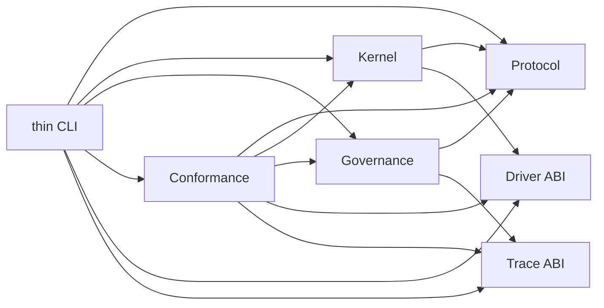

# PheroOS 全项目架构审计、解耦与清理完成记录

状态：已完成（2026-07-18）

审计基线：2026-07-16，`0.1.0` Draft ABI

性质：本文是原全项目 hardening plan 的非规范完成记录，用于说明审计问题、实施范围、
兼容策略和验收证据。协议真值仍由 `SPEC.md`、版本化 ABI 文档、checked-in schemas、
TCK 和 conformance 决定；本文不再承担第二套规范职责。

适用范围：Protocol、Kernel、Governance、Driver、Trace、Conformance、CLI、schemas、
provider-free examples、tests、CI、供应链和项目文档。

权威配套文档：

- [API lifecycle](api-lifecycle.md)
- [Schema v1/v2 migration](schema-v1-v2-migration.md)
- [Removal ledger](removal-ledger.md)
- [Release checklist](release-checklist.md)
- [Hybrid Pheromone ABI](../protocol/hybrid-pheromone-abi.md)
- [Optimal Commit ABI](../protocol/optimal-commit-abi.md)

## 1. 完成结论

本次整改没有把 PheroOS 降级为最小评分补丁，也没有把协议收紧成封闭的 agent framework。
完整 Hybrid Pheromone、Optimal Commit、Distributed Finality、Trace lineage 和 conformance
语义均被保留，并围绕生产级作用域、权威状态、原子提交、版本治理和独立证明完成硬化。

最终结构满足四个目标：

| 目标 | 完成结果 |
| --- | --- |
| 对内低耦合 | package/private import graph 以静态 Tarjan SCC gate 保持为 DAG；records、invariants、schema、evaluation、store 和 facade 分层 |
| 对外高聚合 | 外部 runtime 继续使用六个 package facade、版本化 schema、CLI、TCK 和 conformance；Governance 527 个兼容导出与 Conformance 33 个导出均由静态 lazy facade 保持身份 |
| 高可扩展性 | Driver、StateStore、TraceStore、TCK adapter 和非权威 extension 都有显式、provider-neutral contract；改变 commit truth 的扩展必须版本化 |
| 结构整洁 | 巨型 Governance/Trace/TCK 聚合模块拆为单一职责私有域；旧全局权威隔离；D-01 至 D-18 全部有明确处置 |

严格性只施加在 authority-critical 路径：scope、evidence、permission、head、CAS、certificate、
output 和 critical version 必须 fail-closed。metadata、provider implementation、持久化 backend、
非权威 proposal 与未声明 swarm 的 baseline protocol 仍保持开放。因此，本次改进增强了可扩展性，
没有强迫所有协议采用同一 swarm/commit profile。

## 2. 审计问题与关闭结果

| 原风险 | 等级 | 最终处置 |
| --- | --- | --- |
| tenant/run scope 未贯穿全部 ABI | P1 | 建立 canonical `RuntimeScope`/`scope_ref`，贯穿 Kernel、Driver、Governance、Trace 与 conformance |
| 权威依赖 module-global dict、cursor、object identity | P1 | 建立 `GovernanceStateStore`、显式 head/revision/CAS、snapshot/rehydrate/retire/tombstone contract；旧 registry 进入 `_legacy` |
| state 与 Trace 非原子 | P1 | 建立 `GovernanceCommitBatch`/receipt 与 prepare/commit/verify/finalize 原子 Hybrid transition |
| Driver 注册丢 subtype 字段、静默覆盖、调用绑定不足 | P1 | descriptor 文档版本化；冲突拒绝；request/result 绑定 scope、operation、digest、invocation 与 idempotency |
| 未知 `protocol_version` fail-open | P1 | loader 和 conformance 对未知 critical version fail-closed，并返回稳定 diagnostic code/path |
| TCK adapter 可读取 expected 并自证 | P1 | TCK v2 request 不含 expected；独立 stdlib JSONL oracle 和 adversarial adapter harness 均 fail-closed |
| 用户 manifest 检查未证明派生语义 | P1 | manifest-derived checks 与 profile 注册表从实际 policy 计算，mutation tests 可感知行为变化 |
| 公共 ABI 只冻结名称 | P2 | checked-in inventory 同时冻结 signature、dataclass fields/defaults、enum、constant、alias、owner 与 error shape |
| Core 缺少 durable-state contract | P2 | 仅定义 provider-neutral store/CAS/atomic ABI 与 in-memory conformance 实现，不引入数据库 |
| Governance、Trace、TCK 聚合模块职责混合 | P2 | 拆分私有 domain engine；公共旧模块保留薄兼容 facade；禁止 private engine 反向 import aggregate facade |
| Kernel availability 仅声明直通 | P2 | plan/document v2 显式绑定 scope、readiness、probe、capability 和 version，不从 v1 猜测权威字段 |
| Trace/TCK/diffusion 生命周期与性能无 gate | P2 | retirement cardinality、10k append/retire、diffusion scaling、TCK 与 cold-import 基线进入测试和 CI |
| CI、sdist、供应链和文档治理不足 | P3 | 17 个 CI jobs、Python 3.12/3.13/3.14、SHA-pinned Actions、exact constraints、wheel/sdist、SBOM/provenance 与 migration 文档闭环 |

## 3. 完成后的架构

### 3.1 Package 边界

依赖方向继续服从 protocol-core 边界：

- Protocol 仍是纯声明、schema 和 validation 层。
- Kernel 只做 capability、permission、connection、scope 和 plan materialization，不执行领域结论。
- Governance 拥有 authority/decision semantics，不拥有 provider runtime。
- Driver 只提供通用 capability lifecycle 和 invocation ABI。
- Trace 只提供 canonical event、append-only store 与 lineage validation。
- Conformance 可组合全部核心面，但核心包不反向依赖 conformance。
- CLI 只做版本选择、文件读取、结构化输出和 exit code 映射。

全 `pheroos` 静态 import graph、Governance private graph 和 Trace graph 都有 SCC 测试；任何新增循环、
aggregate-facade back-import 或隐藏 mutable registry 会在 CI 失败。

### 3.2 Governance 私有域

原大文件被收敛为薄 facade，实际实现按生命周期拆入：

- `_authority`：state head、CAS、atomic batch、snapshot、rehydration、retirement；
- `_risk`：threshold、risk chain、payload 与 invariant；
- `_commit`：context、assessment、certificate contract、replay 与 records；
- `_commit_state`：window、liveness、replay、payload 和 state invariant；
- `_support`：membership、lease、evaluation 与 replay；
- `_pheromone`：records、scoring、diffusion 与 lifecycle；
- `_swarm`：signals、scoring、pipeline、replay 与 trace；
- `_hybrid`：request、preflight、binding、attention、finality、output 与 trace；
- `_distributed`：membership、epoch、proposal、witness、certificate、state 与 finality；
- `_certificate`：local/portable certificate、outcome 与 invariant；
- `_schema`：foundation、commit、support、hybrid、distributed 和 certificate branches；
- `_legacy`：仅承载有明确退役版本的兼容实现。

公共 `commit.py`、`commit_state.py`、`distributed_commit.py`、
`hybrid_commit_evaluation.py` 和 `schema.py` 现在只承担聚合或 compatibility；算法只有一个私有权威实现。

### 3.3 对外高聚合面

推荐公共入口保持为：

- `pheroos.protocol`
- `pheroos.kernel`
- `pheroos.governance`
- `pheroos.drivers`
- `pheroos.trace`
- `pheroos.conformance`

Governance facade 保留 527 个既有导出身份，Conformance facade 保留 33 个既有导出身份；
两者都使用静态、线程安全的 lazy mapping。Commit TCK artifact 路径还会延迟可选 reference
adapter，避免为了资源校验加载 Governance engine。公共 API inventory 和 lifecycle artifact
固定 owner、shape、alias、兼容模块与退役信息，避免内部拆分泄漏给使用者。

## 4. 数据库管理与 API 管理结论

### 4.1 数据库边界

Core 不需要、也不应内置数据库。审计确认 runtime dependencies 仍为空，源码没有 ORM、SQL client、
database migration runtime、queue 或 server 依赖。

生产持久化通过 `GovernanceStateStore` contract 外置：

- canonical key 包含 tenant/run scope 与 authority domain；
- `expected_revision`/head 实现 compare-and-swap；
- state、Trace 和 receipt 在一个 atomic batch 中提交；
- retry 依赖 invocation/idempotency binding，不重复推进 authority；
- snapshot 可在新进程显式 rehydrate；
- retire 产生 tombstone，并对高基数 scope 做清理；
- in-memory 实现仅用于 reference、tests 和 conformance，不声称是生产数据库。

外部 backend 通过公开 `GovernanceStateStoreConformanceAdapter` 提供 fresh、checkpoint restore、
snapshot restore 与确定性 failure-injection fixture，并运行与 reference 相同的
`run_governance_state_store_conformance(...)` 矩阵。Trace 持久化则由独立 `TraceStore` Protocol
承载；外部实现通过 `TraceStoreConformanceAdapter` 与 `run_trace_store_conformance(...)` 证明
validation-before-write、顺序、不可变快照和 fresh-store 隔离。conformance adapter 只是测试夹具，
不会让 core 取得数据库或 provider lifecycle ownership。

StateStore 矩阵还以固定 32-worker 测试负载验证同批次幂等重试与冲突批次单一赢家；
worker 数不进入 provider ABI。因此“外部同一矩阵”包含真实 concurrency proof，
又不会把测试负载变成协议约束。

外部 PostgreSQL、SQLite、KV 或事务日志 adapter 可以替换，但必须通过同一 CAS、atomicity、restart、
concurrency、failure-injection 和 scope-isolation conformance。这样既补齐“数据库管理语义”，又不把
protocol-core 变成数据库产品。

### 4.2 API 边界

本仓库的 API 管理对象是 Python ABI、wire schema、Driver ABI、Trace ABI、CLI 和 conformance，
不是 HTTP endpoint。Core 没有 FastAPI/Flask、API gateway、API key store、rate limiter 或 provider SDK。

API lifecycle 现在由以下机制共同管理：

- package version 单一来源；
- frozen v1 schema roots 与 strict v2 schema-document IDs；
- exact reader dispatch，未知 critical version fail-closed；
- typed、non-lossy v1→v2 migration；
- public ABI inventory/lifecycle drift gate；
- structured diagnostic `code`、`path`、profile/report version；
- compatibility alias 的 replacement、deprecation 和 remove-after 记录；
- CLI `version`、`profile`、`schema`、`wire`、`tck`、`abi` 管理面。

如果外部产品需要 HTTP/API gateway，它应在独立 runtime 仓库中把这些 ABI 映射为 transport，不能把
server ownership 反向带入 PheroOS core。

## 5. 工作包完成情况

| 工作包 | 状态 | 主要交付 |
| --- | --- | --- |
| WP-A 基线与红测 | 完成 | scope、restart、CAS、atomic failure、Driver loss、unknown version、TCK expected leak、import SCC 等负向测试 |
| WP-B Version/report/scope spine | 完成 | 单一 `__version__`、Conformance Report v2、`RuntimeScope`、scoped trace 与 fail-closed protocol dispatch |
| WP-C Driver ABI v2 | 完成 | descriptor document v1/v2、无损迁移、冲突拒绝、scoped invocation/result、digest 与 idempotency |
| WP-D Authority domain/durable-state ABI | 完成 | `GovernanceStateStore`、head/revision、CAS、snapshot/rehydrate、retire/tombstone 与 in-memory reference |
| WP-E Atomic transition/Trace/output | 完成 | atomic batch/receipt 与 Hybrid prepare/commit/verify/finalize；失败不能留下半状态或伪造 output |
| WP-F Schema/Trace static contract | 完成 | 四个 frozen v1 roots、四个 strict v2 artifacts、Trace contract 拆分与生成物 drift gate |
| WP-G Governance engine 解耦 | 完成 | risk、commit、state、support、pheromone、swarm、hybrid、distributed、certificate、schema 私有域与 DAG gate |
| WP-H Public facade/API lifecycle | 完成 | Governance 527-export 与 Conformance 33-export lazy facade、六 facade inventory、shape/owner/alias/compatibility lifecycle artifacts 与 cold-import budget |
| WP-I TCK v2/独立证明 | 完成 | expected-free JSON/JSONL protocol、独立 stdlib oracle、adversarial adapters、manifest mutation proof |
| WP-J Legacy canonicalization/删除 | 完成 | legacy authority 隔离、canonical owner/codec、D-01 至 D-18 removal ledger、完成计划文档收口 |
| WP-K 性能/CI/发布/供应链 | 完成 | Python 3-version matrix、lint/type、性能、wheel/sdist external-CWD、reproducibility、SBOM 和 provenance gates |

工作包按 authority spine → adapter → atomicity → decomposition → compatibility → cleanup 的顺序完成，
因此没有通过临时 fallback 或双实现来换取测试通过。

## 6. 关键实施结果

### 6.1 Scope、并发与重启

- 同名 tenant/run/target 在不同 scope 中不会共享 head、idempotency result 或 Trace。
- 同一 invocation 的并发重试只产生一个 authoritative transition；不同 payload 复用 key 会被拒绝。
- CAS conflict、commit failure 和 Trace failure 都有 failure-injection 覆盖。
- serialized snapshot 在新 store 中恢复后，current head、revision、receipt 和 lineage 仍可验证。
- retire 后旧 scope 不再可写，并以 tombstone 明确区分“从未存在”和“已退役”。

### 6.2 原子 Hybrid Commit 与最终输出

Hybrid evaluation 采用四阶段边界：

1. `prepare` 只形成 typed proposal 和预期 head，不获得 authority；
2. `commit` 以 CAS 原子写入 state、Trace 和 receipt；
3. `verify` 从 committed receipt/head 重建并验证 finality/certificate；
4. `finalize` 只在 evidence、stop、permission、scope 和 publication contract 全部满足后授权 output。

attention、pheromone、learned/evolutionary/metacognitive layer 仍只能影响 proposal 或 priority；它们不能
创建 evidence、绕过 permission 或直接 commit。deadline、失败或无共识会产生声明过的 fallback/terminal
envelope，而不是无限 pending，因此 multi-agent 交互仍能获得可交付最终结果。

### 6.3 Schema 与版本迁移

旧的以下 `$id`/bytes 被永久冻结：

- `schemas/capability.schema.json`
- `schemas/protocol.schema.json`
- `schemas/driver.schema.json`
- `schemas/kernel.schema.json`

新增严格版本化 artifacts：

- `schemas/capability-v2.schema.json`
- `schemas/protocol-v2.schema.json`
- `schemas/driver-v2.schema.json`
- `schemas/kernel-v2.schema.json`

Capability/Protocol 的 schema-document version 与 payload `pheroos.protocol.v1` 分离；Driver descriptor
version 与 provider version 分离；Kernel plan discriminator 也独立。v1 reader 不静默补 authority 字段，
升级到 v2 必须显式提供 scope/readiness/probe/capability/version 等新增信息。

### 6.4 TCK 与 conformance

- TCK v1 的 38-case artifact root 保持冻结：
  `sha256:0e9cd7fd56087d5cc4987d5a7ed056ed6649512c30ee486685e3dbd45e8b7abe`。
- TCK v2 request 不传 expected，response 只提交可验证结果。
- reference adapter 与独立 stdlib spec adapter 不共享 decision evaluator。
- echo、constant、malformed、out-of-order、timeout 和 cross-request-state adapter 均不能伪造 PASS。
- source conformance 注册表对 active profile 禁止隐式 skip/N/A/no-op PASS。
- Conformance Report v2 公开 profile/version、structured diagnostics 和稳定聚合结果。

### 6.5 清理与兼容

[Removal ledger](removal-ledger.md) 的 18 项均已作出最终处置：

- D-01 至 D-14 为 `removed`，替代路径已成为唯一公共实现；
- D-15 至 D-17 为 `versioned-deferred`，只能在声明的 ABI/package 版本门槛后删除；
- D-18 为 `retained-with-reason`，仍承担受限的历史兼容职责。

本次一周清理冻结在 D-06 至 D-14 以及第一层 swarm-conformance 移除；第三层
facade 收缩不属于本轮范围。`versioned-deferred` 是有 remove gate 的兼容决策，
不是未完成实现。

## 7. 扩展性与“协议过严”评估

| 扩展类型 | 策略 | 原因 |
| --- | --- | --- |
| namespaced metadata | 开放并可 round-trip | 不进入 authority root，不影响 commit truth |
| Driver/provider adapter | 开放 | 通过 descriptor、probe、bind、invoke、Trace 和 conformance 约束能力，不绑定厂商 |
| StateStore/TraceStore backend | 开放 | backend 可替换，但 CAS、atomicity、scope 和 lineage 语义稳定 |
| scout/layer/policy adjustment proposal | 开放但有 typed bounds | 允许创新和探索，不允许 proposal 直接获得 authority |
| 新非权威 conformance adapter | 开放 | 必须输出标准 request/response 并通过 adversarial harness |
| 改变 evidence/permission/commit/output truth | 必须版本化 | 防止运行时 hook 绕过协议和造成不可重放分叉 |

这一区分避免了两个极端：既不允许任意 callback 改写 authority，也不把 provider、存储、群体策略和
metadata 固定成单一实现。Baseline quorum-only manifest 继续通过原路径；swarm、Hybrid 和 Optimal
Commit 检查只在 manifest 显式声明时启用。

最终输出没有因为严格验证而更难获得：协议要求的是“成功 commit 或声明的安全 fallback 都必须
产生 terminal envelope”，而不是“任何不确定性都永久阻塞”。只有 evidence/permission/stop/scope
不满足时禁止伪装成功；失败本身仍是可追踪、可交付、可恢复的协议结果。

## 8. 验收证据

### 8.1 功能与结构

- 全量本地 suite：`1365 passed`（包含 lazy facade、跨进程 pickle、兼容生命周期与生成发行物后的供应链绑定检查）。
- Source conformance v3：9/9 通过，包含可复用的 StateStore/TraceStore adapter 矩阵。
- Toy、E2E、Swarm、Hybrid Pheromone、Hybrid Commit 和 Distributed examples 全部通过。
- TCK v1 38 cases 与 TCK v2 reference/independent/adversarial matrix 全部通过。
- 全 package、Governance private 和 Trace import SCC 检查通过。
- 四个 frozen v1 schema 与四个 strict v2 schema generator/drift checks 通过。
- public API inventory、Governance export 和 Commit TCK generators 均无漂移。
- public API type identity 在 Python 3.12、3.13、3.14 间屏蔽 `pathlib` 私有实现模块漂移，
  冻结 artifact 保持公共类型名且不需要版本升级。
- Critical Ruff `E9,F63,F7,F82` 与声明的 incremental Mypy scope 通过。
- Core runtime dependencies 仍为空；数据库、HTTP server、provider SDK、queue/worker 扫描为零。

### 8.2 性能与生命周期

- Governance cold import median 约 3 ms，低于 120 ms hard budget；只加载少量实现模块。
- manifest reference check 约 1 ms；完整 92-evaluation TCK v1 约 1.42 s；TCK v2 约 0.04 s。
- append 10k Trace 约 0.10 s；retire 10k scopes 约 0.13 s。
- diffusion double-size ratio 约 1.99，未出现非预期超线性退化。
- Hybrid/Distributed conformance 均低于冻结 hard ceiling；性能基线不能通过提高 ceiling 静默放宽。
- authority SHA-256 校验收敛到单一严格 validator；普通字符串语义、调用方错误契约和
  TCK roots 不变；`str` 子类仍按底层纯字符串判定，不能通过覆写切片行为跨版本绕过。
- TCK v1 gate 对 92 次 evaluation 的完整运行取中位数，并用父进程与已完成隔离子进程的
  process-tree CPU time 判定；不取最小值、不裁向量，也不提高 3.20 秒 hard ceiling。
- artifact 中审计前 TCK 样本保留原始 wall-clock 量纲并显式标记为不可与新的
  process-tree CPU 样本直接比较；冻结门禁和硬阈值统一使用后者。

这些数值是本机验收样本；CI 以 [reference performance artifact](reference-performance-v1.json) 的
固定预算判定，不把单次绝对耗时当作跨平台承诺。

### 8.3 发行与供应链

- wheel 与 normalized sdist 使用 exact-pinned backend、`SOURCE_DATE_EPOCH=315532800` 构建。
- 第二次独立构建的 wheel/sdist 文件名和 SHA-256 均逐字节一致。
- wheel 与 exact normalized sdist 分别安装到独立 venv，并从源码树外执行 `pip check`、version、
  validate、Toy/Swarm/Hybrid conformance、source conformance、四类 v2 schema export 和 TCK v1/v2。
- CycloneDX 1.6 与 SPDX 2.3 SBOM 绑定经过外部验证的确切 distribution bytes。
- GitHub Actions 使用完整 40-character SHA；默认权限为 `contents: read`，只有可信 main push 的
  provenance job 获得最小 attestation 权限。
- CI 包含 17 个显式 jobs，覆盖 Python 3.12、3.13、3.14、lint/type、schema/API drift、TCK、scope、
  restart/atomicity、import DAG、performance、wheel/sdist、SBOM 和 provenance。

### 8.4 Definition of Done 证据索引

| DoD 要求 | 当前权威证据 |
| --- | --- |
| Package/private graph 无未批准 SCC | `tests/conformance/test_package_import_graph.py`、`tests/governance/test_private_import_graph.py`、`tests/trace/test_static_contracts.py` |
| Facade 不拥有算法且保持 lazy/identity | Governance 与 Conformance 的 lazy/decomposition tests、`tests/conformance/test_lazy_facade.py`、public API artifacts |
| tenant/run scope 端到端隔离 | `tests/kernel/test_runtime_scope.py`、`tests/drivers/test_driver_invocation.py`、`tests/conformance/test_runtime_scope_contract.py`、`tests/trace/test_scoped_trace.py` |
| 无新 module-global authority | `tests/governance/test_legacy_authority_isolation.py` 与 static graph/registry scans |
| restart/rehydrate/CAS/retire/tombstone | `tests/governance/test_authority_ledger.py`、`tests/conformance/test_authority_ledger_contract.py`；同一矩阵由外部 adapter fixture 实际调用 |
| TraceStore 可替换且保持 append-only/快照语义 | `pheroos.trace.TraceStore`、`tests/trace/test_trace_store_protocol.py`、`tests/conformance/test_trace_store_contract.py` |
| state 与 Trace atomic | `tests/governance/test_atomic_hybrid_commit.py` 的 success、CAS conflict、state failure 与 Trace failure matrix |
| Core 无数据库/server/provider runtime | runtime dependency 为空；CI source-surface/domain-neutrality checks 与禁用依赖扫描 |
| unknown critical version fail-closed | `tests/conformance/test_protocol_version_fail_closed.py`、`tests/protocol/test_schema_versioning.py` |
| Driver round-trip/冲突/invocation binding | `tests/drivers/test_driver_schema_versions.py`、`tests/drivers/test_driver_lifecycle.py`、`tests/drivers/test_driver_invocation.py` |
| Public ABI shape 与 lifecycle | `tests/test_public_api_contract.py`、`tests/test_public_api_inventory.py`、`tests/conformance/test_public_api_lifecycle.py` |
| frozen v1 与 strict v2 schema | schema generator `--check`、`tests/cli/test_schema_version_surfaces.py`、Protocol/Driver/Kernel schema-version tests |
| TCK expected 不可见且有独立 oracle | `tests/conformance/test_commit_tck_v2.py`、v2 JSONL spec adapter 与 adversarial adapter cases |
| Active profile 不得 skip/N/A/no-op PASS | source conformance registry checks、profile mutation/negative tests |
| D-01 至 D-18 有最终状态 | [Removal ledger](removal-ledger.md)；状态集合只允许 `removed`、`retained-with-reason`、`versioned-deferred` |
| README/SPEC/process 无死链 | `tests/test_documentation_links.py`，同时验证中英文 README entry-point parity |
| 性能和高基数生命周期 | `tests/performance/test_reference_performance_contract.py` 与 `scripts/check_reference_performance.py --check --quick` |
| wheel/sdist 外部消费者与可复现字节 | `tests/ci/test_distribution_reproducibility.py`、CI `wheel-sdist-external-cwd` job |
| exact-artifact SBOM/provenance | `tests/ci/test_supply_chain.py`、`scripts/check_ci_supply_chain.py --check`、CI supply-chain/provenance jobs |

以上证据均在最终 worktree 上重新执行；广义完成声明不依赖单一窄测试或仅凭源码搜索推断。

## 9. 完成边界与后续版本

本计划的整改目标已经完成。package version 仍是 `0.1.0` Draft ABI；本次是源代码 hardening 与集成，
不是擅自创建发布 tag 或宣告稳定 ABI。未来版本只能在以下条件下继续演进：

- 改变 authority truth 时发布新的版本化 schema/TCK/profile；
- 兼容 alias 按 lifecycle 和 removal ledger 的 remove gate 退役；
- 新数据库、server、provider runtime 保持在 core 外部；
- 新 adapter 通过现有 scope、atomicity、restart、lineage 和 adversarial conformance；
- baseline protocol 不被强制升级为 swarm/Hybrid/Optimal Commit。

后续若出现新缺陷，应建立新的短期 issue/plan 并链接规范；不要重新把本文扩张成长期并行规范。

## 10. 最终原则

PheroOS 的可扩展性来自小而明确、版本化、可替换并可验证的 ABI，而不是更多 Manager、hook、
动态 registry 或 app runtime。

内部只有一个规则所有者、显式状态和单向依赖；外部看到高聚合 facade、稳定 schema、清晰 adapter
contract 和可执行 conformance。删除以替代、迁移和版本证据为前提，不以行数或“仓内暂无引用”为依据。

Agents are not authority. Protocol is authority.
