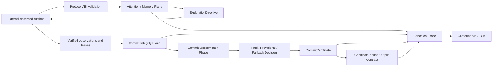

# PheroOS Commit Integrity ABI 方案

状态：提案（下一阶段 Draft ABI）

方案日期：2026-07-11

完整实施、no-downgrade、bounded-liveness、counterevidence、risk 与
distributed finality 的交付计划见
[optimal-commit-full-hardening-plan.md](optimal-commit-full-hardening-plan.md)。
若本文的阶段性措辞与完整计划冲突，以完整计划为准；manifest 激活可以是可选的，
但完整 ABI release 的交付范围不可删减。

研究输入：用户提供的《昆虫群体决策逻辑与 PheroOS 提交条件设计》

适用范围：`pheroos.protocol`、`pheroos.governance`、`pheroos.trace`、
`pheroos.conformance`、provider-free examples、CLI schema/export、测试与迁移文档

说明：研究报告中的 `turn...` 引用标记是研究工具内部标识，本方案把报告作为设计输入，
不把这些标记当作已独立复核的正式文献引用，也不将其复制进协议规范。

## 0. 执行结论

PheroOS 下一阶段不应继续把新能力叠加到一个更复杂的 collective score 上。

推荐新增 **Commit Integrity ABI**，把现有 Hybrid Pheromone ABI 明确定位为
“探索、注意力分配和集体记忆平面”，再增加一个独立的
“证据资格、稳定性与提交权平面”。

核心规则是：

> Pheromone 决定接下来去哪里看；独立证据、有效支持租约、来源多样性、
> 稳定窗口、target/action-scoped stop 与明确 authority 决定何时可以 commit。

研究报告中的最重要约束可写成：

`Commit = E + S + D + Margin + Stability + StopOK + Authority`

其中：

- `E` 是按 independence group 封顶后的有效证据量；
- `S` 是按已验证 principal cluster 去重后的有效支持租约数；
- `D` 是有效证据的来源域多样性；
- `Margin` 是候选相对其他候选的最低证据领先边际；
- `Stability` 是以上门槛在连续逻辑步内保持成立；
- `StopOK` 必须同时绑定 target 和 action；
- `Authority` 必须来自协议与治理验证，不能是 agent 自报布尔值。

Recruitment、soft inhibition、pheromone 和 layer advice 不进入 commit 真值。
它们只有在促成新的有效 observation 或新的有效 support lease 后，才能间接改变提交条件。

## 1. 为什么这是 PheroOS 的正确下一步

### 1.1 当前 Hybrid 基线已经完成

现有项目已经具备：

- declared target、declared candidate 和 safe fallback；
- governance-issued signal verification 和权威快照；
- pheromone deposit、evaporation、diffusion、feedback reinforcement；
- nonlinear response、exploration/reopen、L1-L4 proposal 与 bounded adjustment；
- replay receipt、causal fingerprint、append-only trace lineage；
- manifest-driven conformance profile；
- provider-free、network-free 示例；
- 完整的 schema、public ABI、wheel 和 source-boundary 验证。

这些能力不应被推倒重建。它们应继续成为 Commit Integrity ABI 的
Hybrid exploration/memory substrate。

### 1.2 当前 commit 语义与研究结论冲突

当前 `score_candidates(...)` 会把以下通道合并到同一个候选分数：

- scout support；
- recruitment；
- inhibition；
- pheromone；
- governed layer contribution。

随后 `_decide_collective_state(...)` 在 independent scout 数满足时，
以 blended score 是否达到 `quorum_threshold` 决定 commit。

因此，在 evidence 与 scout 集合不变时，仅改变 pheromone、recruitment 或 layer proposal，
仍可能改变 commit 结果。研究报告明确要求这类社会放大和环境记忆只影响探索，
不能获得认识论提交权。

这不是一个小型 scoring hardening 问题，而是需要版本化处理的 authority semantic change。

### 1.3 当前可复用基础与新增缺口

| 领域 | 当前基础 | Commit Integrity 缺口 |
| --- | --- | --- |
| Candidate | target-scoped declaration 与 safe fallback | 无需新候选系统 |
| Scout | identity、evidence id、provenance、verification | 缺 observation、independence group、source domain、TTL、nonce |
| Evidence | `EvidenceGraph` 检查 node 与 provenance | 未绑定 target/candidate、claim、payload hash、root |
| Identity | governance-issued signal verification | 未按 principal cluster 折叠 Sybil 身份 |
| Support | scout support 与 collective score | 没有可过期、可撤销、可切换的 `SupportLease` |
| Stability | 单步 score threshold | 没有 margin、连续窗口或 pending phase |
| Stop | `StopResolution(target, action, ...)` | commit/output 消费路径未严格按 action 隔离 |
| Permission | output 接收 caller bool | 缺 target/action-bound authoritative permission snapshot |
| Replay | Hybrid trail/feedback/adjustment receipt | 缺 observation、lease、witness、certificate replay |
| Decision | governance-issued `QuorumDecision` | 无 pending/provisional/final/fallback kind 与 certificate |
| Trace | Hybrid lifecycle lineage 完整 | 缺 evidence、lease、phase、certificate lineage |
| Conformance | core/swarm/hybrid v1 profile | 缺 channel-separation、E/S/D、stability、certificate TCK |

## 2. 对研究建议的取舍

### 2.1 直接采纳

- recruitment 不是 evidence；
- pheromone 是可衰减 collective memory，不是 truth；
- independent evidence 需要 correlation/independence-group cap；
- support 必须使用 lease，而不是永久票；
- source diversity 与 evidence amount 是不同门槛；
- 单步达标只能进入 pending，不能立即 commit；
- commit stop 与 publish stop 必须按 target/action 隔离；
- observation、lease、feedback、witness 都需要 replay protection；
- commit 与 mobilization、publish 必须分离；
- distributed final commit 需要 witness/certificate，而不是共享布尔值。

### 2.2 按 protocol-core 边界调整

| 研究建议 | PheroOS 采用方式 |
| --- | --- |
| wall-clock TTL | v1 使用调用方提供的逻辑 step/epoch；wall clock 映射由外部 runtime 完成 |
| 身份签名与 Sybil 判断 | Core 只定义 attestation/verification ABI；PKI、身份服务与聚类在外部 |
| 风险公式动态调阈值 | v1 由 manifest 直接声明最终阈值；不让 runtime layer 调整 commit gate |
| soft evidence decay | v1 先采用 hard TTL，避免跨实现浮点衰减歧义 |
| 大规模模拟实验 | Core 只保留 deterministic TCK vectors；Monte Carlo/环境模拟留在外部 |
| MCP/A2A/OPA/PROV 集成 | 只写 provider-neutral mapping contract，不引入 SDK、client 或 server |
| worker mobilization | Commit certificate 是 core 终点；调度、执行与传播属于外部 runtime |

### 2.3 完整实现前必须固定的 threat model

以下能力不得在缺少规范时拍脑袋落地，但都属于完整 ABI 的必交付范围：

- membership 动态变化下的 support ratio；
- risk coefficient 的运行时自适应；
- Byzantine fault 数与 quorum intersection；
- clock skew 与跨节点 wall-clock finality；
- cryptographic signature suite negotiation；
- network partition detection；
- 多节点证书收集和持久化。

实现前必须先声明 membership snapshot、fault model、epoch 和恢复规则；
阶段依赖不等于范围延后或可删除。

## 3. 目标架构

### 3.1 Attention / Memory Plane

复用现有 Hybrid Pheromone ABI：

- scout discovery；
- recruitment demand；
- soft inhibition；
- pheromone deposit、evaporation、diffusion 与 feedback；
- nonlinear response；
- novelty、stale route reopen；
- layer proposals 与 metacognitive coordination。

该平面的权威输出应逐步从 `candidate score` 改为：

- `ExplorationDirective`；
- candidate/route priority；
- bounded exploration budget；
- requested scout role；
- reopen eligibility；
- caution/alarm pressure。

它不得签发 commit。

### 3.2 Epistemic Plane

负责把 runtime observation 提案变成可计入的 evidence：

- principal verification；
- target/candidate binding；
- independence group；
- source domain；
- quality/relevance qualification；
- payload/claim hash；
- provenance；
- nonce、TTL 和 replay receipt；
- canonical evidence root。

### 3.3 Commitment Plane

只消费已经验证的：

- observations；
- evidence bindings；
- support leases；
- stop resolution；
- action permission；
- prior commit window/replay state。

输出：

- per-candidate `CommitAssessment`；
- `DecisionPhase`；
- governance-issued decision；
- 当前 assurance 要求的 `CommitCertificate` 或 typed outcome certificate。

### 3.4 Publication Plane

扩展现有 Output Contract。发布必须同时绑定：

- final decision/certificate；
- protocol-declared candidate；
- evidence root；
- output/claim digest；
- target + `publish` stop resolution；
- target + `publish` permission；
- fallback publication policy。

Provisional decision 永远不能 publish。

## 4. 不可协商的不变量

1. Agents are not authority. Protocol is authority.
2. Pheromone、recruitment、soft inhibition 和 layer advice 不得直接改变 commit 真值。
3. 固定 observations、leases、stops、permissions 和 prior commit state 时，
   改变 exploration/memory 输入不得改变 commit result。
4. 只有 declared candidate 可以接受 observation、lease、witness 或 certificate。
5. 所有 authority-bearing input 必须同时绑定 protocol、target、action/subject 和 lineage。
6. Observation 必须绑定 target 与 candidate；只绑定 target 不足以计入证据。
7. 同一 independence group 的总贡献不得超过 manifest cap。
8. Principal 数量按 governance-verified cluster 去重，不按 caller 字符串去重。
9. Support lease 必须引用有效 observation/evidence；裸 candidate support 不计入。
10. Expired、revoked、replayed 或 equivocated observation/lease 不计入。
11. 第一次达到门槛只能进入 `QUORUM_PENDING`。
12. Stability window 必须由 governance-issued prior state 连续推进；调用方不能伪造历史。
13. Commit stop 和 publish stop 必须按 target 与 action 精确匹配。
14. Safe fallback 必须是 declared safe fallback，并明确标记 `decision_kind=fallback`。
15. Fallback 不得伪装成 evidence-backed conclusion。
16. Commit threshold、evidence qualification 和 certificate 规则不能由 learned/evolutionary layer 调整。
17. Certificate 的 candidate、epoch、manifest、evidence root、lease root、threshold snapshot、
    stop snapshot 任一被修改都必须失效。
18. Distributed conflict 或不完整 finality 只能产生 provisional，不得授权 output。
19. 所有 canonical hash 输入必须版本化、有限、稳定排序且 provider-neutral。
20. Baseline、toy、e2e、basic swarm 和 Hybrid v1 不得被强制升级。

## 5. Protocol ABI

### 5.1 显式 opt-in

在 `ProtocolManifest` 增加可选：

`collective_commit_policy: CollectiveCommitPolicy | None`

规则：

- 缺少该字段时，继续选择现有 core/swarm/Hybrid v1 profile；
- 字段存在时，必须选择新的 commit profile；
- 不允许仅添加字段但仍运行旧 score-to-commit evaluator；
- 不允许根据启发式 feature detection 静默改变旧 manifest 语义。

推荐第一版 profile：

`pheroos-hybrid-commit-v1`

现有 `pheroos-hybrid-swarm-v1` 保持不变并进入 documented legacy Draft 状态。

### 5.2 `CollectiveCommitPolicy`

第一版完整字段：

| Field | 语义 |
| --- | --- |
| `target` | active target |
| `model` | 固定为 `evidence_bound_v1` |
| `evidence_threshold` | 最低独立证据量 E |
| `minimum_support_clusters` | 最低有效 lease cluster 数 S |
| `source_diversity_threshold` | 最低来源域数 D |
| `independence_group_cap` | 单一相关证据组上限 |
| `minimum_margin` | 领先第二候选的最低 E margin |
| `stability_window_steps` | 连续满足门槛的逻辑步数 |
| `observation_ttl_steps` | observation hard TTL |
| `support_lease_ttl_steps` | lease hard TTL |
| `deliberation_deadline_steps` | 未形成稳定决策前允许 deliberation 的最大步数 |
| `fallback_candidate` | declared safe fallback |
| `distributed_policy` | manifest 激活可选；完整 ABI release 的实现与 TCK 必交付 |

阈值必须是 manifest 的权威最终值。第一版不实现 runtime risk formula，
也不允许 `PolicyAdjustmentProposal` 修改以上字段。

### 5.3 `DistributedCommitPolicy`

只有 Phase 5 启用，至少声明：

- membership snapshot requirement；
- witness threshold；
- minimum witness cluster diversity；
- minimum witness source-domain diversity；
- epoch policy；
- witness TTL；
- certificate conflict policy；
- provisional/finalization rule。

在 quorum intersection 与 fault model 未定义前，不得仅凭“3–7 个 witness”宣称 split-brain safety。

## 6. Governance ABI

建议在现有顶层 package 内增加小型 owner modules，而不是继续扩大
`collective.py`：

- `pheroos.governance.principal`
- `pheroos.governance.observation`
- `pheroos.governance.support_lease`
- `pheroos.governance.commit`
- `pheroos.governance.certificate`

### 6.1 身份与 observation

`PrincipalAttestation`：

- `principal_id`
- `attestation_ref`
- `method`
- `issuer_id`
- `issued_at_step`
- `expires_at_step`
- `provenance`
- `trace_event_id`

`PrincipalVerification` 必须由 governance 签发，并增加：

- `cluster_id`
- verified issuer/method snapshot；
- canonical attestation fingerprint；
- authority issuance snapshot。

Cluster 不能由 agent 自报后直接计数。

`ObservationAttestation`：

- `observation_id`
- `target`
- `candidate_id`
- `principal_id`
- `independence_group`
- `source_domain`
- `quality`
- `relevance`
- `payload_hash`
- `claim_hash`
- `provenance_ref`
- `nonce`
- `observed_at_step`
- `ttl_steps`
- `trace_event_id`
- governance-issued verification。

Quality 与 relevance 不能仅靠 agent 自报获得权威；verification 必须绑定最终计入值。

### 6.2 Evidence binding

`EvidenceBinding`：

- `binding_id`
- `target`
- `candidate_id`
- sorted observation fingerprints；
- `evidence_root`
- `claim_hash`
- `protocol_id`
- version。

第一版不需要引入 Merkle-tree dependency。可以使用标准库 SHA-256：

1. 对每个 observation 生成 versioned canonical JSON leaf；
2. 按 leaf fingerprint 稳定排序；
3. 对完整 versioned leaf list 计算 root；
4. 拒绝 NaN、Infinity、unknown authority fields 和 duplicate nonce。

### 6.3 Support lease

`SupportLease`：

- `lease_id`
- `target`
- `candidate_id`
- `principal_id`
- `principal_cluster_id`
- `evidence_refs`
- `issued_at_step`
- `ttl_steps`
- `revoked_at_step`
- `nonce`
- `provenance`
- `trace_event_id`
- governance-issued verification。

规则：

- lease 必须引用当前 candidate 的有效 evidence；
- 同一 cluster 同时支持互斥候选视为 equivocation；
- equivocation 必须 fail-closed，并产生 trace；
- lease switching 必须先撤销旧 lease，再签发新 lease；
- expired/revoked lease 不进入 S；
- `S` 按 cluster 去重。

### 6.4 Commit assessment

`CandidateCommitMetrics`：

- `evidence_weight`；
- `support_clusters`；
- `source_diversity`；
- `evidence_margin`；
- `active_observation_ids`；
- `active_lease_ids`；
- `evidence_root`；
- `lease_root`；
- 每个 gate 的 bool 与 reason；
- `excluded_channels`，固定包含 recruitment、inhibition、pheromone、layer advice。

`CommitAssessment`：

- target；
- current step/epoch；
- per-candidate metrics；
- leading candidate；
- threshold snapshot；
- stop snapshot；
- permission snapshot；
- replay/equivocation findings；
- readiness result。

### 6.5 Phase 与 authority state

`DecisionPhase` 第一版只覆盖 core 拥有的状态：

- `SEARCH`
- `DELIBERATE`
- `QUORUM_PENDING`
- `COMMITTED`
- `SAFE_FALLBACK`
- `BLOCKED`
- `PROVISIONAL`

`MOBILIZING`、`EXECUTING`、`VERIFYING` 属于外部 runtime，不进入 core state machine。

`CommitWindowState` 必须：

- 由 governance 从上一 step 签发；
- 绑定 protocol、target、policy fingerprint 与 epoch；
- 记录 leading candidate、consecutive ready steps 和 assessment roots；
- 在 step 不连续、policy 改变、gate 失败或 leader 改变时 reset；
- 使用 authority snapshot 防止 caller 伪造稳定历史。

`CommitReplayState` 负责 observation、lease、witness、certificate receipt，
与现有 `HybridReplayState` 分离，不能把 pheromone replay memory 当成 commit authority。

### 6.6 Decision 与 certificate

`CollectiveCommitDecision` 不复用一个含糊的 `committed: bool` 表达所有状态。

建议字段：

- `decision_kind`: `pending | evidence_commit | safe_fallback | blocked | provisional`
- `target`
- `candidate_id`
- `final`
- `reason`
- `assessment_fingerprint`
- `certificate_id`
- governance issuance snapshot。

`CommitCertificate`：

- certificate/protocol/schema version；
- protocol id 与 manifest hash；
- target/candidate/decision kind；
- epoch；
- evidence root；
- lease root；
- window/assessment root；
- threshold snapshot；
- stop snapshot；
- commit permission snapshot；
- witness root（distributed only）；
- issued logical step；
- governance issuer/attestation refs；
- canonical fingerprint。

现有 `QuorumDecision` 继续服务 legacy profile。新 profile 可提供只读 compatibility adapter，
但不得丢失 pending/fallback/provisional/finality 语义。

## 7. Reference semantics

### 7.1 Observation validity

Observation 只有同时满足以下条件才有效：

- principal verification authoritative 且未过期；
- target/candidate 与 active decision 匹配；
- provenance、payload hash、claim hash 非空；
- observation id 与 nonce 未被不同 payload 重用；
- current step 未超过 TTL；
- quality/relevance 有限且在声明范围内；
- evidence binding root 可重建。

相同 nonce + 相同 canonical payload 是幂等 replay；相同 nonce + 不同 payload 必须 fail-closed。

### 7.2 E、S、D 与 margin

对候选 j：

`E(j) = sum over groups(min(group_cap, sum(quality * relevance)))`

`S(j) = count(unique verified principal clusters with active evidence-bound leases)`

`D(j) = count(unique source domains among valid observations)`

`Margin(j) = E(j) - max(E(other candidates))`

第一版使用 hard TTL，不使用 soft time decay。所有输入排序、分组和浮点处理必须有
规范 reference semantics，并拒绝非有限数值。

### 7.3 Ready gate

候选只有同时满足才进入 ready：

- E >= evidence threshold；
- S >= minimum support clusters；
- D >= source diversity threshold；
- Margin >= minimum margin；
- no replay conflict；
- no equivocation；
- evidence/lease roots valid；
- target + `commit` stop 显式 resolved 且未 blocked；
- target + `commit` permission authoritative 且 allowed。

### 7.4 Stability 与 fallback

- 第一次 ready：进入 `QUORUM_PENDING`；
- 同一 leader 在连续 step 中持续 ready：推进 window；
- 达到 `stability_window_steps`：签发 final evidence commit；
- leader 改变或任何 gate 失败：reset 到 `DELIBERATE`；
- 未到 deadline 且仍有探索预算：保持非 final；
- deadline/exhaustion 后仍无稳定 leader：签发 declared safe fallback；
- hard commit stop：进入 `BLOCKED`，不得用 ordinary fallback 绕过 stop。

Safe fallback certificate 必须明确其 decision kind，消费者不能把它解释为
“该候选已被 E/S/D 证明”。

## 8. Hybrid integration

### 8.1 新入口

推荐新增：

`evaluate_hybrid_commit_step(...) -> HybridCommitStep`

概念顺序：

1. 验证 manifest、active target、candidate set 和 profile；
2. 验证 prior Hybrid replay state 与 prior Commit state；
3. 运行现有 pheromone/layer reference semantics；
4. 生成 `ExplorationDirective`，不生成 commit score；
5. 验证 observations、principal attestations 和 leases；
6. 构建 evidence/lease roots 与 E/S/D/margin；
7. 验证 commit stop 和 permission；
8. 推进 stability window；
9. 产生 pending、final commit、blocked 或 safe fallback；
10. 必要时签发 certificate；
11. 发出完整 trace；
12. 返回两个互相隔离的 state：attention/memory 与 commit integrity。

### 8.2 迁移期 score 语义

现有 `score_breakdown` 在 v1 保持不变。

在新 profile 中：

- 改名或新建 `attention_breakdown`；
- `pheromone_score`、recruitment、inhibition 和 layer contribution 只能进入 attention lineage；
- `commit_metrics` 只包含 evidence/lease-derived categories；
- conformance 必须证明两者没有共享 authority-bearing numeric path。

最关键的 metamorphic test：

> 固定 observations、leases、stops、permissions、policy 与 prior commit state，
> 任意置换或改变 pheromone、recruitment 和 layer inputs，commit decision 必须不变。

### 8.3 Hard inhibition

Soft inhibition 只影响 attention/reopen。

需要阻断 commit 或 publish 的 hard inhibition 必须经过 governance resolution，
转化为 target/action-scoped stop。Layer 不能自行创建 authoritative stop。

## 9. Stop、permission 与 output

### 9.1 Stop verification

保留 `StopResolution` 作为兼容数据对象，但新 profile 应消费 governance-issued
`StopResolutionVerification`，其行为类似 `SignalVerification`：

- 绑定 target/action；
- 绑定 resolution payload fingerprint；
- 绑定 verifier authority、provenance 与 trace id；
- 防 caller 直接构造或篡改。

### 9.2 Action permission

新增 provider-neutral `ActionPermission`：

- target；
- action（至少 `commit` / `publish`）；
- allowed；
- issuer/policy ref；
- issued/expires step；
- provenance/trace；
- governance issuance snapshot。

OPA 或其他 policy engine 可以在外部产生决策，但 core 不引入 OPA client。
外部 adapter 负责验证外部响应，再调用 governance issuance boundary。

### 9.3 Certificate-aware output

新 output evaluator 必须验证：

- final certificate authoritative；
- certificate decision 不是 provisional/blocked；
- certificate candidate 仍是 declared candidate；
- output claim hash 与 evidence/decision binding 一致；
- `publish` stop resolution 精确匹配 target/action；
- `publish` permission 精确匹配 target/action；
- manifest 明确允许对应 decision kind 的输出。

Legacy output API 保持兼容，但不能被新 profile 用作 authority bypass。

## 10. Trace ABI

建议新增 built-in events：

| Event | 必须可重建的 lineage |
| --- | --- |
| `principal_attested` | principal、cluster、issuer、expiry、attestation fingerprint |
| `observation_recorded` | target、candidate、group、domain、quality、relevance、hash、nonce、TTL |
| `evidence_bound` | sorted observation fingerprints、claim hash、evidence root |
| `support_lease_issued` | principal cluster、candidate、evidence refs、TTL、nonce |
| `support_lease_revoked` | lease id、reason、replacement ref |
| `support_lease_expired` | lease id、issued/current step、TTL |
| `commit_metrics` | E/S/D/margin、gates、active ids、roots、excluded channels |
| `commit_window_advanced` | prior/current root、leader、consecutive steps、reset reason |
| `quorum_pending` | leader、required/observed window、threshold snapshot |
| `commit_certificate_issued` | certificate fingerprint 与全部 authority roots |
| `quorum_witness` | membership/epoch、local snapshot、evidence root、attestation |
| `commit_provisional` | missing finality/conflict reason |
| `output_decided` | certificate、claim/output hash、publish stop/permission snapshots |

Trace remains an append-only ABI，不变成 database、queue 或 monitor。

Canonical record 必须版本化。Event-specific contract、schema 和 conformance
必须同步新增，不能只把 event name 加入 allowlist。

## 11. Conformance 与 TCK

### 11.1 新 profile checks

建议 `pheroos-hybrid-commit-v1` 至少包含：

- `commit_policy_contract`
- `principal_attestation_contract`
- `observation_binding_contract`
- `support_lease_contract`
- `commit_metrics_contract`
- `commit_channel_separation`
- `commit_window_contract`
- `commit_authority_boundary`
- `commit_trace_contract`
- `commit_certificate_contract`
- `certificate_output_contract`

Distributed feature 另加：

- `distributed_membership_contract`
- `quorum_witness_contract`
- `certificate_conflict_contract`
- `provisional_output_denial`

### 11.2 必须包含的 TCK vectors

| Case | 预期 |
| --- | --- |
| 三个 observation 来自同一 group | E 不超过 group cap |
| 不同 principal id 属于同 cluster | S 只加一 |
| observation/lease expired | 不计入 commit |
| lease 未引用 evidence | 拒绝 |
| 相同 nonce 与相同 payload | 幂等、不重复计数 |
| 相同 nonce 与不同 payload | fail-closed |
| 同 cluster 同 epoch 支持互斥 candidate | equivocation，不能 commit |
| E/S/D 满足但 margin 不足 | pending/fallback，不 commit |
| 单步满足所有门槛 | 仅 `QUORUM_PENDING` |
| window 中间一步失败 | window reset |
| target B commit stop | 不影响 target A |
| target A publish stop | 不替代 target A commit resolution |
| pheromone 极高但无 evidence | 不 commit |
| 固定 evidence 后改变 pheromone | commit 结果不变 |
| layer support 极高但无 lease | 不 commit |
| certificate root 被修改 | 无效 |
| conflicting certificate 同 epoch | provisional only |
| provisional 进入 output | 拒绝 |
| input 任意排列 | root、metrics、decision、trace 一致 |
| legacy manifests | 原 profile 与结果保持不变 |

### 11.3 TCK artifact

在 `tests/fixtures/commit-integrity/` 或等价目录保存 provider-neutral JSON vectors。

允许：

- deterministic vector runner；
- mutation matrix；
- permutation/property tests；
- pure reference replay。

不允许：

- colony simulator runtime；
- worker/network harness；
- database；
- background clock；
- provider integration。

## 12. 分阶段实施路线

每个工作包都必须是 protocol + governance + trace + conformance + tests 的纵向切片。

### P0：语义 RFC 与兼容护栏

交付：

- 本方案转为 normative draft；
- 明确 v1 score semantics 与 vNext commit semantics；
- 增加 metamorphic negative tests，证明当前路径的差异；
- 决定 canonical hash envelope 和 profile version；
- 添加 migration skeleton。

验收：

- 无旧 manifest 被静默重解释；
- channel-separation invariant 有可执行测试；
- public ABI 变更台账完整。

### P1：Evidence-bound base vertical slice

交付：

- `CollectiveCommitPolicy`；
- principal verification；
- `ObservationAttestation`；
- `EvidenceBinding`；
- `SupportLease`；
- 完整 single-governance-domain E/S/D assessment；
- trace、schema、loader、validation、conformance；
- provider-free base success/fallback example。

验收：

- independent group cap、cluster collapse、source diversity 全部可执行；
- evidence root 可独立重建；
- recruitment/pheromone 不进入 assessment；
- toy/e2e/swarm/Hybrid v1 全部继续通过。

### P2：Temporal 与 replay hardening

交付：

- logical-step TTL；
- observation/lease replay receipt；
- lease revoke/switch；
- no-equivocation；
- margin；
- governance-issued `CommitWindowState`；
- pending/stability/deadline/fallback state transitions。

验收：

- 单步达标不 commit；
- window interruption reset；
- stale/replay/equivocation adversarial vectors 全部 fail-closed；
- prior state 伪造与 mutation 被拒绝。

### P3：Hybrid Commit integration

交付：

- `ExplorationDirective` / `attention_breakdown`；
- `evaluate_hybrid_commit_step(...)`；
- existing Hybrid memory pipeline 复用；
- commitment channel 与 attention channel 的模块边界；
- `pheroos-hybrid-commit-v1` profile；
- new provider-free Hybrid commit example。

验收：

- 固定 commit inputs 后，改变 pheromone/recruitment/layer 不改变 decision；
- pheromone 的 diffusion/feedback/nonlinear/layer 能力全部仍可影响探索；
- unresolved layer conflict 只能影响探索/fallback policy 声明的安全路径，
  不能伪造 E/S/D；
- trace 可分别重建 attention 与 commit。

### P4：Authority certificate 与 output binding

交付：

- verified stop resolution；
- authoritative `ActionPermission`；
- `CollectiveCommitDecision`；
- `CommitCertificate`；
- certificate-aware output evaluator；
- canonical fingerprint 与 mutation conformance。

验收：

- commit/publish 的 target/action 不能串用；
- fallback/evidence commit/provisional 语义不可混淆；
- output hash、candidate、evidence root 与 certificate 全部绑定；
- 任何 certificate leaf mutation 都导致验证失败。

### P5：Distributed assurance（manifest 激活可选，完整交付必做）

前置条件：

- membership snapshot ABI 已批准；
- fault/adversary model 已写明；
- quorum intersection 与 epoch transition 已形式化；
- witness canonicalization 已固定。

交付：

- `QuorumWitness`；
- distributed `CommitCertificate`；
- conflict detection；
- provisional/final transition；
- distributed conformance vectors。

验收：

- partition/conflicting epoch 不产生 final publishable result；
- witness 不能跨 target/epoch/candidate replay；
- core 不包含 network、collector、storage 或 consensus service。

### P6：TCK、迁移与 release readiness

交付：

- checked-in JSON TCK；
- implementation-neutral schema artifacts；
- profile/version negotiation；
- v1 -> Commit Integrity migration guide；
- README、SPEC、CHANGELOG、release checklist 更新；
- isolated wheel 与 external-working-directory examples；
- CI matrix。

验收：

- 新旧 profile 都能从 manifest 确定性选择；
- schema artifact 与 loader 行为一致；
- provider-free examples 在 source 和 wheel 环境通过；
- full suite、source conformance、public ABI snapshot 通过；
- 不引入 provider SDK 或 runtime infrastructure。

## 13. 推荐 PR 切分

| PR | 纵向范围 | 依赖 |
| --- | --- | --- |
| PR-1 Commit RFC/Profile Guard | policy/profile skeleton、negative invariant、migration | 无 |
| PR-2 Evidence Commit Base | principal + observation + binding + lease + E/S/D + trace/TCK | PR-1 |
| PR-3 Temporal Commit State | TTL/replay/equivocation/margin/window/deadline | PR-2 |
| PR-4 Hybrid Channel Separation | attention directive + Hybrid commit step + profile | PR-3 |
| PR-5 Certificate Output | stop/permission verification + certificate + output binding | PR-4 |
| PR-6 Distributed Finality | membership/witness/epoch/provisional/final | PR-5 + threat model |
| PR-7 TCK and Release | portable vectors、docs、schema、CI、migration | PR-5；distributed delivery 必须完成 |

前三个 dependency slice 可以先合并，但只允许标记 internal/incomplete；
不得把中间状态宣传为完整 Commit Integrity 或 Optimal Commit。

## 14. 明确不进入 protocol-core

- MCP tool/resource adapter runtime；
- A2A transport、Agent Card discovery 或 task server；
- OPA client/server 或 Rego policy engine；
- PROV database、validator service 或 graph store；
- identity provider、PKI、key management 或 Sybil clustering service；
- witness collection network、consensus node 或 certificate database；
- worker pool、scheduler、mobilization、execution engine；
- publication delivery；
- background TTL daemon；
- stochastic colony/environment simulator；
- neural network、evolutionary training runtime 或 analytics loop。

Core 只拥有 ABI contracts、pure governance semantics、canonical trace、
conformance/TCK、provider-free examples 与薄 CLI。

## 15. Definition of Done

Commit Integrity ABI 只有同时满足以下条件才算完成：

- Protocol manifest/schema/loader/validation 全部支持显式 commit profile；
- Governance 使用独立 evidence/lease gates，而不是 blended score；
- Pheromone/recruitment/layer 与 commit authority 存在可执行隔离证明；
- Identity cluster、TTL、replay、equivocation、margin、stability 全部有语义；
- Stop/permission 按 target + action 严格验证；
- Decision kind 明确区分 pending、evidence commit、fallback、blocked、provisional；
- Certificate 绑定 manifest/evidence/lease/window/threshold/stop/permission；
- Output 只接受符合 policy 的 final certificate；
- Trace 能重建 observation -> lease -> assessment -> phase -> certificate -> output；
- Conformance 使用真实公共 ABI，不实现第二套 commit logic；
- TCK 覆盖同源复述、Sybil、replay、stale、poisoning、cross-target/action、
  window reset、certificate mutation 与 split-brain；
- Baseline 与 Hybrid v1 保持兼容；
- 示例 provider-free、network-free、domain-neutral；
- 全量 tests、schema drift、source profile、wheel isolation 和文档同步通过。

## 16. 成功指标

第一阶段不以“commit 更快”为目标，而以权威边界可证明为目标：

- unsafe commit path 数量为 0；
- pheromone/recruitment/layer 对 commit 的直接敏感度为 0；
- correlated evidence amplification 不超过 group cap；
- Sybil cluster amplification 不超过 1；
- identical replay gain 为 0；
- conflicting replay/certificate fail-closed；
- trace reconstruction completeness 为 100%；
- legacy profile regression 为 0。

性能与分布式指标（latency、fallback rate、adaptation lag、split-brain rate）
在 ABI 语义稳定后通过外部 simulation/runtime 验证，不在 protocol-core 内建设实验平台。

## 17. 最终建议

将下一阶段正式命名为：

**PheroOS Commit Integrity ABI — Evidence-Bound Collective Commit**

它不是对 Hybrid Pheromone ABI 的否定，而是完成其 authority boundary：

- Hybrid Pheromone 负责发现、探索、记忆、扩散、反馈与再打开；
- Evidence Commit 负责判断证据是否独立、支持是否有效、状态是否稳定；
- Commit Certificate 负责把结论变成可验证的协议产物；
- Output Contract 负责判断该产物能否发布；
- Runtime 负责 commit 之后的 mobilization 与 execution。

这样 PheroOS 才不会演变成“更复杂的群体打分器”，而会成为一个能够明确回答
“多智能体结论何时获得提交权”的协议核心。
