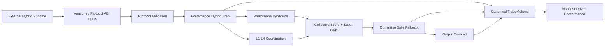

# PheroOS Hybrid Pheromone 完整加固与演进方案

状态：实施完成（Draft ABI；`pheroos-hybrid-swarm-v1`）
计划日期：2026-07-10
完成验收：2026-07-11
适用范围：`pheroos.protocol`、`pheroos.governance`、`pheroos.trace`、
`pheroos.conformance`，以及与该路径相交的 Kernel/Driver boundary、provider-free examples、
CLI 与测试

## 0. 完成验收快照

本计划的完整范围已经交付；`Draft ABI` 表示公共 ABI 仍处于预稳定阶段，不表示任何工作包、
trace 语义或 conformance 证明被降级或跳过。最终验收证据如下：

- 全量测试在仓库虚拟环境和隔离 Python 3.12 wheel 环境中均为 `629 passed`。
- toy、e2e、swarm 和 Hybrid manifest 的 validate/conformance 矩阵全部成功，并分别选择
  `pheroos-core-v1`、`pheroos-swarm-v1` 和 `pheroos-hybrid-swarm-v1`。
- `pheroos-source-v1` 的 source surface、domain neutrality、import DAG、Driver lifecycle、
  public ABI ownership/defensive snapshot 和 profile contract 全部通过。
- Hybrid provider-free example 与 adaptive replay example 均在源码环境和非仓库当前目录的
  隔离 wheel 环境中成功运行。
- checked-in schema artifact、Draft 2020-12 schema validation、public `__all__` 快照、canonical
  type identity、CLI structured failure/exit code 和 `git diff --check` 全部通过。
- 独立的 A–H Definition-of-Done 审计和 trace/replay adversarial mutation 审计均返回 `CLEAR`；
  rejected clip、replay receipt、跨 lifecycle identity、issuance snapshot、output authority 和
  manifest-driven legal/negative matrix 不存在剩余 C0/C1 阻断项。

## 1. 文档定位

本文是
[`hybrid-pheromone-abi.md`](hybrid-pheromone-abi.md)
的完整整改与交付计划，用于把当前 Hybrid Pheromone ABI 从“对象和字段基本齐备”
推进到“协议不变量、治理语义、事件谱系和符合性证明全部闭环”。

本文不是最小落地方案，也不是对 Hybrid Pheromone ABI 的缩减版本。本文中的阶段只表示
依赖顺序，不表示可以删减后续范围、提前宣告完成或发布不完整能力。

以下规则具有阻断性：

- 不接受只增加 schema 字段而没有治理语义的实现。
- 不接受只增加治理函数而没有 trace、conformance 和负向测试的实现。
- 不接受只声明 trace event 名称而没有事件级 lineage contract 的实现。
- 不接受用硬编码自测替代 manifest 声明行为的符合性证明。
- 不接受以兼容性、交付速度或代码规模为理由关闭 authority、fallback、evidence、
  stop resolution、trace 或 declared-candidate 检查。
- 不接受把已经声明为核心 ABI 的能力静默降级为无效字段、注释性 metadata 或外部约定。
- 不接受 Hybrid feature 回落到 swarm/core profile，也不接受用 N/A、skip、no-op 或默认零值
  代替尚未完成的 Hybrid 语义。
- 不接受把外部 runtime、provider、服务端、训练系统、数据库、队列或 worker 设施放入
  protocol-core。

完整交付以前，Hybrid Pheromone ABI 不应被标记为“fully implemented”。

## 2. 核心目标

目标是形成一个对外低耦合、对内高聚合、确定性、provider-free、可追踪、可证明的
Hybrid Pheromone 协议核心。

对外低耦合意味着：

- 外部 runtime 只依赖版本化 manifest、公共 dataclass、治理入口、Trace ABI 和
  conformance profile。
- 外部 runtime 不依赖仓库目录、当前工作目录、内部辅助函数、私有状态或模块导入副作用。
- 外部 runtime 只提交 proposal、feedback、topology、scout report、evidence 和 permission；
  不提交未经治理验证的最终分数、commit 结果或输出授权结果。
- ABI 输入保持 provider-neutral、domain-neutral、network-free，并能由标准 JSON Schema
  工具独立验证。
- 版本变化通过 schema、profile、changelog 和 migration note 显式表达。

对内高聚合意味着：

- Protocol package 只负责声明、严格加载、跨字段验证和诊断。
- Governance package 只负责 authority、评分、协调、fallback 和 output decision。
- Pheromone、feedback、layer coordination、policy adjustment 各自拥有本领域规则，不在
  CLI、示例或 conformance 中复制实现。
- `collective.py` 只负责编排完整集体决策，不再充当其他治理模块的宽泛重导出门面。
- Trace package 统一拥有 canonical event、事件级 lineage contract 和 append-only 语义。
- Conformance package 调用公共 ABI 证明不变量，不实现第二套业务逻辑。
- CLI 只负责参数解析、调用核心能力和输出结构化结果。

## 3. 不可协商的不变量

所有阶段都必须维护以下规则：

1. Agents are not authority. Protocol is authority.
2. Pheromone is collective memory, not evidence, truth, quorum, permission, commit authority,
   or output authority.
3. Learned、evolutionary、reactive 和 metacognitive layer 只能提交 proposal、feedback 或
   bounded adjustment，不能直接提交候选或授权输出。
4. 只有 declared candidate 可以进入评分和 commit 路径。
5. 所有 candidate、trail、feedback、topology subject、layer proposal 和 fallback 都必须与
   active target 一致。
6. Independent scout gate 必须使用非空、可区分、带 evidence provenance 的 scout identity。
7. Consensus 失败、layer conflict 未解决或输入不完整时，只能使用 declared safe fallback。
8. Output authorization 必须同时满足 committed candidate、evidence provenance、
   target-scoped stop resolution 和 publication permission。
9. 所有影响分数、协调、fallback、commit 和 output 的输入都必须是有限数值，并受 manifest
   声明边界约束。
10. 所有分数必须能从 `score_breakdown` 精确重建。
11. 所有状态变化必须产生与实际变化一致的 trace；未发生的 lifecycle event 不得被伪造为已发生。
12. Conformance 对所有合法 manifest 都必须返回确定性的结构化报告，不能抛出未捕获异常，
    也不能因缺少源码目录而空扫描通过。
13. Baseline quorum、toy、e2e 和非 Hybrid swarm manifest 必须保持兼容，不能被强制升级为
    Hybrid 协议。

## 4. 目标架构



外部 runtime 与 core 的唯一交互面应由以下公共对象组成：

- `CapabilityManifest` / `CollectiveDecisionPolicy`
- `ScoutReport`
- `RecruitmentSignal` / `InhibitionSignal`
- `PheromoneTrail` / `PheromoneFeedback`
- `PheromoneNeighborhood`
- `LayerProposal` / `StrategyBias` / `LayerPerformanceSnapshot`
- `PolicyAdjustmentProposal`
- `EvidenceGraph` / `StopResolution` / publication permission
- `HybridCollectiveStep` 或等价的完整治理结果对象
- canonical `TraceEvent`
- versioned `ConformanceReport`

外部 runtime 不应被允许直接提供以下权威状态：

- 任意构造的 `LayerCoordinationState` 评分结果
- 任意构造的 `CollectiveDecisionState`
- 已提交的 `QuorumDecision`
- 已授权的 output result
- 绕过 manifest bounds 的最终 policy

这些对象可以作为治理输出，但不能作为未经重新验证的权威输入。

## 5. 内部模块职责

| 模块 | 聚合职责 | 不应承担的职责 |
| --- | --- | --- |
| `pheroos.protocol.models` | ABI declarations、常量、feature activation | 运行时评分、trace 写入 |
| `pheroos.protocol.schema` | 标准 schema artifact 生成 | typed coercion、治理规则 |
| `pheroos.protocol.schema_validation` | 执行生成 schema 实际使用的全部关键字 | 宽松默认、静默纠正输入 |
| `pheroos.protocol.manifest` | fail-closed JSON-to-dataclass 映射 | 修复错误输入、吞掉类型错误 |
| `pheroos.protocol.validation` | 跨字段、target、profile、safety bounds 验证 | 运行时决策 |
| `pheroos.governance.pheromone` | trail lifecycle、kind response、topology、diffusion、scoring | feedback outcome 映射、layer conflict |
| `pheroos.governance.pheromone_feedback` | feedback validation、source/round budgets、reinforcement lineage | collective commit |
| `pheroos.governance.layer_coordination` | proposal validation、confidence、weight、conflict、resolution | manifest mutation、output authorization |
| `pheroos.governance.policy_adjustment` | allowlist、bounds、run-scoped adjustment validation | 永久策略存储、manifest 重写 |
| `pheroos.governance.collective` | scout gate、完整 hybrid step、score、commit/fallback | 跨模块公共类型重导出、provider 调用 |
| `pheroos.governance.output` | 完整 output contract | evidence 创建、publication permission 获取 |
| `pheroos.trace` | canonical event、lineage validation、append-only record | 数据库、队列、运行时监控 |
| `pheroos.conformance` | 使用公共 ABI 证明声明不变量 | 第二套评分实现、产品 policy |
| `pheroos.cli` | 参数解析、结构化输出、退出码 | 协议和治理逻辑 |

公共导出应直接来自对象所属模块。`pheroos.governance.__init__` 可以提供稳定聚合入口，
但不应依赖 `collective.py` 间接转发 pheromone、feedback、coordination 和 adjustment 的全部符号。

### 5.1 ABI 完整覆盖台账

实现期间必须维护完整覆盖台账。每一项 public field 或 feature 都必须同时填写 owner、
executable semantics、trace、negative test 和 conformance；任一列为空即阻断完成与发布。

| Field / capability | Authoritative owner | Executable semantics | Required trace | Negative proof | Conformance |
| --- | --- | --- | --- | --- | --- |
| scout identity/evidence | `governance.collective` | verified independent-scout gate | `scout_report` | empty/duplicate/unverified scout | collective authority check |
| recruitment/inhibition | `governance.collective` | verified bounded score pressure | `recruit` / `inhibit` | empty source/unverified signal | swarm behavior check |
| trail deposit/cap | `governance.pheromone` | validated atomic deposit | `pheromone_deposit` / `pheromone_clip` | invalid target/non-finite/over-budget | pheromone behavior check |
| rejected clip causal receipt | `pheroos.trace` | versioned canonical payload + deterministic fingerprint with lifecycle reconstruction | `pheromone_clip.causal_payload` / `causal_fingerprint` | missing/digest/full-leaf/source/topology mutation | Hybrid trace contract |
| replay receipt authority | `governance.collective` + `pheroos.trace` | disjoint lifecycle receipts bound to governance-issued prior state | `replay_payload` / replay fingerprints / score receipt anchor | same-id substitution/cross-lifecycle collision/phantom event+anchor/forged state | Hybrid trace contract |
| kind weight/priority/suppression | `governance.pheromone` | stable ordered response | `pheromone_score` | permutation/disabled suppression | kind profile check |
| evaporation/TTL/stale | `governance.pheromone` | deterministic lifecycle | `pheromone_evaporate` / `pheromone_expire` | time reversal/stale scoring | pheromone behavior check |
| topology/diffusion | `governance.pheromone` | target-scoped bounded propagation | `pheromone_diffuse` | duplicate/cross-target/excess hop | diffusion check |
| feedback/reward/outcome | `governance.pheromone_feedback` | atomic bounded reinforcement | `pheromone_reinforce` | replay/duplicate/source cap | reinforcement check |
| response/competition | `governance.pheromone` | linear/saturating/threshold/competitive | `pheromone_normalize` | zero-only/order-sensitive result | response check |
| exploration/novelty/reopen | `governance.pheromone` | deterministic bounded pressure | `pheromone_observe` / score lineage | disabled/no-scout/stale misuse | exploration check |
| `LayerProposal.action` | `governance.layer_coordination` | action-specific bounded proposal | `layer_proposal` | unknown/unverified action | layer policy check |
| performance snapshot/weights | `governance.layer_coordination` | bounded evidence-aware allocation | `coordination_assess` | non-finite/out-of-bounds snapshot | layer policy check |
| conflict/metacognition | `governance.layer_coordination` | deterministic resolution/fallback | `coordination_resolve` | unresolved conflict/direct commit | authority check |
| `StrategyBias` | `governance.layer_coordination` | bounded candidate preference | `layer_proposal` | undeclared candidate/unbounded bias | layer policy check |
| policy adjustment | `governance.policy_adjustment` | allowlisted run-scoped overlay | `policy_adjustment` | unsafe key/out-of-range/replay | adjustment check |
| score breakdown | `governance.collective` | exact reconstruction | `candidate_score` | missing/double-counted category | score contract check |
| commit/fallback | `governance.collective` | scout-gated declared candidate | `commit` / `fallback` | forged state/unsafe fallback | authority check |
| output authorization | `governance.output` | four mandatory gates | `output` | each gate independently absent | output contract check |

该表是最低覆盖集合。实现新增 public field 时必须同步扩展台账，不得只在 dataclass/schema 中
增加字段。

## 6. 当前审计基线

当前工作树已经具备 manifest 字段、schema artifact、基础 governance functions、Hybrid trace
event 名称、`pheroos-hybrid-swarm-v1` 和 provider-free examples。全量测试和现有示例均通过。

但以下问题阻止“完整实现”结论：

| 领域 | 当前缺口 | 必须达到的结果 |
| --- | --- | --- |
| Output authority | 空 stop resolution 仍可授权 | 缺少 target-scoped resolution 时 fail-closed |
| Signal authority | quorum signal 默认 verified；空 scout identity 可计数 | governance-issued verification；完整 scout identity |
| Layer authority | 可注入裸 `LayerCoordinationState` 分数 | collective entry point 内部重算并验证 |
| Schema ABI | 部分 JSON Schema 关键字未执行；NaN 可通过 | Loader 与导出 schema 行为一致；只接收有限数值 |
| Policy adjustment | 任意 manifest key 可被声明为 adjustment | 规范允许维度白名单和绝对边界 |
| Target isolation | trail 和 diffusion edge 可跨 target 影响候选 | 所有 subject、edge、trail 和 candidate 严格 target-scoped |
| Feedback bounds | cap 按单条应用，未聚合整轮和来源 | round/source/kind/max-strength 全部生效 |
| Kind profile | `priority`、`can_suppress_positive` 未执行 | 评分顺序稳定且 profile 语义真实生效 |
| Exploration | 多个已声明字段未进入治理语义 | 全部实现确定性 reference semantics |
| L4 coordination | action、threshold、snapshot coverage、StrategyBias 不完整 | 每个公开字段都有确定性语义和负向证明 |
| Trace | 只检查事件名，lineage 可为空且记录可被修改 | event-specific lineage + append-only snapshot |
| Conformance | hard-coded self-check、合法 manifest 可崩溃、源码检查可空通过 | manifest-driven、total、target-scoped、结构化失败 |
| Release | Hybrid profile、README、SPEC、CHANGELOG、CI 未完全同步 | ABI、文档、profile、CI 同步交付 |

## 7. 工作包 A：治理权威闭环

### A1. Output contract

必须交付：

- 在 `OutputContract` 中增加与 manifest 一致的 `stop_resolution_required`。
- `output_authorized(...)` 必须要求至少一个与 `decision.target` 匹配的显式 resolution。
- 其他 target 的 resolution 不能批准或阻断当前 target。
- 缺少 commit、evidence、stop resolution 或 publication permission 中任何一项都必须拒绝。
- Conformance 必须调用真实 `output_authorized(...)`，而不是只检查 manifest 布尔值。

完成条件：

- 四个授权门槛均有独立负向测试。
- safe fallback 输出也必须经过相同 output contract。
- 空 resolution、错误 target resolution、blocked resolution 全部被拒绝。

### A2. Signal verification

必须交付：

- `QuorumSignal` 默认 fail-closed，不能以调用方提供的裸布尔值代表治理验证。
- 复用 `AuthorityLevel` / verified signal 语义，或增加小型 governance verification record。
- `ScoutReport` 强制非空 `scout_id`、`evidence_id` 和 `provenance`。
- Scout identity 去重必须发生在验证后，空字符串不能满足独立性门槛。
- Recruitment 和 inhibition 必须具有经过治理验证的 source identity、target、bounds 和 lineage，
  不能只凭非空 source 获得评分影响力。

完成条件：

- 未验证 signal 不计票。
- agent 自行设置验证状态不能获得 quorum authority。
- 空 scout、重复 scout、缺 evidence 和缺 provenance 均不能满足 gate。

### A3. Layer state trust boundary

必须交付：

- `score_candidates(...)` 不再直接信任外部构造的 `LayerCoordinationState.score_breakdown`。
- Collective 入口接收 `LayerProposal`、snapshot 和 declared policy，在治理内部计算 state。
- 若保留 state 输入兼容路径，必须经过完整结构、lineage、candidate、target、weight 和 bounds 校验，
  且在 draft ABI 中标记 deprecated。
- `LayerCoordinationState` 作为治理输出保留，不作为默认权威输入。

完成条件：

- 手工构造高分 state 不能改变 commit。
- Learned/evolutionary proposal 在 scout gate 之前不能提交候选。
- 所有 layer contribution 都能追溯到已验证 proposal。

## 8. 工作包 B：严格 Protocol ABI

### B1. Schema 执行一致性

内部 validator 必须执行导出 schema 实际使用的全部关键字：

- `type`
- `enum`
- `required`
- `properties`
- schema-valued `additionalProperties`
- `patternProperties`
- `oneOf`
- `items`
- `minItems` / `maxItems`
- `minimum` / `maximum`

如果某个关键字不受内部 validator 支持，则不得由 schema generator 生成该关键字并声称 loader
具有相同行为。实现应保持小型、确定性和标准库优先，不扩展成通用 JSON Schema framework。

必须交付：

- `json.loads` 使用 fail-closed `parse_constant`，拒绝 `NaN`、`Infinity` 和 `-Infinity`。
- 所有 typed mapping 在 schema 成功后执行，不再把错误值转换为默认对象或 `-1` 哨兵。
- kind profile、number map、bounds map、adjustment bounds 均有原始 JSON 负向测试。
- checked-in schema、CLI export 和 loader 行为通过同一 fixture matrix 验证。
- Governance public functions 必须再次验证直接构造的 Python dataclass；严格 JSON loader 不能替代
  runtime trust boundary。
- Runtime records 中的嵌套 list/dict 必须在验证边界规范化并做 defensive snapshot。

完成条件：

- 标准 JSON Schema validator 会拒绝的 manifest，PheroOS loader 也必须拒绝。
- 无效 kind profile 不得被静默转换成默认 profile。
- 所有公开数值进入 dataclass 前已确认有限且类型正确。

### B2. 跨字段不变量

必须增加：

- `pheromone_min_strength >= 0` 且 `max >= min`。
- kind key 必须是 built-in kind 或 namespaced extension。
- Hybrid feedback、diffusion、coordination、adjustment 启用时，provenance 和 trace 不能关闭。
- Feature activation、profile selection 和 required trace events 使用同一个 helper。
- `mode="hybrid"` 必须稳定激活 Hybrid profile 和完整 Hybrid required checks，不能静默降为
  basic swarm profile。
- Diffusion、feedback、layer coordination、policy adjustment 等 Hybrid-only field 不能在
  `bee_swarm` 或 `ant_colony` 下悄然获得部分 Hybrid 语义；若未来允许复用，必须通过新的显式
  profile/version 声明。
- 当前以 `mode="hybrid"` 运行却只激活 basic swarm profile 的示例必须迁移为合适的 basic
  swarm mode，或补齐完整 Hybrid declaration。
- Enabled feature 的依赖必须完整，例如 diffusion 的 topology、hop 和 attenuation 语义不能互相矛盾。
- Diffusion enabled 时必须声明正的 hop bound 和有效传播语义；layer coordination enabled 时
  必须具备完整 weight/confidence/fallback bounds。
- `layer_default_weights`、confidence thresholds 和 adjustment bounds 必须覆盖合法 layer id，并满足
  field-specific absolute bounds。

### B3. Policy adjustment allowlist

允许调整维度限定为规范声明集合：

- evaporation rate
- built-in kind weight
- allowed response model
- exploration floor
- declared layer weight
- cautionary threshold
- alarm threshold

必须拒绝：

- manifest、mode、candidate、fallback、trace policy、evidence policy、output policy 的替换或嵌套修改
- 未知字段
- 非有限数值
- 超出字段绝对范围或 manifest 声明范围的值
- reactive layer adjustment
- 空 source、provenance 或 trace lineage

Accepted adjustment 必须是 run-scoped immutable overlay，不能修改原 manifest。

## 9. 工作包 C：完整 Pheromone 动力学

### C1. Target 和 topology isolation

必须交付：

- `validate_pheromone_trail(...)` 校验 candidate 与 trail target 一致。
- Topology subject key 不允许重复或产生不同 candidate binding。
- Edge 两端必须属于兼容 target；跨 target diffusion 默认拒绝。
- Diffused trail 从目标 subject 派生正确 target、candidate 和 lineage。
- Feedback 只能更新 active target 下声明的 subject/candidate binding。
- Multi-target 测试必须覆盖外部 target candidate 排在列表首位的情况。

### C2. Source 和 round budgets

必须交付：

- `per_round_deposit_cap` 对整个治理 step 聚合，而不是对每条记录分别裁剪。
- `per_source_cap` 在 deposit、feedback、diffusion 和 scoring 的统一 source identity 上执行。
- 相同 subject、不同 source 的 feedback 保持独立 lineage，不得合并后保留错误 source。
- Feedback reinforcement 同时受 kind profile、max strength、round cap 和 source cap 约束。
- Budget 消耗顺序确定且可在 trace 中重建。

完成条件：

- 任意拆分同一总输入都不能绕过 round/source cap。
- 输入排列变化不能改变最终分数、预算或 fallback 结果。

### C3. Kind profile 和 response

必须交付：

- `priority` 决定稳定处理顺序，高优先级 alarm/cautionary 不被低优先级输入抢占 source budget。
- `can_suppress_positive` 为 `false` 时不得触发 positive suppression；为 `true` 时按声明阈值执行。
- Per-kind `competitive` response 能触发对应 normalization，不只读取全局 response model。
- `stale` 在所有路径保持 no-score。
- Extension kind 默认 metadata-only；仅其自身 kind profile 的非空
  `scored_subject_types` 可显式启用 scoring，空 profile 不得继承全局 scored subjects。
- `evidence` 可作为 memory subject 保存 lineage，但不得出现在任何 scored-subject
  declaration，也不得产生 candidate score。
- Kind 与 subject 的 breakdown 必须同时可解释，且不能破坏总分重建。

### C4. Exploration semantics

必须对以下字段给出真实、确定性的 reference semantics：

- `exploration_enabled`
- `exploration_floor`
- `pheromone_exploration_floor`
- `novelty_decay_rate`
- `stale_route_reopen_threshold`

Core 不进行随机选路。Exploration 只能产生有界 score pressure、reopen eligibility 或
runtime-facing observation，并且必须：

- 由 manifest 显式启用
- 不创建 candidate 或 evidence
- 不绕过 scout gate
- 有 score/trace/conformance 证明

如果两个 exploration floor 表达重复语义，必须在 draft ABI 阶段完成合并、迁移说明和 schema
更新，不能长期保留互相矛盾的字段。

本计划内所有已经声明的 exploration field 都必须获得完整、确定性的 core reference semantics。
把字段移出 ABI 或改成纯 runtime hint 只能作为独立、明确批准的 breaking-change proposal，
不能作为本文的完成路径。

### C5. Atomic batch 和 replay semantics

必须交付：

- Deposit、feedback、diffusion 和 layer proposal batch 必须先完成全批验证，再执行状态转换。
- 任一 batch item 失败时，结果不得包含部分 deposit、部分 reinforcement、部分 adjustment 或
  部分 trace。
- 同一 batch 内重复 `trace_event_id`、feedback identity 或等价 lifecycle record 默认拒绝。
- 跨 replay 重复输入必须具有明确幂等键；相同已处理 feedback 不能被重复强化。
- Bool 不能作为 numeric value；输入、中间计算、breakdown、normalized score 和最终 score
  都必须保持 finite。
- 原子转换顺序和 duplicate/replay 结果必须进入 trace lineage。

完成条件：

- 在 batch 最后一项注入错误不会留下任何前序状态变化。
- 同一 replay 执行两次不会产生第二次 reinforcement。
- Overflow、NaN、Infinity 或中间 non-finite result 在 commit 前被拒绝。

## 10. 工作包 D：L1-L4 协调完整语义

### D1. Proposal contract

`LayerProposal` 必须验证：

- supported `layer_id`
- 非空 `source_id`
- declared target/candidate
- supported action
- finite confidence/support/risk/proposed strength
- confidence 的规范范围
- evidence、provenance、trace lineage 的 feature-specific 要求
- proposed pheromone kind 与 subject binding

Action 不能只是未使用字符串。Reactive alarm、support、risk、route preference、request scouting、
fallback pressure 等公开 action 必须映射到明确治理语义；未知 action 只能使用 namespaced extension，
且默认不评分。

### D2. Performance snapshot 和 weight allocation

必须交付：

- 校验 snapshot layer、数值范围、evidence coverage 和 trace coverage。
- `mean_confidence`、`evidence_coverage`、`trace_coverage` 必须参与明确的确定性权重规则。
- 权重调整始终受 `layer_weight_bounds` 约束。
- Active emergency 存在时，不得仅因历史 performance 降低 reactive emergency 的必要压力。

### D3. Conflict detection 和 resolution

必须区分：

- 不同 layer 对不同 candidate 的相近强支持
- positive exploitation 与 alarm/cautionary pressure 冲突
- learned/evolutionary proposal 缺少 scout/evidence/trace coverage
- reactive emergency 与 learned exploitation 冲突
- 可由 metacognitive proposal 在 bounds 内解决的冲突
- 无法解决、必须 fallback 的冲突

`resolve_layer_conflicts(...)` 不能把所有 conflict 简化成同一种 fallback，也不能在没有证明的
情况下选择高分候选。每个 resolution 必须携带 reason、weights、proposal lineage 和
fallback 状态。

### D4. StrategyBias 和 adjustment

- `StrategyBias` 必须有 validation、bounds、score category 和 trace lineage。
- StrategyBias 只能影响声明 candidate 的有界 preference。
- Policy adjustment 只返回 run-scoped overlay；不允许永久修改 manifest。
- StrategyBias、LayerProposal 和 PolicyAdjustmentProposal 的职责必须分离，不能用同一个无界
  dict 代替三种 ABI。

## 11. 工作包 E：完整 Hybrid Collective Step

增加单一、纯函数式治理入口，例如：

```python
evaluate_hybrid_collective_step(...)
```

名称可以遵循现有代码风格，但必须一次性表达完整处理顺序：

1. 验证 active target、candidate set 和 safe fallback。
2. 验证 scout、recruitment 和 inhibition inputs。
3. 验证并应用 run-scoped policy adjustment overlay。
4. 验证并 deposit 新 trails。
5. Evaporate 现有 trails。
6. Diffuse over declared topology。
7. Reinforce from bounded feedback。
8. 验证 LayerProposal、StrategyBias 和 snapshot。
9. 执行 L1-L4 confidence、weight、conflict 和 resolution。
10. 计算 scout、recruitment、inhibition、pheromone 和 layer breakdown。
11. 强制 independent scout gate。
12. 达到 threshold 时只 commit declared target candidate。
13. 未达成或 conflict 未解决时 commit declared safe fallback。
14. 返回真实产生的 trace actions。
15. 由外层使用 evidence、stop resolution 和 permission 调用 output contract。

建议结果对象包含：

- decision
- collective state
- active trails
- reinforcement/diffusion lifecycle records
- layer coordination state
- accepted adjustment overlay
- score breakdown
- trace events

该入口不能调用 provider、tool、network、secret、数据库或外部 runtime。它只组合已有 pure
governance functions，并成为 examples 与 conformance 的唯一 reference path。

完成条件：

- Example 不再手工模拟处理顺序。
- 同一逻辑不在 test、example 和 conformance 中复制。
- 输入 permutation 在协议定义为集合语义的地方保持相同结果。
- 每个步骤都有对应真实 trace event；未发生步骤不产生伪造 event。

## 12. 工作包 F：Trace ABI 完整谱系

### F1. Event-specific lineage contract

通用 `TraceEvent` 保持 provider-neutral，但 built-in lifecycle event 必须使用事件级 validator。

最低要求：

| Event | 必需 lineage |
| --- | --- |
| `scout_report` | scout、candidate、evidence、provenance |
| `pheromone_deposit` | source、subject、candidate、kind、old/new strength、step |
| `pheromone_evaporate` | subject、kind、old/new strength、elapsed steps、profile |
| `pheromone_diffuse` | source subject、target subject、hop、attenuation、candidate、provenance |
| `pheromone_reinforce` | feedback source、outcome、reward/delta、old/new strength、budget result |
| `pheromone_normalize` | candidates、pre/post scores、response model |
| `layer_proposal` | layer、source、action、candidate、confidence、evidence/provenance |
| `coordination_assess` | confidences、weights、coverage、proposal lineage |
| `coordination_resolve` | conflicts、resolution、selected/fallback candidate、reason |
| `policy_adjustment` | proposed values、declared bounds、accepted/rejected result、source |
| `candidate_score` | full reconstructable breakdown、scout diversity、pheromone source diversity |
| `commit` / `fallback` | target、candidate、decision reason、upstream score lineage |
| `output` | four output gates and final authorization result |

### F2. Append-only semantics

必须交付：

- `InMemoryTraceStore.append()` 保存防御性快照，调用方后续修改原 dict 不能改变历史记录。
- `TraceRecord.sequence` 保持单调。
- Lineage 中的 list/dict 同样需要深层不可变快照或等价保护。
- Trace validation 失败不得写入 store。

### F3. Trace 真实性

- Governance function 应返回 trace action 或足够构造 canonical event 的结构化 lineage。
- Example 不得为了满足 required event 列表而添加未发生的 expire、fallback 或 recovery event。
- Conformance 必须检查实际 replay trace，而不只检查 manifest 声明名称。

## 13. 工作包 G：Conformance 重构

### G1. Total-function contract

每个 check 必须：

- 对所有通过 manifest validation 的输入返回 `CheckResult`。
- 不依赖至少存在一个非 fallback candidate 的隐含假设。
- 按 active target 选择 candidate。
- 捕获并报告治理错误，不把 traceback 暴露为 CLI 输出。

Runner 必须提供安全 check wrapper。单个 check 失败后，后续 check 继续运行并形成完整报告。

### G2. Profile-driven execution

- `pheroos-core-*` 只执行 core required checks。
- `pheroos-swarm-*` 执行 core + swarm checks。
- `pheroos-hybrid-swarm-*` 执行 core + swarm + hybrid checks。
- `ConformanceReport.ok` 以 active profile 实际执行的 checks 为准。
- Profile required-check 集合变化必须视为 ABI 变化并记录版本。

### G3. Manifest-driven behavior proof

Hybrid checks 必须派生 manifest 的真实 policy，不再用固定的本地 policy 替代：

- declared subject types
- kind profiles
- diffusion hops/attenuation
- feedback caps
- response model
- exploration policy
- layer weights/confidence/conflict thresholds
- policy adjustment bounds
- required trace events

Conformance 要证明声明行为，而不只是证明当前 Python helper 在一个硬编码示例上工作。

### G4. Source-level checks 与 manifest checks 解耦

Domain-neutrality 和 import-boundary 属于 protocol-core source conformance，不属于任意外部
manifest 的环境假设。采用以下单一契约：

- Manifest conformance 只验证 manifest 和已安装公共 ABI，不把 source check 的 N/A 计作通过证明。
- Source conformance 使用独立 versioned source profile，并要求显式 `core_root` 或从已安装 package
  可靠解析源码根。
- Release CI 必须运行 source profile；缺少 protocol、kernel、governance、drivers、trace、
  conformance 或 CLI surface 时直接失败。
- 外部 manifest consumer 可以不运行 source profile，但其报告不能声称已经证明 core source
  boundary。
- 当前工作目录不能作为隐式 authority；目录不存在时不能空扫描通过。

### G5. 负向 conformance matrix

必须覆盖：

- fallback-only Hybrid manifest
- multi-target candidate ordering
- route/tool/agent scoring
- undeclared subject/candidate/target
- duplicate topology subject/edge
- all response models
- stale no-score
- source/round budget bypass attempts
- all four layer ids
- reactive emergency
- snapshot weight bounds
- every declared adjustment bound
- forged layer state
- missing lineage field by field
- all output authorization gates
- CLI JSON and exit-code behavior

## 14. 工作包 H：兼容性、示例与发布

### H1. Backward compatibility

- Toy 和 e2e manifest 不增加 swarm required fields。
- Basic swarm 不增加 Hybrid required fields。
- `PheromoneTrail(candidate_id, strength)` 兼容路径继续工作，除非通过 migration note 明确版本化。
- 新 fail-closed validator 属于 draft ABI 安全收紧，必须在 changelog 说明受影响输入。
- 公开类型移动需要 package-level compatibility export，不能产生第二套不兼容对象。

### H2. Provider-free examples

保留并完善：

- `examples/toy-protocol`
- `examples/e2e-protocol`
- `examples/swarm-protocol`
- `examples/hybrid-pheromone-protocol`
- `examples/adaptive-pheromone-replay`

Hybrid example 必须通过完整治理入口产生真实 lifecycle、decision 和 output trace。Adaptive replay
必须真正消费 trace-like fixture 并提交 ABI records，不能只返回声明 authority retained 的常量。

### H3. Documentation 和 versioning

必须同步：

- `README.md`
- `README.zh-CN.md`
- `SPEC.md`
- `CHANGELOG.md`
- conformance 文档
- runtime integration 文档
- schema artifacts
- profile version

如果 `pheroos-hybrid-swarm-v1` 尚未发布，应在首次合并前完成全部阻断性修复；如果已经被外部
消费者采用，则需要新 profile version 和 migration note。

### H4. Core cohesion 和 package boundary

必须交付：

- `DriverRegistry.register()` 复用 Driver lifecycle 的 canonical descriptor validation，不能形成
  一条绕过 `declare -> validate -> register` 的第二注册路径。
- Import DAG checker 必须正确解析 relative import，并按 package allowlist 检查跨包依赖。
- Source conformance 的扫描 surface 必须覆盖 protocol、kernel、governance、drivers、trace、
  conformance 和 CLI；规则必须绑定具体项目边界，不能依赖宽泛通用词阻断正常协议文档。
- `pheroos.protocol.PheromoneKindProfile` 是 manifest ABI 的唯一 canonical public declaration
  type。Governance 若需要 normalized runtime representation，必须使用明确不同的内部名称并通过
  单一 adapter 构造，不能导出第二个同名 ABI type。
- `pheroos.governance.PheromoneKindProfile` compatibility export 必须指向 canonical public type，
  或通过 migration window 移除；不能继续代表另一个不兼容对象。
- Public frozen dataclass 中的 list/dict 输入必须在 trust boundary 做 defensive snapshot，不能让
  调用方在验证后修改有效治理状态。
- `pheroos.governance.__init__` 直接从 owning module 聚合稳定 API，`collective.py` 不再承担跨模块
  symbol relay。

完成条件：

- Registry 和 lifecycle 对同一 invalid descriptor 给出一致拒绝结果。
- Relative cross-package import 违规能被 conformance 检出。
- `pheroos.protocol.PheromoneKindProfile is pheroos.governance.PheromoneKindProfile` 在保留 compatibility
  export 时成立；normalized internal type 不出现在 package `__all__`。
- Public type identity、唯一 adapter、转换位置和 compatibility alias 有测试与 migration note。
- 验证后的 policy、trace 和 decision inputs 不受调用方后续可变对象修改影响。

## 15. 执行阶段

阶段是依赖顺序，不是裁剪范围。任何阶段完成都不代表整个计划可以提前结束。Phase 0–4
仅是内部 checkpoint，不能单独发布、标记 Supported、更新“fully implemented”状态或作为
Hybrid profile 的降级版本交付。完整 Definition of Done 是唯一 release gate。

### Phase 0：回归护栏

交付：

- 将已复现的 authority、schema、target、trace 和 conformance 缺口写成失败测试。
- 增加 CLI subprocess、fallback-only 和 multi-target fixtures。
- 建立 loader 与 schema artifact 一致性 matrix。

Gate：测试必须先在旧行为上准确失败，并且每个测试名称对应一个协议不变量。

### Phase 1：Authority 与严格 ABI

交付工作包 A、B。

Gate：输出、signal、scout、layer state、policy adjustment 和 non-finite input 全部 fail-closed。

### Phase 2：Pheromone 动力学

交付工作包 C。

Gate：target isolation、aggregated budgets、priority、suppression、response 和 exploration 全部有
确定性测试及 conformance。

### Phase 3：L1-L4 与完整治理入口

交付工作包 D、E。

Gate：完整 hybrid step 成为 example、test 和 conformance 的共同 reference path。

### Phase 4：Trace 与 Conformance

交付工作包 F、G。

Gate：实际 trace 可重建决策；所有合法 manifest 返回结构化报告；不存在空扫描通过。

### Phase 5：兼容性和发布收尾

交付工作包 H。

Gate：全部示例、schema、文档、profile、changelog 和 CI 同步；没有未声明的 ABI 变化。

## 16. CI 与验收命令

本地仓库使用现有 virtual environment：

```bash
.venv/bin/python -m pytest -q
.venv/bin/python -m pheroos.cli.main validate examples/toy-protocol/capability.json
.venv/bin/python -m pheroos.cli.main conformance examples/toy-protocol
.venv/bin/python -m pheroos.cli.main validate examples/e2e-protocol/capability.json
.venv/bin/python -m pheroos.cli.main conformance examples/e2e-protocol
.venv/bin/python -m pheroos.cli.main validate examples/swarm-protocol/capability.json
.venv/bin/python -m pheroos.cli.main conformance examples/swarm-protocol
.venv/bin/python -m pheroos.cli.main validate examples/hybrid-pheromone-protocol/capability.json
.venv/bin/python -m pheroos.cli.main conformance examples/hybrid-pheromone-protocol
.venv/bin/python examples/adaptive-pheromone-replay/replay.py
git diff --check
```

GitHub Actions 或其他干净 CI 环境不得假设仓库内存在 `.venv`，必须至少执行：

```bash
python -m pip install -e ".[dev]"
python -m pytest -q
pheroos validate examples/toy-protocol/capability.json
pheroos conformance examples/toy-protocol
pheroos validate examples/e2e-protocol/capability.json
pheroos conformance examples/e2e-protocol
pheroos validate examples/swarm-protocol/capability.json
pheroos conformance examples/swarm-protocol
pheroos validate examples/hybrid-pheromone-protocol/capability.json
pheroos conformance examples/hybrid-pheromone-protocol
python examples/adaptive-pheromone-replay/replay.py
git diff --check
```

还必须通过 subprocess 和 installed-package 测试证明：

- CLI 从非仓库当前目录运行时行为明确且稳定。
- Wheel/editable install 后的 console script 和 public imports 不依赖 source-tree cwd。
- Invalid manifest 返回非零退出码和结构化 JSON。
- Check 内部异常被转换为失败报告。
- Schema export 与 checked-in artifact 完全一致。
- Public package `__all__`、canonical type identity 和 schema artifact 不发生未声明漂移。

## 17. 完整 Definition of Done

只有同时满足以下条件，本文计划才算完成：

- 当前审计表中的所有 authority、ABI、target、budget、trace 和 conformance 缺口均关闭。
- 所有已经声明的公开 Hybrid 字段都有实际、确定性的 core reference semantics；不存在
  runtime-hint、N/A、skip、no-op 或静默无效字段形式的降级出口。
- 完整 hybrid step 覆盖 deposit、evaporation、diffusion、feedback、L1-L4、adjustment、score、
  scout gate、commit/fallback 和 trace。
- Output authorization 强制执行四个门槛。
- Trace record 具备事件级 lineage，追加后不可被调用方修改。
- Conformance 使用真实 manifest policy 和实际 replay trace。
- 所有合法 manifest 都获得确定性结构化报告。
- Toy、e2e、swarm 和 hybrid backward compatibility 全部通过。
- Provider-free examples 不依赖网络、provider、数据库、队列、server 或 worker。
- README、SPEC、schema、profile、changelog、migration note 和 CI 已同步。
- Driver lifecycle、package import DAG、public type ownership 和 defensive snapshot 边界已通过
  conformance。
- 不存在以 TODO、临时跳过、空实现、常量声明或手工伪造 event 代替协议行为的交付项。

## 18. 明确非目标

本计划不在 protocol-core 中增加：

- neural network 或训练循环
- evolutionary algorithm executor
- environment simulator
- agent colony runtime
- model-provider router
- server、dashboard、database、queue、daemon 或 worker pool
- 持久化 pheromone store
- analytics platform
- 通用 agent framework
- 通用 policy engine

这些能力属于外部 runtime。Core 只提供稳定 ABI、确定性治理语义、trace lineage 和
conformance proof。

## 19. 最终原则

本计划的成功标准不是增加更多字段或通过更多正向测试，而是让完整 Hybrid Pheromone 路径
真正遵守同一套 authority、target、evidence、fallback、trace 和 conformance 规则。

对外保持低耦合：外部 runtime 只提交标准 ABI records。
对内保持高聚合：每个核心模块拥有并证明自己的协议不变量。
拒绝最小实现：任一缺失环节都不能代表完整 Hybrid ABI。
拒绝降级行为：任何 proposal、pheromone 或 runtime hint 都不能成为未声明的 authority。
