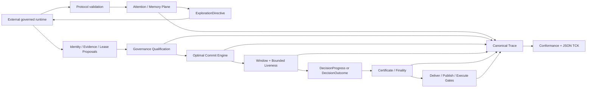
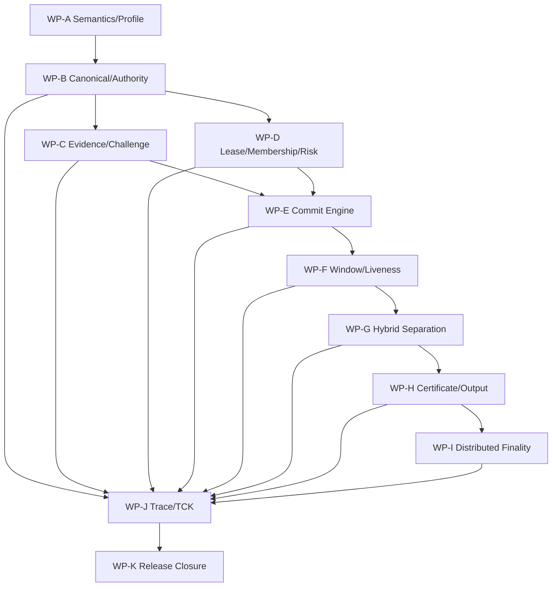

# PheroOS Optimal Commit ABI 完整改进与加固计划

状态：实施完成（Draft ABI；禁止降级、禁止最小实现）

计划日期：2026-07-11

完成日期：2026-07-15

完成证据：WP-A–K、51-branch Commit Wire、26 类 Commit Trace event、20 项
active conformance check、38-case aggregate/split TCK、provider-free examples、
source 与 isolated wheel/external-CWD 验证全部闭环。最终全仓测试为
`1058 passed`；TCK aggregate semantic root 为
`sha256:0e9cd7fd56087d5cc4987d5a7ed056ed6649512c30ee486685e3dbd45e8b7abe`。

Anti-overconstraint 审计同时关闭了两个会妨碍最终 output 的耦合：attention
不可用不再否决独立 commit authority；同 semantic commit value 的不同
proposal/proof envelope 不再触发 distributed conflict freeze。

研究输入：《昆虫群体决策逻辑与 PheroOS 提交条件设计》

架构基础：[Commit Integrity ABI 方案](commit-integrity-abi-plan.md)

目标 profile：

- `pheroos-commit-integrity-v1`
- `pheroos-hybrid-commit-v1`
- `pheroos-certified-commit-v1`
- `pheroos-distributed-commit-v1`

适用范围：`pheroos.protocol`、`pheroos.governance`、`pheroos.trace`、
`pheroos.conformance`、公共 schema、provider-free examples、CLI、TCK、CI、
迁移与发布文档。

## 0. 完整交付声明

本文是 Commit Integrity ABI 的完整实施、加固和交付计划。

阶段只表示依赖与审查顺序，不表示可以删除后续范围、发布半成品 profile，
或把尚未实现的能力降级为外部约定。

以下规则具有阻断性：

- Activation is optional per manifest; delivery is mandatory per ABI release.
- `advisory` 是非权威结果，不是弱化版 commit。
- 高 assurance 输入不完整时，不能自动签发低 assurance commit。
- 新 profile 不能调用 legacy blended-score commit evaluator。
- active feature 不能返回 skip、N/A、pass-through、默认 true 或 no-op success。
- 不能只增加 dataclass/schema/event name 而缺少治理语义、trace、TCK 和 conformance。
- 不能用 caller bool、空 snapshot、mock witness 或字符串 identity 代替 authority。
- 不能把 `pending`、`provisional`、`fallback` 压缩成含糊的 `committed: bool`。
- 不能通过降低 E/S/D、反证、stability、stop、permission 或 witness 门槛保证输出。
- distributed membership、fault model、epoch、quorum intersection、conflict/finality
  和 certificate 全部属于完整交付范围。
- PKI、network、witness collector、storage 和 worker runtime 仍留在 core 外。

只有所有工作包、TCK、示例、schema、source/wheel 验证和兼容矩阵全部闭环后，
本计划才可以标记“实施完成”。

## 1. “最优 commit”的规范含义

`Optimal commit` 不表示 PheroOS 能成为现实真值 oracle，也不表示每次 run 都必须提交。

它表示：

> 在 manifest 声明的候选、风险、证据资格、authority 和 finality 约束内，
> 选择唯一、稳定、风险匹配且净证据最高的候选；若不存在这样的候选，
> 在有限逻辑步内确定性地产生可交付、可解释、不可冒充 commit 的终态。

因此，最优性是一个 constrained selection problem：

1. 先验证身份、证据、lease、stop、permission、replay、risk 和 roots；
2. 再计算候选的正证、反证、支持、多样性和领先边际；
3. 只有通过全部 hard gates 的候选才有资格竞争；
4. 只有唯一净证据 leader 才能进入 stability window；
5. stability 与声明 assurance 满足后才能签发 commit；
6. tie、margin 不足、critical counterevidence、finality 不足都不能用 ID 排序强行解决；
7. deadline 只改变 outcome kind，永远不改变 commit truth。

以下输入不属于最优 commit objective：

- pheromone；
- recruitment；
- soft inhibition；
- layer advice；
- worker availability；
- provider preference；
- arrival order；
- candidate lexical order。

它们可以影响探索、验证请求、attention budget 和 reopen，但不能进入 commit 真值或 tie-break。

## 2. 当前基线与必须解决的问题

当前 Hybrid Pheromone Draft ABI 已完整实现：

- declared candidates 与 safe fallback；
- governance-issued signal verification；
- pheromone deposit、evaporation、diffusion、feedback、response；
- L1-L4 proposal、coordination、bounded adjustment；
- replay receipt、causal trace、authority snapshot；
- manifest-driven conformance 与 provider-free examples；
- 629 个测试、source profile 和 isolated wheel 验证。

但当前 `score_candidates(...)` 把 scout、recruitment、inhibition、pheromone 和
layer contribution 合并为 score，`_decide_collective_state(...)` 再用
`score >= quorum_threshold` 决定 commit。

完整改进必须关闭以下缺口：

| 领域 | 当前缺口 | 完整目标 |
| --- | --- | --- |
| Commit truth | blended score 可临界改变 commit | attention 与 commit 物理隔离 |
| Evidence | 无 target/candidate/claim/root/反证绑定 | signed evidence vector 与 canonical root |
| Identity | 按字符串 scout id 去重 | governance-verified principal cluster |
| Support | 永久 support 数值 | evidence-bound lease、TTL、revoke、switch |
| Counterevidence | inhibition 与 evidence 混淆 | verified contradict observation 与 disposition |
| Challenge | 没有反证搜索证明 | risk-bound challenge coverage |
| Risk | 没有单调 risk gate | immutable risk snapshot 与 band policy |
| Stability | 当前 step 即可 commit | governance-issued bounded window |
| Liveness | pending/provisional 可理论无限 | absolute deadline 与 terminal totality |
| Output | deliver/publish/execute 混在 output | 三个 action-scoped authority gate |
| Stop/permission | caller 构造或 bool | governance-issued verified records |
| Certificate | 无 portable decision proof | typed local/certified/distributed certificate |
| Distributed | 无 membership/fault/epoch/intersection | static-epoch Byzantine finality ABI |
| Trace | 无 observation-to-certificate chain | event-specific full replay proof |
| Conformance | 无 implementation-neutral Commit TCK | checked-in JSON vectors + mutation matrix |

## 3. 不降级与 anti-overconstraint

### 3.1 不降级规则

高 assurance 必须累积低 assurance 的全部规则。

如果 manifest 声明 `distributed`：

- 缺 witness 不能回退 `certified` commit；
- 缺 portable certificate 不能回退 `evidence_bound` commit；
- 缺 identity/evidence/lease 不能回退 legacy score commit；
- deadline 到达只能得到 non-commit terminal outcome。

未知 assurance、未知 critical extension 或 unsupported profile 必须 fail-closed。

### 3.2 不过度约束规则

严格性只作用于 authority path，不冻结探索和 runtime 扩展：

- arbitrary agent architecture 可以在外部 runtime 使用；
- MCP/A2A/PROV/OPA 可以通过 provider-neutral mapping 接入；
- 新 signal、pheromone kind、layer proposal 可以扩展 attention plane；
- 非权威 `extensions` metadata 可以开放保存；
- advisory outcome 不需要伪装成 commit；
- legacy manifest 不被强制声明新字段；
- 只有声明 Commit Integrity 的 manifest 才运行新 gate。

任何新 constraint 都必须同时具备：

- protocol invariant；
- governance semantics；
- trace event/lineage；
- negative TCK；
- conformance check；
- provider-free public behavior。

否则不得加入 core。

### 3.3 完整交付与 manifest 激活分离

完整 ABI release 必须实现全部 assurance。

具体 manifest 可以选择：

- 只需要 advisory；
- 需要 evidence-bound local authority；
- 需要 portable certified authority；
- 需要 distributed finality。

“未激活”与“未实现”是不同状态：

- 未激活：conformance 可判定 NOT_APPLICABLE；
- 已激活且完整：只能 PASS 或 FAIL；
- 已激活但实现不支持：`UNSUPPORTED_ASSURANCE`，profile conformance FAIL，
  runtime 返回 terminal `invalid`；
- 绝不能 skip 或回退旧 evaluator。

## 4. 目标架构



### 4.1 Attention / Memory Plane

复用完整 Hybrid Pheromone pipeline，输出：

- `AttentionBreakdown`；
- `ExplorationDirective`；
- candidate/route/tool priority；
- exploration budget；
- requested verification/challenge role；
- reopen eligibility；
- caution/alarm pressure。

该 plane 不输出 commit score。

### 4.2 Epistemic Qualification Plane

负责：

- principal attestation verification；
- observation support/contradict polarity；
- target/candidate/claim/payload binding；
- independence group cap；
- source-domain qualification；
- TTL、nonce、replay；
- counterevidence disposition；
- challenge coverage；
- evidence/lease/challenge roots。

### 4.3 Commit Integrity Plane

负责：

- risk snapshot；
- E/S/D/counterevidence/margin；
- unique leader；
- no-replay/no-equivocation；
- target/action stop 和 permission；
- stable window；
- safe fallback；
- bounded terminality。

### 4.4 Certificate / Finality Plane

负责：

- local authority receipt；
- portable evidence commit certificate；
- membership snapshot；
- quorum witness；
- epoch certificate；
- conflict detection；
- distributed finality；
- certificate mutation rejection。

### 4.5 Outcome / Action Plane

将三个动作分开：

- `deliver`：把 terminal envelope 返回调用者；
- `publish`：向外声明权威结果；
- `execute`：触发副作用或不可逆操作。

Commit failure MUST NOT imply response failure.

每个 conforming run 都必须在 deadline 内产生可 deliver 的 terminal outcome，
但只有满足声明 assurance 的结果才可以 publish 或 execute。

## 5. Assurance 与 profile

### 5.1 `advisory`

- 不签发 commit；
- 产生 non-authoritative terminal advice；
- 可以 deliver；
- 不得作为事实 publish；
- 不得授权 execute；
- attention ranking 可以出现在建议中，但必须标记非权威。

### 5.2 `evidence_bound`

必须完整执行：

- principal verification；
- positive/counter observation；
- independence-group cap；
- source diversity；
- support lease；
- TTL/replay/equivocation；
- challenge coverage；
- risk threshold；
- unique leader/margin；
- stability window；
- commit stop/permission；
- governance-local authority receipt。

它不是删减版 commit，只是 authority scope 限于当前 governance domain。

### 5.3 `certified`

包含 `evidence_bound` 全部规则，并要求：

- portable canonical certificate；
- issuer attestation；
- independent certificate verification；
- certificate-bound publish/execute；
- complete wire schema。

### 5.4 `distributed`

包含 `certified` 全部规则，并要求：

- immutable membership snapshot；
- declared Byzantine bound；
- epoch；
- witness proposal digest；
- quorum intersection；
- conflict detection；
- final/provisional distinction；
- epoch transition certificate。

### 5.5 Profile 选择

推荐：

- `pheroos-commit-integrity-v1`：advisory/evidence-bound core；
- `pheroos-hybrid-commit-v1`：完整 Hybrid attention + evidence-bound；
- `pheroos-certified-commit-v1`：portable certificate；
- `pheroos-distributed-commit-v1`：distributed finality。

`profile_for_manifest(...)` 必须先检测 Commit Integrity，再检测 legacy Hybrid。

新 profile 不能把 `quorum_policy.commit_threshold` 当成 commit authority。
当新旧 policy 同时声明 target/fallback 时，validator 必须要求完全一致，
避免双重真值。

## 6. Protocol ABI

### 6.1 Policy 组合

在 `ProtocolManifest` 增加：

`collective_commit_policy: CollectiveCommitPolicy | None`

`CollectiveCommitPolicy` 使用小型组合对象，不继续扩大
`CollectiveDecisionPolicy`：

- `EvidenceQualificationPolicy`
- `SupportLeasePolicy`
- `RiskBandPolicy`
- `CommitWindowPolicy`
- `TerminalOutcomePolicy`
- `CertificatePolicy`
- `DistributedCommitPolicy`

### 6.2 `EvidenceQualificationPolicy`

必须声明：

- fixed numeric scale；
- quality/relevance bounds；
- positive/counter group caps；
- counterevidence weight；
- maximum counterevidence；
- maximum counterevidence ratio；
- domain contribution floor；
- minimum source diversity；
- required challenge categories；
- observation TTL；
- provenance/trace requirements。

### 6.3 `SupportLeasePolicy`

必须声明：

- minimum support clusters；
- support ratio；
- eligible membership snapshot requirement；
- lease TTL；
- switch/revoke semantics；
- no-equivocation；
- required evidence reference；
- cluster verification requirement。

### 6.4 `RiskBandPolicy`

风险档固定为：

- `LOW`
- `MODERATE`
- `HIGH`
- `CRITICAL`

每档显式声明最终门槛：

- minimum positive evidence；
- maximum counterevidence；
- maximum counterevidence ratio；
- minimum support clusters/ratio；
- minimum source diversity；
- minimum margin；
- stability steps；
- challenge coverage；
- minimum assurance；
- allowed publish/execute outcomes。

这用显式、可验证、单调的门槛表实现研究中的风险自适应，
替代 runtime 可随意改变的连续 `R` 公式。它不是缩减风险范围，
而是把风险调整固化为可跨实现重放的 Protocol ABI。

Protocol validation 必须证明风险单调性：

- 风险上升时 positive evidence、support、diversity、margin、window、challenge
  不得下降；
- maximum counterevidence/ratio 不得上升；
- assurance 只能增强；
- publish/execute outcome 集只能收缩；
- deadline 不能修改任何风险门槛。

### 6.5 `CommitWindowPolicy`

必须声明：

- minimum stability steps；
- absolute deliberation deadline；
- maximum leader/window reset count；
- maximum epoch restarts；
- absolute run deadline；
- policy/risk/membership change reset rules。

Deadline 在 run 初始化时冻结。Pheromone、新 observation、leader reset 或 layer proposal
都不能延长绝对 deadline。

### 6.6 `TerminalOutcomePolicy`

必须声明：

- safe fallback candidate；
- deadline outcome：`safe_fallback` 或 `advisory`；
- policy-incomplete outcome；
- finality-unavailable outcome；
- fallback delivery/publication rules；
- blocked/invalid delivery rules。

它不能声明“deadline 后降低 commit threshold”。

### 6.7 `DistributedCommitPolicy`

v1 normative model 使用 static-epoch unweighted verified principal clusters：

- `fault_model = byzantine_static_v1`；
- membership snapshot；
- `max_byzantine_faults = f`；
- witness quorum `q`；
- witness TTL；
- failure-domain diversity；
- epoch transition rule；
- conflict freeze/recovery rule。

Validator 必须要求：

- `n >= 3f + 1`；
- `q <= n - f`；
- `2q - n > f`。

标准配置为 `q = 2f + 1`。

## 7. Governance ABI

### 7.1 Proposal 与 authority 分离

每个 authority-bearing input 都采用 proposal -> governance-issued record：

- `PrincipalAttestation` -> `PrincipalVerification`；
- `ObservationAttestation` -> `VerifiedObservation`；
- `SupportLeaseProposal` -> `SupportLease`；
- `StopResolution` -> `StopResolutionVerification`；
- external policy result -> `ActionPermission`；
- `QuorumWitness` -> `WitnessVerification`。

调用路径只消费 issued record，并验证 defensive snapshot。

### 7.2 Evidence records

`ObservationAttestation` 至少包含：

- observation id；
- target/candidate；
- principal；
- polarity：`support | contradict`；
- independence group；
- source domain；
- quality/relevance；
- materiality/criticality；
- payload hash/claim hash；
- provenance；
- nonce；
- observed step/TTL；
- trace id。

Quality、relevance、materiality 和 criticality 必须由 governance verification 固化。

`CounterevidenceDisposition`：

- `unresolved`；
- `rebutted`；
- `accepted`；
- `immaterial`。

`rebutted` 必须引用独立 rebuttal evidence 与 governance resolution；
caller label 本身没有 authority。

`ChallengeAttestation` 证明已执行声明的反证搜索类别，而不是仅声明“没有发现问题”。

### 7.3 Evidence binding

`EvidenceBinding` 绑定：

- protocol/profile/version；
- target/candidate/claim；
- sorted positive/counter observation fingerprints；
- disposition refs；
- challenge refs；
- evidence root；
- challenge root。

Canonical hash 使用标准库 SHA-256，但所有 leaf 必须先按 Commit wire ABI
规范化。

### 7.4 Membership 与 lease

`EligiblePrincipalSnapshot`：

- target/epoch；
- eligible principal clusters；
- issuer/method/failure domain；
- membership root；
- issued/expires step；
- governance authority snapshot。

`SupportLease`：

- lease/target/candidate/epoch；
- principal/cluster；
- positive evidence refs；
- issued/expiry/revoked step；
- nonce/provenance/trace；
- governance verification。

同 cluster 同 epoch 支持互斥 candidate 时，冲突 lease 全部不计入，
并产生 fail-closed equivocation finding。

### 7.5 Commit records

新增：

- `CommitThresholdSnapshot`；
- `CandidateCommitMetrics`；
- `CommitAssessment`；
- `CommitWindowState`；
- `CommitReplayState`；
- `DecisionProgress`；
- `DecisionOutcome`；
- `LocalCommitReceipt`；
- `EvidenceCommitCertificate`；
- `DistributedCommitCertificate`；
- `OutcomeCertificate`。

`OutcomeCertificate` 与 `EvidenceCommitCertificate` 必须使用不同 schema discriminator；
safe fallback、blocked、invalid 不能被类型兼容误用为 evidence commit。

### 7.6 Progress 与 outcome

`DecisionProgress`：

- phase：`SEARCH | DELIBERATE | QUORUM_PENDING | PROVISIONAL`；
- `terminal = false`；
- absolute deadline；
- remaining reset/epoch budget；
- next required inputs；
- unmet gates；
- current leader/window count；
- assessment ref。

`DecisionOutcome`：

- kind：
  `evidence_commit | safe_fallback | advisory | blocked | invalid |
  finality_unavailable | safety_violation`；
- `terminal = true`；
- `authoritative_commit`；
- `epistemically_committed`；
- authority scope；
- candidate；
- reason codes；
- assessment/certificate refs；
- delivery/publication/execution eligibility。

`pending` 和 `provisional` 永远不是 terminal outcome。

## 8. Deterministic numeric 与 canonical ABI

### 8.1 Fixed-point

Commit Integrity 不复用实现相关 float 作为 certificate truth。

v1 固定：

- `WEIGHT_SCALE = 1_000_000`；
- quality/relevance/counter ratio 使用 ppm integer；
- threshold/margin 使用同一 fixed-point unit；
- 乘法采用规范整数运算与明确 rounding；
- 中间乘积按无界数学整数求值；实现必须用 arbitrary-precision/等价分解复现，
  `MAX_AUTHORITY_INTEGER` 只约束输入与最终 authority leaf，不能因宿主整数溢出改变结果；
- schema 禁止 bool-as-int、negative、overflow、NaN/Infinity。

推荐 reference：

`weight = floor(quality_ppm * relevance_ppm / WEIGHT_SCALE)`

任何 rounding 变化都需要新 ABI version。

### 8.2 Canonical envelope

所有 authority root 必须：

- 包含 schema/profile/payload version；
- JSON key 稳定排序；
- UTF-8；
- integer-only authority numeric leaves；
- list 按 canonical fingerprint 排序；
- duplicate id/nonce fail-closed；
- unknown critical field fail-closed；
- unknown non-critical extension 不进入 authority root；
- hash 使用 `sha256:<hex>`。

### 8.3 Portable 与 process-local authority

现有 private issuance sentinel 继续保护单进程 record。

跨 runtime authority 必须使用：

- canonical wire record；
- opaque signature/attestation ref；
- local verifier 产生的 governance-issued verification；
- portable certificate fingerprint。

Core 不实现 PKI、key storage 或 network verification service。

## 9. Formal optimal commit semantics

### 9.1 Observation validity

Observation 只有同时满足才有效：

- principal verification authoritative 且 fresh；
- target/candidate/epoch 绑定；
- polarity、group、domain、hash、provenance、nonce 完整；
- TTL 未过期；
- quality/relevance/materiality verification 匹配；
- replay receipt 无冲突；
- evidence root 可重建。

相同 nonce + 相同 canonical payload 是幂等 replay；
相同 nonce + 不同 payload 是 safety finding。

### 9.2 Positive 与 counter evidence

对候选 j 和 independence group g：

`P(g,j) = min(cap_positive(g), sum(valid support weights))`

`N(g,j) = min(cap_counter(g), sum(valid contradict weights))`

`P(j) = sum(P(g,j))`

`N(j) = sum(N(g,j))`

`V(j) = P(j) - counter_weight * N(j)`

反证不能只被净分淹没，仍必须独立满足：

- `N(j) <= max_counterevidence`；
- `counter_ratio(j) <= max_counterevidence_ratio`；
- 不存在 unresolved material critical counterevidence；
- challenge coverage 满足当前 risk band。

当 `P(j) + N(j) = 0` 时，counter ratio 规范为满值且候选不 ready，
禁止除零、默认零或实现相关特殊值。

### 9.3 Source diversity

来源域必须达到最低有效权重才计入：

`D(j) = count(domains whose valid positive contribution >= domain floor)`

大量几乎零权重 observation 不能膨胀 D。

### 9.4 Support

`S(j)` 是引用 j 的有效正证、未过期、未撤销、未 equivocate 的
unique verified principal cluster 数。

有效支持门槛：

`theta_S = max(min_support_clusters, ceil(support_ratio * eligible_clusters))`

Membership snapshot 缺失或过期时，不按较小 N 计算，而是 policy incomplete。
Eligible cluster 数为零时同样是 policy incomplete，不允许把 support ratio 解释为零门槛。

### 9.5 Risk

Run/epoch 开始时签发 immutable `RiskAssessment` 和
`CommitThresholdSnapshot`。

规则：

- 缺 risk snapshot 不按 LOW 处理；
- risk 在同 epoch 内不得降低；
- risk 上升或 policy 改变必须 reset window；
- learned/evolutionary/metacognitive layer 不能改 risk、threshold 或 assurance；
- threshold snapshot 必须进入 assessment、trace 和 certificate。

### 9.6 Unique optimal leader

对所有 declared substantive candidates 同时计算 V：

`leader = uniqueArgMax(V(j))`

以下情况 `leader = none`：

- 完全 tie；
- 差值落入 tie tolerance；
- margin 不足；
- input permutation 会产生不同结果。

Candidate ID 只用于 trace 排序，不能打破 commit tie。

### 9.7 Ready gate

候选 ready 当且仅当：

- positive evidence 达标；
- counterevidence 与 ratio 未超限；
- critical counterevidence resolved；
- challenge coverage 达标；
- S、D、margin 达标；
- roots valid；
- no replay；
- no equivocation；
- target + commit stop 显式 resolved 且未 blocked；
- target + commit permission authoritative 且 allowed；
- risk/policy/membership snapshots valid；
- assurance-required certificate/finality inputs可满足。

Pheromone、recruitment、soft inhibition、layer advice 不在该 gate 内。

### 9.8 Stability

同一 leader 在连续逻辑 step 中保持 ready 才推进：

- 第一次 ready：`QUORUM_PENDING`，count=1；
- 下一连续 step 同 leader 且所有 gate 仍成立：count+1；
- leader 改变、gate 失败、step gap、epoch/policy/risk/membership 改变：reset；
- evidence root 可因新增有效证据变化，只要 leader 和所有 gate 连续成立，
  window 不必 reset；
- ordered assessment roots 生成 `window_root`；
- count 达到 risk band 的 stability steps 后才可 commit。

### 9.9 Central commit

`evidence_bound` commit 需要：

- unique leader ready；
- stable window；
- governance authority；
- local receipt；
- declared candidate；
- no safety finding。

`certified` 在此基础上还需要 portable
`EvidenceCommitCertificate` 可独立重建和验证。

### 9.10 Distributed finality

每个 witness 必须同时签署完整 proposal digest 与 semantic commit-value root：

- candidate/target/epoch；
- manifest/policy/risk/membership roots；
- evidence/lease/challenge/window/threshold roots；
- commit stop/permission snapshots；
- certificate version。

完整 digest 绑定 proposal envelope、witness replay 与传输精确性。Semantic value
root 绑定 candidate、claim、output 和全部 authority/truth roots，但排除 proposal、
receipt、certificate 的 envelope identity 与 proposal-time transport metadata。

只有来自 epoch membership、经过验证、未 replay、未 equivocate 的 witness 才计入。

Final certificate 需要 q 个同 proposal digest witness，并满足 quorum intersection。
同 semantic value 的不同 envelope 是幂等重试，不构成 equivocation 或 split brain；
只有 semantic value root 不同的 final certificates 才是安全冲突。

同 epoch 出现两个有效冲突证书：

- outcome = `safety_violation`；
- freeze epoch；
- publish/execute 拒绝；
- 只能通过 declared recovery 和新 epoch certificate 恢复。

### 9.11 Pheromone independence

固定 evidence、lease、risk、stop、permission、membership 和 prior commit state 时：

`CommitOutcome(attention_a) = CommitOutcome(attention_b)`

即使两个 attention input 的 pheromone、recruitment、inhibition 或 layer proposal
完全不同，commit/outcome certificate 也必须一致。

Attention 缺失、畸形、跨 step 或 coverage 不完整时只能得到 nonfatal
`attention_status=unavailable` 诊断；不得把独立有效的 commit authority path 改成
`invalid`、阻止 finality 或否决 terminal output。

## 10. Bounded liveness 与最终 output

### 10.1 协议保证

PheroOS 保证：

- 不一定在有限步内产生 evidence commit；
- 一定在声明的 absolute deadline 内产生 terminal `DecisionOutcome`；
- 每个 terminal outcome 都可以 deliver 给调用者；
- 只有 qualified outcome 才可以 publish 或 execute。

Runtime 必须提供单调 logical step 并持续调用 evaluator。
Core 不建设 clock、scheduler 或 background daemon。

### 10.2 Deadline

Run 初始化时冻结：

- `absolute_deadline_step`；
- `absolute_run_deadline`；
- `remaining_reset_budget`；
- `remaining_epoch_restart_budget`。

以下事件不能延长 deadline：

- leader change；
- window reset；
- new observation；
- new pheromone；
- recruitment；
- layer proposal；
- finality unavailable；
- network partition metadata。

若允许 epoch restart，新 epoch 仍受 absolute run deadline 和 max restart 限制。

### 10.3 Terminal priority

在同一 step 同时满足多个终止条件时，固定优先级：

1. `invalid`（无法建立有效协议实例）；
2. `safety_violation`；
3. `blocked`（hard stop、permission denial、policy incomplete）；
4. `evidence_commit`（完整 stability/finality）；
5. `finality_unavailable`；
6. declared `safe_fallback`；
7. `advisory`。

`invalid` 在结构验证失败时可立即终止，不进入候选比较。

### 10.4 Outcome 语义

| Outcome | Terminal | Commit authority | Deliver | Publish | Execute |
| --- | --- | --- | --- | --- | --- |
| `evidence_commit` | yes | yes | yes | policy + certificate gate | separate execute gate |
| `safe_fallback` | yes | no epistemic commit | yes | only explicit fallback policy | normally no |
| `advisory` | yes | no | yes | advisory-labelled only | no |
| `blocked` | yes | authoritative denial | yes | denial record only | no |
| `invalid` | yes | no | yes | no | no |
| `finality_unavailable` | yes | no final commit | yes | no authoritative fact | no |
| `safety_violation` | yes | authoritative freeze | yes | no | no |

Fallback 可以表达“证据不足”“未获得 finality”或“达到 deadline”，
但不得声称 substantive candidate 已被证明。

### 10.5 Action-scoped authority

新增 provider-neutral `ActionPermission`，至少支持：

- `publish`；
- `execute`；
- `commit`；
- `epoch_transition`；
- `recovery`。

`deliver` 是 evaluator 对已授权调用者的结构化返回保证，不由 caller bool
或 publish policy 关闭。若上层调用本身无权访问结果，core 仍返回
`blocked` envelope，而不是无返回或无限 pending。

Stop 与 permission 必须同时精确匹配：

- protocol；
- target；
- action；
- epoch；
- decision/certificate；
- freshness；
- issuer/provenance/trace。

Commit certificate 记录历史 commit stop/permission snapshot；
publish/execute 时必须重新验证当前 action gate。

### 10.6 Total-function entry

新完整入口：

`evaluate_hybrid_commit_step(...) -> HybridCommitStep`

必须返回：

- `attention_step`；
- `exploration_directive`；
- `commit_assessment`；
- `commit_window_state`；
- `commit_replay_state`；
- `decision_progress | decision_outcome`；
- 当前 assurance 所要求的 local/portable/distributed certificate；
- canonical trace events；
- structured diagnostics。

Malformed runtime records必须 fail-closed。完整入口不得让一个可诊断输入错误变成
未捕获异常或静默 legacy fallback。

## 11. Trace ABI

### 11.1 Event set

新增：

- `principal_attested`；
- `principal_verified`；
- `risk_assessed`；
- `membership_snapshot`；
- `observation_recorded`；
- `observation_verified`；
- `counterevidence_disposed`；
- `challenge_recorded`；
- `evidence_bound`；
- `support_lease_issued`；
- `support_lease_revoked`；
- `support_lease_expired`；
- `support_equivocation`；
- `commit_metrics`；
- `commit_window_advanced`；
- `commit_window_reset`；
- `quorum_pending`；
- `decision_outcome`；
- `stop_resolution_verified`；
- `action_permission_issued`；
- `commit_certificate_issued`；
- `quorum_witness`；
- `epoch_certificate`；
- `commit_provisional`；
- `certificate_conflict`；
- `output_decided`。

### 11.2 Reconstructable chain

Trace 必须能重建：

`principal
-> risk/membership
-> observation/challenge
-> evidence binding
-> lease
-> metrics
-> leader/window
-> outcome
-> certificate/finality
-> deliver/publish/execute`

### 11.3 Event-specific contracts

每个 event 必须同时具有：

- event allowlist entry；
- required lineage contract；
- conditional schema；
- canonical payload version；
- runtime validator；
- mutation tests；
- conformance replay；
- append-only defensive snapshot。

不得只添加 event name。

建议新增 `pheroos.trace.commit_contracts` 保存 commit-specific validator，
但 `TraceEvent` 仍由 `pheroos.trace` 唯一拥有。

## 12. 模块与文件映射

### 12.1 Protocol

新增：

- `pheroos/protocol/commit_models.py`

修改：

- `pheroos/protocol/models.py`：挂接 optional policy，保留 legacy；
- `pheroos/protocol/manifest.py`：strict load；
- `pheroos/protocol/schema.py`：conditional profile schema；
- `pheroos/protocol/validation.py`：cross-field、risk monotonicity、profile invariants；
- `pheroos/protocol/__init__.py`：public exports。

Artifacts：

- `schemas/protocol.schema.json`；
- `schemas/capability.schema.json`；
- `schemas/commit.schema.json`。

### 12.2 Governance

新增：

- `pheroos/governance/principal.py`；
- `pheroos/governance/observation.py`；
- `pheroos/governance/evidence_binding.py`；
- `pheroos/governance/challenge.py`；
- `pheroos/governance/support_lease.py`；
- `pheroos/governance/risk.py`；
- `pheroos/governance/permission.py`；
- `pheroos/governance/commit_state.py`；
- `pheroos/governance/commit.py`；
- `pheroos/governance/certificate.py`；
- `pheroos/governance/distributed_commit.py`；
- `pheroos/governance/attention.py`；
- `pheroos/governance/hybrid_commit.py`；
- `pheroos/governance/schema.py`。

修改：

- `collective.py`：legacy wrapper 保留；共享 memory pipeline 委托给 attention；
- `stop_signal.py`：verified resolution；
- `output.py`：deliver/publish/execute 与 typed certificate gate；
- `governance.__init__`：intentional public ABI。

新 evaluator 绝不能调用 `_decide_collective_state(...)`。

### 12.3 Trace

修改：

- `pheroos/trace/__init__.py`；
- `pheroos/trace/schema.py`；
- `schemas/trace.schema.json`。

新增：

- `pheroos/trace/commit_contracts.py`。

### 12.4 Conformance

新增 checks：

- `commit_policy_contract`；
- `commit_numeric_contract`；
- `principal_attestation_contract`；
- `risk_monotonicity_contract`；
- `membership_snapshot_contract`；
- `observation_binding_contract`；
- `counterevidence_contract`；
- `challenge_coverage_contract`；
- `support_lease_contract`；
- `commit_metrics_contract`；
- `commit_channel_separation`；
- `commit_window_contract`；
- `commit_liveness_contract`；
- `commit_authority_boundary`；
- `commit_trace_contract`；
- `commit_certificate_contract`；
- `certificate_output_contract`；
- `distributed_finality_contract`；
- `certificate_conflict_contract`；
- `no_assurance_downgrade`。

修改：

- `pheroos/conformance/profile.py`；
- `pheroos/conformance/runner.py`；
- `pheroos/conformance/checks/__init__.py`；
- `docs/conformance/conformance-suite.md`。

### 12.5 CLI

扩展：

- `pheroos schema export commit`；
- structured profile/conformance failure；
- unchanged thin-wrapper boundary。

CLI 不计算 evidence、risk、certificate 或 finality。

### 12.6 Examples

新增：

`examples/hybrid-commit-protocol/`：

- success path；
- counterevidence challenge；
- first-ready pending；
- stable evidence commit；
- certificate-aware publish；
- deadline safe fallback。

`examples/commit-certificate-replay/`：

- provider-free root reconstruction；
- certificate mutation rejection；
- replay idempotence。

`examples/distributed-commit-protocol/`：

- static membership；
- 2f+1 finality；
- insufficient quorum；
- conflict freeze；
- deadline finality-unavailable outcome。

所有示例必须 deterministic、network-free、domain-neutral。

### 12.7 Tests

新增 suite：

- `tests/protocol/test_commit_policy.py`；
- `tests/governance/test_principal_verification.py`；
- `tests/governance/test_risk_policy.py`；
- `tests/governance/test_observation_binding.py`；
- `tests/governance/test_counterevidence.py`；
- `tests/governance/test_challenge_coverage.py`；
- `tests/governance/test_support_lease.py`；
- `tests/governance/test_commit_metrics.py`；
- `tests/governance/test_commit_window.py`；
- `tests/governance/test_commit_liveness.py`；
- `tests/governance/test_commit_certificate.py`；
- `tests/governance/test_certificate_output.py`；
- `tests/governance/test_distributed_commit.py`；
- `tests/trace/test_commit_trace_contract.py`；
- `tests/conformance/test_commit_integrity_conformance.py`；
- `tests/swarm/test_hybrid_commit_vertical_slice.py`。

Legacy tests与 golden results 必须保留。

## 13. ABI 完整覆盖台账

| Capability | Owner | Executable semantics | Trace | Negative proof | Conformance |
| --- | --- | --- | --- | --- | --- |
| Profile/assurance | Protocol | exact selection/no downgrade | decision outcome | unknown/unsupported | profile contract |
| Fixed numeric | Protocol/Governance | ppm integer math | commit metrics | overflow/rounding | numeric contract |
| Principal cluster | Governance | issued identity collapse | principal verified | forged/expired | principal contract |
| Risk band | Protocol/Governance | monotonic threshold snapshot | risk assessed | weaker high risk | risk contract |
| Membership | Governance | epoch-bound eligible set | membership snapshot | stale/tampered | membership contract |
| Observation | Governance | verified support/contradict | observation verified | wrong target/nonce | observation contract |
| Counterevidence | Governance | cap/ratio/critical gate | disposition | fake rebuttal | counter contract |
| Challenge | Governance | declared coverage proof | challenge recorded | missing category | challenge contract |
| Evidence root | Governance/Trace | canonical sorted binding | evidence bound | root mutation | binding contract |
| Support lease | Governance | issue/revoke/switch/expire | lease lifecycle | equivocation | lease contract |
| Metrics | Governance | P/N/V/S/D/margin | commit metrics | attention injection | metrics contract |
| Window | Governance | continuous leader/gates | advance/reset | forged history | window contract |
| Liveness | Governance | absolute deadline | outcome | infinite pending | liveness contract |
| Stop | Governance | target/action verified | stop verified | cross-action | authority contract |
| Permission | Governance | action-scoped issuance | permission issued | caller bool | authority contract |
| Outcome | Governance | typed terminal semantics | decision outcome | fallback-as-commit | outcome contract |
| Certificate | Governance/Trace | canonical authority proof | cert issued | leaf mutation | cert contract |
| Witness/finality | Governance | BFT intersection | witness/epoch | split brain | distributed contract |
| Output | Governance | deliver/publish/execute | output decided | provisional publish | output contract |
| Hybrid attention | Governance | exploration only | attention lineage | commit sensitivity | separation contract |

任一新增 public field 必须增加一行。任一列缺失都阻断完成。

## 14. 完整工作包

### WP-A：Normative semantics、version 与 no-downgrade

交付：

- assurance/profile/version；
- DecisionProgress/DecisionOutcome；
- deliver/publish/execute；
- completion contract；
- active feature PASS/FAIL 规则；
- migration skeleton；
- legacy golden fixtures。

验收：

- unknown/unsupported assurance fail-closed；
- 新 profile 不调用 legacy evaluator；
- advisory 不可作为 commit；
- active feature 无 skip/N/A/no-op。

### WP-B：Canonical numeric、wire schema 与 authority substrate

交付：

- fixed-point math；
- canonical JSON/hash；
- commit wire schema；
- process-local/portable authority boundary；
- principal verification；
- verified stop；
- ActionPermission。

验收：

- cross-order/cross-CWD/cross-wheel root 一致；
- bool/overflow/non-finite/unknown critical field 拒绝；
- authority record mutation 被拒绝；
- caller bool 不产生 authority。

### WP-C：Evidence、counterevidence 与 challenge

交付：

- proposal -> VerifiedObservation；
- positive/counter polarity；
- group cap；
- source domain floor；
- TTL/replay；
- CounterevidenceDisposition；
- ChallengeAttestation；
- evidence/challenge roots；
- trace/schema/TCK。

验收：

- 同源复述不放大；
- critical counterevidence 不可被多数/pheromone 淹没；
- fake rebuttal 失败；
- 未执行 challenge 不能声称无反证。

### WP-D：Lease、membership 与 risk

交付：

- EligiblePrincipalSnapshot；
- lease issue/revoke/switch/expire；
- cluster collapse；
- equivocation；
- support ratio；
- RiskAssessment/RiskBandPolicy；
- threshold snapshot；
- risk monotonicity conformance。

验收：

- Sybil amplification <= 1；
- expired/stale membership 不降低门槛；
- high risk 不能比 low risk 更弱；
- risk/policy change reset window。

### WP-E：Optimal commit engine

交付：

- P/N/V/S/D/counter ratio/margin；
- unique argmax；
- tie/no-leader；
- Ready gate；
- CommitAssessment；
- exact reason codes；
- permutation/metamorphic tests。

验收：

- lexical ID/arrival order 不打破 tie；
- attention mutation不改变 metrics/outcome；
- roots/metrics可独立重建；
- conformance 不复制第二套算法。

### WP-F：Temporal state、bounded liveness 与 outcome

交付：

- governance-issued CommitWindowState；
- CommitReplayState；
- advance/reset；
- absolute deadline；
- reset/epoch budget；
- terminal priority；
- safe fallback/advisory/blocked/invalid/finality unavailable/safety violation。

验收：

- deadline 后没有 pending/provisional；
- deadline 不改变 gate；
- 每个有效 run 有 terminal deliverable outcome；
- fallback 不标记 epistemic commit。

### WP-G：Hybrid channel separation

交付：

- AttentionBreakdown；
- ExplorationDirective；
- single memory pipeline；
- HybridCommitStep；
- state/replay/trace root 隔离；
- full attention mutation matrix。

验收：

- Hybrid diffusion/feedback/layers 继续完整工作；
- commit直接敏感度为零；
- active Commit profile 不经过旧 `score_candidates` -> commit path；
- legacy Hybrid result完全不变。

### WP-H：Certificate 与 action output

交付：

- LocalCommitReceipt；
- EvidenceCommitCertificate；
- OutcomeCertificate；
- independent verifier；
- certificate-aware deliver/publish/execute；
- claim/output hash binding；
- exhaustive leaf mutation matrix。

验收：

- safe fallback certificate 不能作为 commit certificate；
- commit stop 不替代 publish/execute stop；
- publish permission expiry不篡改历史 commit，但拒绝当前发布；
- 每个 certificate leaf mutation 都失效。

### WP-I：Distributed finality

交付：

- Byzantine static membership/fault model；
- QuorumWitness/WitnessVerification；
- proposal digest；
- q intersection；
- epoch transition certificate；
- conflict freeze/recovery；
- finality-unavailable deadline outcome；
- distributed example/TCK。

验收：

- insufficient q不能 final；
- 2q-n > f被验证；
- witness不能跨 epoch/target/candidate replay；
- conflicting final certificates触发 safety violation；
- core 无 network/collector/storage。

### WP-J：Trace replay 与 implementation-neutral TCK

交付：

- 全 event lineage contracts；
- commit trace schema；
- append-only snapshots；
- checked-in JSON vectors；
- mutation/permutation/property runner；
- source/wheel运行。

验收：

- observation到output完整重建；
- actual trace 与 governance result 一致；
- TCK 不依赖 Python 私有对象；
- active profile 无 hard-coded self-pass。

### WP-K：Conformance、兼容、文档与发布

交付：

- 全 profile checks；
- profile precedence；
- README/SPEC/CHANGELOG/migration；
- schema drift；
- public ABI snapshot；
- toy/e2e/swarm/Hybrid legacy matrix；
- new examples；
- CI/wheel/external CWD。

验收：

- legacy regression = 0；
- profile selection确定性；
- full source/wheel/TCK通过；
- 无 provider/runtime依赖；
- release metadata与Draft ABI状态一致。

所有 WP 都是完整交付必需项。WP-I 的 manifest 激活可以是可选的，
但 WP-I 的实现、TCK 和文档不是可删范围。

## 15. 依赖与执行阶段



### Phase 0：冻结 normative contract

- WP-A；
- fixed numeric/hash ADR；
- distributed threat/fault model；
- full negative baseline；
- no completion claim。

### Phase 1：Authority 与 epistemic substrate

- WP-B、WP-C、WP-D；
- 每个 vertical slice同步 trace/TCK/conformance；
- profile保持 internal/incomplete。

### Phase 2：Optimal commit 与 liveness

- WP-E、WP-F；
- central evidence-bound evaluator完成；
- 尚未完成 certificate/output时不能宣传完整 ABI。

### Phase 3：Hybrid integration 与 portable authority

- WP-G、WP-H；
- `pheroos-hybrid-commit-v1` 与 `pheroos-certified-commit-v1`
  可进入完整 Draft 候选。

### Phase 4：Distributed finality

- WP-I；
- threat model、membership、epoch、intersection、conflict全部实现；
- 不接受 simplified witness count。

### Phase 5：Trace/TCK/release closure

- WP-J、WP-K；
- full matrix、schema、docs、wheel、CI；
- 只有此阶段完成后更新状态为“实施完成”。

## 16. TCK 与对抗验收矩阵

至少包含：

1. 三个同 group 正证，P 不超过 group cap。
2. 重复同 group 反证，N 不重复放大。
3. 高正证 + unresolved critical counterevidence，不能 commit。
4. fake rebuttal 无独立 root/resolution，拒绝。
5. 大量低权重 domain 不抬高 D。
6. 多 principal id 同 cluster，S 只计一。
7. lease 无 evidence、过期、撤销、跨 candidate，均不计。
8. 同 cluster 同 epoch 双重 lease，equivocation。
9. risk band 不单调，manifest invalid。
10. risk/membership root变化后复用 window，拒绝。
11. 固定 commit inputs后随机改变 attention inputs，outcome/certificate不变。
12. 单步 ready 只能 pending。
13. 连续 W 步才 commit。
14. gate失败、leader变化、step gap、epoch变化均 reset。
15. evidence root变化但 leader/gates连续成立，window可继续。
16. V tie或margin不足，不按ID提交。
17. 输入任意排列，root/metrics/outcome/trace一致。
18. deadline前允许 pending；deadline后必 terminal。
19. deadline不降低任何gate。
20. 无commit时按policy返回safe fallback/advisory。
21. hard commit stop返回blocked，不能fallback绕过。
22. commit/publish/execute stop不能串用。
23. target B stop不影响target A。
24. fallback/output certificate不能作为commit certificate。
25. certificate任一leaf mutation失效。
26. nonce/receipt跨target/candidate/epoch replay拒绝。
27. n=3f+1、q=2f+1满足intersection。
28. 两个不足q的分区都不能final。
29. 一个分区达到q时另一分区不能形成冲突final。
30. 检测冲突证书后safety violation且publish拒绝。
31. finality unavailable在deadline后是non-commit terminal outcome。
32. publish permission过期：历史commit仍有效，当前publish拒绝。
33. deliver所有terminal outcome均成功。
34. active assurance缺输入时不产生低级commit。
35. active conformance check不能skip/N/A。
36. unknown critical extension/version fail-closed。
37. legacy manifests/profile/result/trace逐项一致。
38. source/wheel/external CWD root与TCK一致。

每个 vector 必须包含：

- manifest/profile；
- prior authoritative state；
- inputs；
- expected metrics/roots；
- expected progress/outcome；
- expected trace sequence；
- expected certificate/failure code。

建议目录：

`tests/fixtures/commit-integrity/v1/`

Conformance 必须比较精确值，不能只验证“没有抛异常”。

## 17. CI 与验收命令

CI 必须新增：

- Commit schema drift；
- Commit TCK 独立 job；
- Hybrid commit success/fallback/challenge example；
- certificate replay/mutation example；
- distributed finality/conflict example；
- source conformance/public ABI；
- isolated wheel + external CWD；
- legacy toy/e2e/swarm/Hybrid 全部保留；
- `git diff --check`。

最终至少执行：

```bash
python -m pytest -q
python -m pheroos.cli.main validate examples/toy-protocol/capability.json
python -m pheroos.cli.main conformance examples/toy-protocol
python -m pheroos.cli.main validate examples/swarm-protocol/capability.json
python -m pheroos.cli.main conformance examples/swarm-protocol
python -m pheroos.cli.main validate examples/hybrid-pheromone-protocol/capability.json
python -m pheroos.cli.main conformance examples/hybrid-pheromone-protocol
python -m pheroos.cli.main validate examples/hybrid-commit-protocol/capability.json
python -m pheroos.cli.main conformance examples/hybrid-commit-protocol
python -m pheroos.cli.main validate examples/distributed-commit-protocol/capability.json
python -m pheroos.cli.main conformance examples/distributed-commit-protocol
```

还必须验证：

- checked-in schemas 与 export一致；
- TCK source/wheel结果一致；
- examples不依赖repo CWD；
- no provider/network/runtime dependency；
- public ABI owner唯一；
- all active checks PASS/FAIL，无skip。

## 18. 完整 Definition of Done

只有以下全部成立才算完成：

- manifest显式确定 assurance/profile；
- 新profile从未走legacy blended-score commit；
- attention变化对commit/certificate直接敏感度为零；
- fixed-point/canonical root跨输入顺序和环境一致；
- identity、risk、membership、observation、lease、stop、permission、
  prior state全部governance-issued；
- 正证、反证、challenge、E/S/D/margin/counter ratio全部有normative semantics；
- risk gate单调且epoch内不可降低；
- unique leader tie不被ID/arrival order打破；
- stability window不可伪造；
- deadline后不存在pending/provisional；
- terminal outcome totality = 100%；
- deliverable terminal envelope coverage = 100%；
- implicit assurance downgrade paths = 0；
- active conformance skips = 0；
- fallback/advisory/finality unavailable不被标为commit；
- commit/publish/execute严格target/action/epoch scoped；
- certificate绑定manifest/policy/risk/membership/evidence/counterevidence/challenge/
  lease/window/threshold/stop/permission；
- certificate任一leaf mutation失效；
- distributed q满足intersection；
- conflict certificate冻结epoch并禁止publish/execute；
- trace可完整重建principal到output；
- conformance只使用正式公共实现；
- JSON TCK implementation-neutral；
- baseline/Hybrid v1 regression = 0；
- source、wheel、external CWD、schema、docs、CI全部通过；
- core保持provider-free、network-free、domain-neutral；
- distributed、certificate、liveness都未被标记optional delivery。

任何一项缺失时，状态只能是“实施中”或“blocked”，不能标记完整。

## 19. 明确非目标

不加入：

- MCP/A2A/OPA provider client；
- PROV database/service；
- identity provider、PKI 或 key store；
- Sybil clustering runtime；
- network membership discovery；
- witness collector/consensus node；
- certificate database；
- worker pool、scheduler、mobilization、execution engine；
- publication delivery service；
- background TTL/clock daemon；
- stochastic colony/environment simulator；
- model provider、neural/evolutionary training runtime；
- dashboard、server、queue 或 analytics loop。

Core 只定义 ABI、pure governance、canonical trace、conformance/TCK、
provider-free examples 与薄 CLI。

## 20. 最终原则

完整 Optimal Commit 路径是：

1. Hybrid attention 决定去哪里继续探索；
2. Governance 验证 principal、risk、membership、observation 和 challenge；
3. Evidence binding 建立正证、反证和 provenance root；
4. Support lease 表明哪些独立主体承担承诺；
5. Commit engine 在 hard gates 内选择唯一净证据 leader；
6. Stability window 证明优势不是瞬时噪声；
7. Certificate 把 decision 变成可验证协议产物；
8. Distributed finality 证明跨局部视图的一致承诺；
9. Outcome policy 在 deadline 内保证可交付终态；
10. deliver、publish、execute分别受权威控制。

最终不变量：

> PheroOS 必须始终执行 manifest 声明的最高 assurance，绝不通过降级制造 commit；
> 如果无法获得该级 commit，则在有限步内返回可交付、可解释、
> 不可被误当成权威结论的 terminal outcome。
