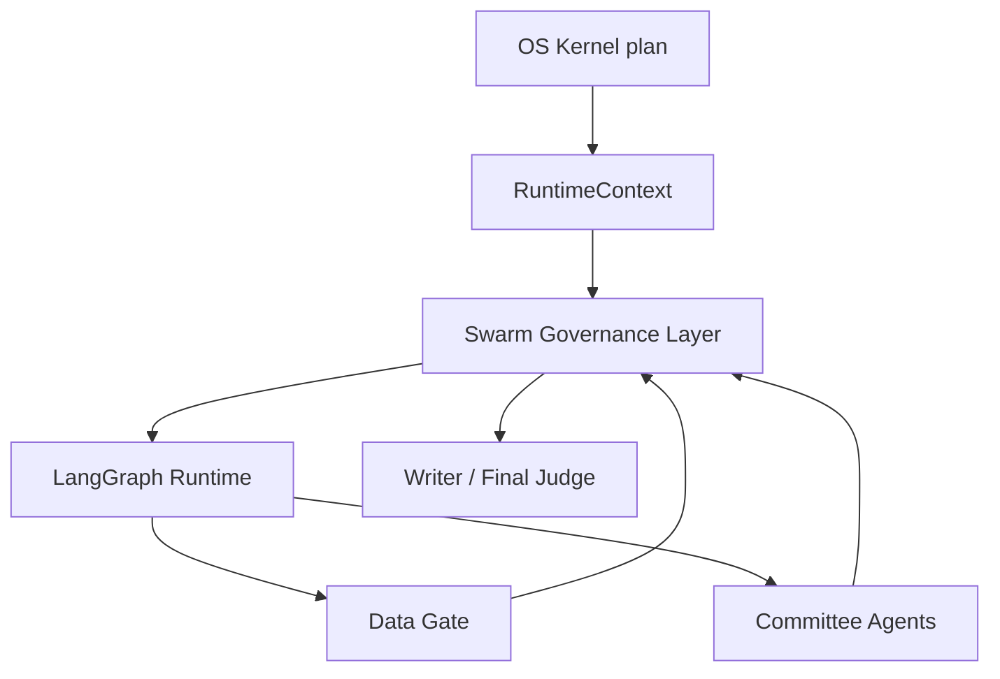

# Swarm Governance Layer

The Swarm Governance Layer upgrades the platform from a fixed multi-agent
workflow into a constraint-aware committee OS. It does not replace the OS Kernel,
Capability Registry, Agent Registry, RuntimeContext, LangGraph runtime, Tool
Registry, or Data Gate. It sits between runtime planning and agent execution as a
shared typed signal field.

## Purpose

The layer models multi-agent coordination as a typed pheromone field:



The goal is not to add more agents. The goal is to make existing agents
self-govern around evidence, permissions, data readiness, stop-signals, and
candidate quorum.

## Signal Types

Signals are defined in `runtime/swarm/types.py`.

Core signal types:

- `constraint`: hard workflow or policy constraint.
- `permission`: permission granted by policy.
- `evidence`: verified or proposed factual support.
- `data_contract`: data-source and period contract.
- `risk`: data, logic, market, or policy risk.
- `negative`: failed or suppressed path.
- `demand`: task demand for a role or capability.
- `quorum`: candidate decision support.
- `tool_health`: tool availability and failure pressure.
- `model_route`: model routing preference.
- `crowding`: duplicate work pressure.
- `stop_signal`: blocking or suppressive governance signal.
- `encounter_rate`: recent local verified-return rate.
- `bottleneck`: handoff backlog / receiver recruitment pressure.
- `arousal`: system-wide verification intensity.
- `trust_badge`: agent/tool/capability identity boundary.
- `policing`: agent protocol violation / overreach signal.
- `contamination`: prompt-injection or poisoned artifact signal.
- `quarantine`: isolated artifact or claim.
- `lane_assignment`: permitted workflow lane for an agent.
- `homeostasis`: global swarm stability pressure.
- `maturity`: staged agent authority / lifecycle status.
- `independence`: independent scout source-diversity signal.
- `artifact_cue`: artifact-derived coordination signal.

Every signal has a target, strength, confidence, verification state, source, and
blocking flag. Hard constraints and blocking stop-signals do not decay.

## Current Implementation

Implemented modules:

- `runtime/swarm/types.py`
- `runtime/swarm/agent_profile.py`
- `runtime/swarm/pheromone_field.py`
- `runtime/swarm/pheromone_store.py`
- `runtime/swarm/target_registry.py`
- `runtime/swarm/authority.py`
- `runtime/swarm/lifecycle.py`
- `runtime/swarm/contracts.py`
- `runtime/swarm/event_log.py`
- `runtime/swarm/trace_store.py`
- `runtime/swarm/evidence_graph.py`
- `runtime/swarm/encounter_rate.py`
- `runtime/swarm/bottleneck_recruitment.py`
- `runtime/swarm/trust_badge.py`
- `runtime/swarm/social_immunity.py`
- `runtime/swarm/policing.py`
- `runtime/swarm/arousal.py`
- `runtime/swarm/lane_scheduler.py`
- `runtime/swarm/homeostasis.py`
- `runtime/swarm/maturity.py`
- `runtime/swarm/independent_scout.py`
- `runtime/swarm/artifact_cues.py`
- `runtime/swarm/receiver_normalizer.py`
- `runtime/swarm/evidence_steward.py`
- `runtime/swarm/tool_health.py`
- `runtime/swarm/capability_sandbox.py`
- `runtime/swarm/outcome_memory.py`
- `runtime/swarm/quorum_marshal.py`
- `runtime/swarm/governance_agents.py`
- `runtime/swarm/controllers.py`
- `runtime/swarm/resolution.py`
- `runtime/swarm/signal_extractor.py`
- `runtime/swarm/stop_signal.py`
- `runtime/swarm/quorum.py`
- `runtime/swarm/patroller_gate.py`
- `runtime/swarm/response_threshold.py`
- `runtime/swarm/signal_verifier.py`

Current integrations:

- User input is first wrapped as a redacted `InputEnvelope` by
  `runtime/input_envelope.py`. Secret-like spans, prompt-injection-like text,
  explicit user constraints, attached-file metadata, selected agents, and output
  format are normalized before the task is planned.
- `InputEnvelope` preflight emits contamination, quarantine, risk, and
  constraint signals. Raw secrets are replaced before `normalized_task` reaches
  OS planning or agent prompts.
- OS Kernel `swarm_plan` is now a PheroOS goal router output. It first reads
  capability-declared swarm protocol fields from `capabilities/*/capability.json`
  and converts those declarations into canonical target-demand signals,
  candidate policy, recovery protocols, quorum policy, stop-signal policy, and
  workflow entrypoint metadata. Legacy intent defaults are used only when a
  capability has not declared its own target protocol.
- Capability manifests are now the preferred source of swarm goals. The
  relevant `swarm` fields are:
  - `targets`: canonical goals such as `research:source_retrieval`,
    `gate:research_evidence_gate`, or `decision:formal_valuation`.
  - `recovery_protocols`: retry/recruitment hooks tied to canonical targets,
    including max recovery rounds and allowed recovery tools.
  - `candidate_policy`: capability-defined candidate types and labels, instead
    of assuming every workflow uses investment candidates.
  - `quorum_policy`: evidence coverage, independence, risk, and stop-signal
    weights plus `max_swarm_rounds`.
  - `stop_signal_policy`: authority level, blocking lifetime, and blocked
    action names.
- Runtime materialization initializes the field with capability, permission,
  model-route, demand, and lane-assignment signals so the run starts from an
  auditable system state instead of a bare prompt.
- `runtime/swarm/execution_loop.py` turns recruited agents into a deterministic
  observe → propose → verify → schedule loop. Activated agents observe only
  canonical targets and field pressure, propose manifest-allowed signals, and
  the protocol records whether each proposal is accepted as unverified,
  retained contested, deduped, or rejected. This loop is exposed as
  `swarm_execution_loop` and also emits `swarm.execution.round_completed`
  events into `swarm_protocol_trace`.
- The execution loop carries capability protocol metadata through the run trace:
  `protocol_source`, `capability_protocols`, `candidate_policy`,
  `quorum_policy`, `stop_signal_policy`, and `recovery_protocols`. If a
  recovery protocol declares a higher `max_rounds`, the loop can schedule
  additional target-pressure rounds without hardcoding a domain-specific agent
  list.
- The execution loop is intentionally not a worker. It does not query data
  sources, call models, write reports, or promote facts. It only makes swarm
  governance visible and auditable; system authorities such as Data Gate,
  Permission Policy, Critic, Final Judge, and Signal Verifier retain the power
  to verify, block, or publish.
- Orchestrator emits initial WRDS-only / web-search constraint signals.
- Permission decisions become permission signals or blocking stop-signals.
- Data Gate emits stop-signals for:
  - `data_gate`
  - `report_publication`
  - `formal_valuation`
- Critic rejection emits a `report_publication` stop-signal.
- Investment committee decisions produce a candidate-based `quorum_trace`.
- Orchestrator now emits a deterministic `patroller_report` for runtime readiness.
- Committee opening emits `agent_allocation_trace` explaining activation reasons.
- Committee members may propose manifest-scoped `emitted_signals`; the runtime
  validates them against each agent's `signal_emit_permissions` and records
  accepted/rejected diagnostics in `agent_signal_diagnostics`.
- Deterministic signal verification can promote contested agent stop-signal
  proposals only when Data Gate, Critic, or an existing system stop-signal
  supports the same target.
- Evidence Graph classifies verified facts, contested proposals, blockers,
  quorum candidates, Data Gate output permissions, and Writer constraints.
- Encounter-rate, bottleneck recruitment, arousal, lane scheduling, trust-badge,
  social-immunity, worker-policing, homeostasis, maturity, independent-scout,
  and artifact-cue protocols run at safe graph boundaries. Their outputs are
  exposed as `encounter_rate_report`, `bottleneck_report`, `arousal_report`,
  `lane_assignment_report`, `social_immunity_report`, `trust_badges`,
  `policing_trace`, `homeostasis_report`, `maturity_report`,
  `independence_report`, `artifact_cue_report`, and `swarm_protocol_trace`.
- PheroOS governance caste actors are now first-class local agent plugins under
  `capabilities/value-investing-research/agents/`, but they are not ordinary
  investment committee seats. They are deterministic or system-governance actors:
  `swarm_scheduler_agent`, `receiver_normalizer_agent`,
  `evidence_steward_agent`, `quorum_marshal_agent`,
  `social_immunity_agent`, `protocol_police_agent`,
  `tool_health_sentinel_agent`, `outcome_memory_steward_agent`,
  `capability_sandbox_auditor_agent`, and `independent_scout_agent`.
- `/agents/run` now exposes the governance caste as `swarm_governance_trace`,
  plus detailed reports: `receiver_normalizer_report`,
  `evidence_steward_report`, `tool_health_sentinel_report`,
  `capability_sandbox_auditor_report`, `outcome_memory_steward_report`, and
  `quorum_marshal_report`.
- The Swarm Controller consumes those protocol reports and produces actionable
  runtime policy: committee scheduling overrides, verifier strictness, writer
  limits, lane policy, runtime budget guidance, and quorum independence
  requirements.
- Stop-signal resolution keeps old blockers in the audit trail while allowing
  deterministic gates to mark them `resolved`; resolved/rejected/expired
  signals are ignored by quorum, tool blocking, and writer guardrails.
- Independent scout quorum now has an independence gate. If committee support
  is too correlated and an `Insufficient Data` candidate is available, quorum
  commits `Insufficient Data` instead of treating correlated agreement as
  independent consensus.
- Quorum candidates are now capability-declared when `swarm.candidate_policy`
  is present. Investment capabilities can still expose Buy/Watch/Avoid/Sell,
  while evidence research can expose `Publish synthesis`, `Preliminary with
  caveats`, or `Insufficient evidence`. Stop-signals commit the declared
  insufficient-evidence/data candidate when one exists, falling back to the
  legacy investment candidate set only for capabilities that have not declared
  a candidate policy.
- Runtime writes swarm events and signal snapshots to JSONL logs and to a local
  SQLite trace store when audit logging is enabled.
- Agent profiles are stored locally and updated from committee member outcomes.
- Built-in committee agent manifests include `swarm` metadata for thresholds,
  signal permissions, quorum weight, and blocking authority.
- Evidence recovery now recruits from the OS plan's target allocation first.
  For example, if a capability declares `research:source_retrieval` and the OS
  activates a custom source scout, the recovery node uses that activated agent
  before falling back to first-party defaults. This is the first step from
  fixed recovery helpers toward target-pressure-driven re-recruitment.
- Writer and Final Judge apply swarm guardrails before returning final text.
- `/agents/run` returns:
  - `pheromone_field_snapshot`
  - `pheromone_trace`
  - `stop_signals`
  - `constraint_signals`
  - `quorum_trace`
  - `patroller_report`
  - `agent_allocation_trace`
  - `agent_signal_diagnostics`
  - `agent_signal_verification_trace`
  - `swarm_metrics`
  - `evidence_graph`
  - `swarm_protocol_trace`
  - `encounter_rate_report`
  - `bottleneck_report`
  - `arousal_report`
  - `lane_assignment_report`
  - `social_immunity_report`
  - `policing_trace`
  - `homeostasis_report`
  - `maturity_report`
  - `independence_report`
  - `artifact_cue_report`
  - `trust_badges`

## Protocol Primitives

The second PheroOS layer converts swarm biology into deterministic scheduling
protocols:

- `EncounterRateController`: estimates local verified-return rate from agent
  metrics, tool returns, verifier promotions, and Data Gate status. Healthy
  rates allow expansion; poor rates reduce activation utility.
- `BottleneckRecruitment`: detects evidence-verification handoff pressure and
  recruits receiver agents such as Data Auditor, Quant, and Risk Manager.
- `TrustBadge`: gives every committee member a colony identity, allowed lanes,
  blocking capability, and trust penalty. Third-party agents cannot emit
  blocking signals directly.
- `SocialImmunity`: scans tool/research artifacts for prompt-injection and
  secret-exfiltration patterns, quarantines contaminated artifacts, and raises
  verification arousal.
- `WorkerPolicing`: converts rejected or overreaching agent-emitted signals into
  policing trace and reliability-penalty signals.
- `IndependentScout`: adds source-diversity and correlation penalties to quorum
  candidates so correlated agreement is not mistaken for independent support.
- `Homeostasis`: reports token heat, latency pressure, risk pressure,
  verification backlog, tool failure rate, evidence coverage, and crowding.
- `MaturityLifecycle`: classifies agents as observer, worker, specialist,
  verifier, or blocker without allowing untrusted agents to acquire hard-blocking
  authority.
- `ArtifactCueExtractor`: turns gaps in Data Gate, Metric Registry, Evidence
  Graph, Critic, or Final text into explicit artifact cues.
- `SwarmController`: converts descriptive protocol reports into executable OS
  control decisions. It can recruit or throttle non-mandatory committee members
  on AI-as-OS runs, raise verifier strictness, constrain Writer output, and set
  quorum independence policy.
- `StopSignalResolution`: resolves blocking stop-signals when deterministic
  gates clear them. It does not delete signals; it changes lifecycle state so
  the audit record remains intact but stale blockers stop affecting execution.
- `ReceiverNormalizer`: converts committee prose/JSON into stable
  claim/evidence/risk/gap/candidate objects before downstream governance sees
  the content.
- `EvidenceSteward`: links normalized claims to metric-registry evidence and
  flags unsupported or Data-Gate-blocked claims before Writer can use them.
- `ToolHealthSentinel`: monitors tool/model route attempts, failure rate, empty
  results, slow calls, schema failures, rate limits, and timeouts; failing routes
  emit verified tool-health signals.
- `CapabilitySandboxAuditor`: audits active capability metadata for dangerous
  permissions, untrusted trust levels, and unauthorized blocking-signal
  permissions. This is the first local guardrail for future marketplace plugins.
- `OutcomeMemorySteward`: records process-only learning signals about agent
  reliability, rejected/proposed/promoted signals, and protocol violations. It
  explicitly does not store company-specific investment conclusions.
- `QuorumMarshal`: makes quorum authority visible as a governance actor. CIO can
  propose candidates, but Quorum Marshal explains why a candidate committed or
  why stop-signals forced `Insufficient Data`.

## Runtime Enforcement Contracts

The governance caste is not only an observability layer. Several actors now have
hard runtime enforcement targets:

| Actor | Input contract | Output contract | Enforcement target |
| --- | --- | --- | --- |
| `protocol_police_agent` | policing diagnostics, final draft, execution log, quorum trace | `policing` signals plus blocking `stop_signal` for unsafe writer/tool behavior | `decision:report_publication`, `tool:web_search` |
| `evidence_steward_agent` | normalized claims, Metric Registry, Data Gate | linked / unsupported / blocked claim report | Writer and Final Judge must drop unsupported or blocked claims |
| `quorum_marshal_agent` | candidate quorum trace and active stop-signals | committed candidate and why-committed explanation | Writer and Final Judge cannot publish a different formal decision |
| `social_immunity_agent` | tool/research artifacts | quarantine / contamination signals | contaminated artifacts cannot become evidence |
| `outcome_memory_steward_agent` | agent outcomes and protocol diagnostics | process-only profile updates | stores reliability learning, not domain conclusions |

Writer and Final Judge call `runtime/writer_guardrails.py` /
`runtime/final_judge_guardrails.py` before publishing text. These guardrails
block:

- formal recommendations when `decision:formal_valuation` is blocked;
- any final report when `decision:report_publication` or `gate:data_gate` is
  actively blocked;
- Buy/Sell/target-price language when Quorum Marshal committed
  `Insufficient Data`;
- claims marked unsupported or blocked by Evidence Steward;
- raw WRDS/Compustat field leakage such as `gvkey`, `datadate`, `sale=`, or
  `oancf=`.

Evidence Graph now also produces a machine-checkable Writer Evidence Contract
through `runtime/swarm/evidence_contract.py`. The contract contains:

- `verified_claims`: decision claims with deterministic metric/evidence edges.
- `caveated_claims`: allowed claims that lack direct evidence edges and must be
  phrased as preliminary or uncertain.
- `blocked_claims`: claims forbidden by Data Gate or governance blockers.
- `unsupported_claims`: Evidence Steward claims that cannot enter final output.
- `required_caveats`: caveats that must appear in the final report.
- `forbidden_phrases`: recommendation / target-price language that is disallowed
  under current quorum and Data Gate policy.
- `allowed_metrics`: report-ready metrics from Metric Registry that Writer may
  cite.

Writer and Final Judge reject drafts that omit required caveats, present
caveated claims as facts, include blocked/unsupported claims, or add strong
unsupported language when the graph has no verified/caveated claim support.

Protocol Police also converts writer violations, raw WRDS leaks, and WRDS-only
web-search attempts into blocking stop-signals. This means a violation affects
tool execution, quorum safety, and final publication rather than merely being
shown in the trace.

Evidence Graph claim support is now source-specific. Metrics are linked to
final decision claims only when the claim text references the metric name,
metric alias, or value. A generic metric registry can no longer mechanically
verify unrelated claims such as pricing power or moat durability. The writer
contract exposes `evidence_sources` for verified claims and leaves unrelated
claims in the caveated lane.

The normalized contract layer lives in:

- `runtime/swarm/governance_contracts.py`: actor input/output/enforcement
  contracts.
- `runtime/swarm/governance_results.py`: converts actor-specific reports into
  one `GovernanceResult` shape.
- `runtime/swarm/enforcement_bus.py`: aggregates blocked targets, writer
  constraints, final-judge checks, required caveats, and emits any missing
  blocking stop-signals.

`/agents/run` now exposes `governance_results` and `enforcement_bus_report` in
addition to the existing actor-specific reports. This makes the runtime contract
machine-readable for tests, dashboard panels, and future capability-owned
workflows.

## Governance Caste Design

PheroOS intentionally separates analyst caste from governance caste:

| Caste | Agent | Runtime shape | Can block? |
| --- | --- | --- | --- |
| Traffic scheduler | `swarm_scheduler_agent` | deterministic controller over response thresholds and lanes | No |
| Receiver | `receiver_normalizer_agent` | deterministic handoff normalizer | No |
| Evidence steward | `evidence_steward_agent` | deterministic evidence linker | No |
| Quorum governance | `quorum_marshal_agent` | deterministic commit/block explanation | Yes |
| Social immunity | `social_immunity_agent` | deterministic quarantine scanner | Yes |
| Worker policing | `protocol_police_agent` | deterministic protocol violation detector | Yes |
| Tool health | `tool_health_sentinel_agent` | deterministic tool/model-route monitor | Yes |
| Outcome learning | `outcome_memory_steward_agent` | deterministic process-only profile updater | No |
| Capability trust | `capability_sandbox_auditor_agent` | deterministic capability sandbox auditor | Yes |
| Independent scout | `independent_scout_agent` | deterministic source-diversity quorum adjustment | No |

These manifests appear in the Dashboard Agent Plugins panel so users can see
what the OS is made of, but `AgentRegistry.committee_specs()` deliberately
excludes them from user-selected analyst committees. They run at graph-safe
boundaries and are visible through the Swarm Governance / Decision Debugger
surface.

The capability sandbox auditor now consumes the manifest-level security
contract: `trust_level`, `sandbox`, `allowed_imports`, `network_allowlist`,
`signature`, and `checksum`. Untrusted capabilities are moved into the
inspection/quarantine lane if they request arbitrary network access, filesystem
write access, direct secret access, direct model/tool calls, dangerous imports,
or blocking signal authority. Those findings become PheroOS risk/quarantine
signals, so marketplace-style plugins cannot silently bypass the OS kernel.

## Data Gate Governance

Data Gate is now a governance producer, not just a workflow node. A failed Data
Gate emits a blocking `gate:data_gate` stop-signal. A publication block emits
`decision:report_publication`. A formal valuation block emits
`decision:formal_valuation`. Legacy labels such as `data_gate`,
`report_publication`, `formal_valuation`, `valuation`, and `target price` are
canonicalized by `runtime/swarm/target_registry.py` before they reach
stop-signal or quorum logic.

The writer may still produce a caveated preliminary view when only formal
valuation is blocked, but it cannot publish a formal buy/sell/target-price style
recommendation.

## Decision Debugger APIs

PheroOS now persists enough structure to answer decision-debugger questions
without replaying a run:

- `GET /runs/{run_id}/trace`
- `GET /platform/swarm/runs/{run_id}/timeline`
- `GET /platform/swarm/runs/{run_id}/why-blocked/{target}`
- `GET /platform/swarm/runs/{run_id}/why-committed`
- `GET /platform/swarm/runs/{run_id}/evidence-graph`
- `GET /platform/swarm/runs/{run_id}/agent-allocation`
- `GET /platform/swarm/runs/{run_id}/tool-events`
- `GET /platform/swarm/runs/{run_id}/permission-events`

`/runs/{run_id}/trace` is the aggregate trace API: it accepts `tenant_id`, checks
run ownership, and combines the redacted agent-run audit summary with the
SQLite-backed PheroOS trace sections. The `/platform/swarm/*` run-debugger APIs
also accept `tenant_id`; they read from `.local/swarm_trace.sqlite3` by default
and return redacted, canonical-target payloads only for visible runs.

The global JSONL-backed swarm views are tenant-scoped as well:
`/platform/swarm/signals`, `/platform/swarm/events`, and
`/platform/swarm/agent-profiles` accept `tenant_id` and filter records before
returning them. Legacy local records without an explicit tenant are treated as
`default`, which preserves OSS compatibility without letting named tenants read
each other's PheroOS signals, events, or learned agent profiles.

The Dashboard consumes the same APIs in the Decision Debugger. It now renders an
interactive Evidence Graph explorer: nodes and edges can be clicked to inspect
their canonical target, authority/status, source module, relation, and sanitized
payload preview. Tool and permission events are hydrated beside the blocker and
candidate explanations so the UI can answer not only "what happened" but also
"which tool/permission path made this decision possible or impossible."

## Agent Manifest Swarm Metadata

Committee agents can declare swarm behavior in their manifest:

```json
{
  "swarm": {
    "initial_thresholds": {
      "risk_review": 0.25
    },
    "signal_emit_permissions": ["risk", "negative", "stop_signal", "quorum"],
    "quorum_weight": 0.85,
    "can_block": true
  }
}
```

`AgentRegistry` exposes this metadata to the dashboard and runtime. The response
threshold allocator uses manifest thresholds and optional
`response_demand_profiles` / `demand_profiles` as the first defaults, then
overlays learned values from the local agent profile store.

Committee JSON outputs may also include:

```json
{
  "emitted_signals": [
    {
      "type": "risk",
      "target": "valuation",
      "content": "TTM valuation is unavailable in the deterministic metric registry.",
      "strength": 0.7,
      "confidence": 0.6,
      "priority": "high",
      "evidence_ref": "metric_registry"
    }
  ]
}
```

These are agent proposals, not system facts. The runtime enforces the manifest
allowlist, strips unknown keys, downgrades agent-requested `verified` or
`blocking` status, and stores stop-signal proposals as `contested` rather than
system-blocking. Only deterministic gates such as Data Gate, Permission Policy,
Critic, or Final Judge may create verified blocking signals.

The verifier can promote a contested agent stop-signal when there is already
deterministic support for the same target. Examples:

- `formal_valuation`: promoted only if Data Gate already has
  `formal_valuation_allowed=false`.
- `report_publication`: promoted only if Data Gate blocks publication or Critic
  returns `REJECT_CONDITIONAL` / `REJECT_FATAL`.
- `tool:<name>`: promoted only if an existing system stop-signal blocks that
  tool.

Unpromoted proposals remain visible as contested signal pressure.

## Quorum Decision

Committee output is now accompanied by a candidate trace:

- `Buy`
- `Watch`
- `Avoid`
- `Sell`
- `Insufficient Data`

When a formal valuation or report-publication stop-signal exists, the quorum
manager commits `Insufficient Data` and blocks ordinary buy/sell/watch candidates
from becoming formal valuation decisions.

## Dashboard

The Trace Drawer contains a Swarm Governance panel showing signal counts,
stop-signal counts, blocking targets, committed quorum candidate, active
constraints, active stop-signals, and an Evidence Graph summary. The Evidence
Graph shows how many signals are system facts versus agent proposals and
which output targets are allowed or blocked.

## API and Storage

Platform endpoints:

- `GET /platform/swarm/signals`
- `GET /platform/swarm/events`
- `GET /platform/swarm/agent-profiles`

Local OSS storage:

- `logs/swarm_events.jsonl`
- `logs/pheromone_signals.jsonl`
- `.local/swarm_agent_profiles.json`

These files are intentionally local and git-ignored. The JSONL readers filter by
`tenant_id`, and the agent-profile store uses a tenant-aware v2 shape while
remaining able to read legacy flat profiles as `default`. SQLite stores a
`run_traces` tenant index for debugger queries; a production SaaS deployment
should still replace local files with a proper trace/event store, retention
policy, migrations, authentication/RBAC, and tenant-scoped database tables.

## Remaining Work

Next milestones:

1. Move swarm JSONL storage to a database-backed trace store.
2. Add a typed lifecycle/event schema for signal created/reinforced/decayed/
   contested/verified/promoted/rejected/resolved/expired transitions.
3. Add richer response-threshold learning using cross-run outcomes.
4. Add a runtime control that lets users choose between fixed and dynamic
   committee allocation.
