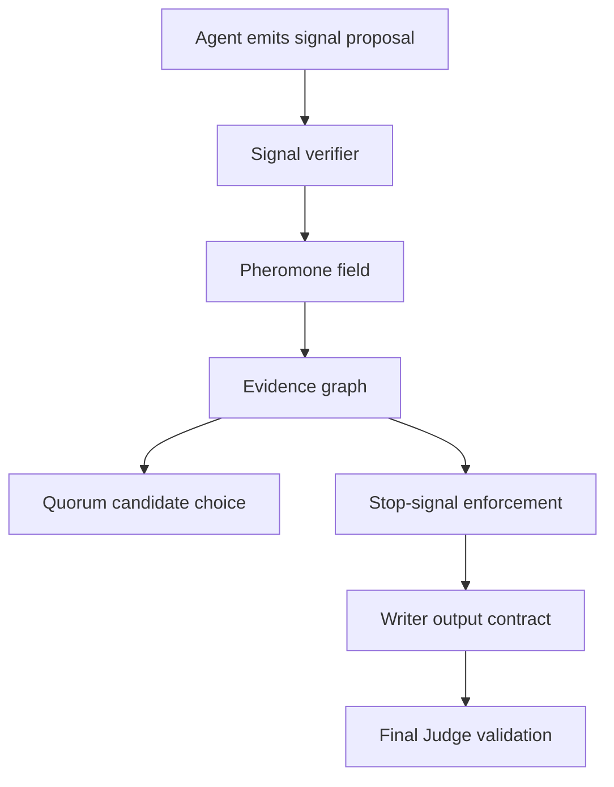

# PheroOS Signal Specification

PheroOS treats every agent output as a signal first, not as a fact. The system
governance layer decides which signals become evidence, blockers, candidate
decisions, or final-output permissions.

## Canonical Targets

Signals must target stable namespaces. The runtime canonicalizes legacy labels
through `runtime/swarm/target_registry.py`.

Phase 1 hardening makes this namespace mandatory at the `PheromoneSignal`
boundary. Any signal entering the field is canonicalized before it can affect a
stop-signal, quorum candidate, writer contract, evidence graph, or persisted
trace. This prevents alias drift such as `formal_valuation`, `valuation`,
`target price`, and `decision:formal_valuation` being treated as separate
targets.

Decision targets:

- `decision:formal_valuation`
- `decision:report_publication`
- `decision:forward_valuation`

Candidate targets:

- `candidate:investment:buy`
- `candidate:investment:watch`
- `candidate:investment:avoid`
- `candidate:investment:sell`
- `candidate:investment:insufficient_data`

Tool targets:

- `tool:web_search`
- `tool:provider_web_search`
- `tool:wrds.company_financials`

Constraint / gate targets:

- `constraint:data_source_policy`
- `gate:data_gate`

Metric targets:

- `metric:<metric_name>`

## Verification States

- `unverified`: raw signal proposal.
- `contested`: accepted as a committee proposal but not system fact.
- `verified`: promoted by a system authority into evidence.
- `blocking`: promoted by a system authority into a blocker.
- `rejected`: refused by manifest, policy, verifier, or parser.

Committee agents can propose contested signals. They cannot directly create
verified facts or blocking stop-signals.

## Lifecycle States

Defined in `runtime/swarm/lifecycle.py`.

- `proposed`: a contested agent or committee proposal.
- `observed`: an unverified but accepted signal.
- `verified`: promoted by a deterministic authority.
- `blocking`: active hard blocker.
- `resolved`: blocker or issue has been closed.
- `rejected`: refused by policy, manifest, parser, or verifier.
- `expired`: signal no longer participates in the field.

The `blocking_status` contract is derived from lifecycle state and is used by
the stop-signal and quorum paths instead of ad hoc boolean checks.

## Authority Levels

Defined in `runtime/swarm/authority.py`.

| Level | Actor examples | Power |
| ---: | --- | --- |
| 5 | OS Kernel, Permission Policy, Data Gate, Patroller Gate | Can create system facts and hard blockers |
| 4 | Deterministic verifier, Metric Registry, Final Judge | Can verify facts and promote blockers |
| 3 | Critic, Data Auditor, Risk Manager, Red Team | Can challenge, contest, and propose blockers |
| 2 | Fundamental, Quant, Industry, Market, CIO agents | Can propose analysis/evidence/risk signals |
| 1 | Writer | Can only express allowed conclusions |

Only authority level `>=4` can create facts. Only authority level `>=4` can make
a signal blocking. Writer has no evidence authority.

## Contracts

`runtime/swarm/contracts.py` defines dashboard/API-safe contract payloads:

- `pheroos.signal.v1`: canonical target, target kind, lifecycle state,
  blocking status, authority level, and source identity.
- `pheroos.event.v1`: event id, run id, timestamp, event type, actor,
  canonical target, lifecycle state, redaction status, and sanitized payload.

`runtime/swarm/event_log.py` normalizes old trace events into this event schema
so JSONL and SQLite trace readers expose one stable shape.

## Evidence Graph

`runtime/swarm/evidence_graph.py` builds the report-safe governance graph for
each run:

- `facts`: verified system evidence.
- `proposals`: unverified or contested agent signals.
- `blockers`: authority-approved stop-signals.
- `metrics`: deterministic metric-registry evidence.
- `output_permissions`: Data Gate conclusion permissions.
- `candidate_decisions`: quorum candidates and blocked/committed status.
- `decision_claims`: committee claims with output permissions attached.
- `review_findings`: Critic issues and overclaims.
- `writer_contract`: explicit rule set for what Writer may express.

The Writer and Final Judge receive a compact Evidence Graph context. The
dashboard receives the full graph for trace inspection.

## Output Contract

The final output must obey:

- Verified metrics and Data Gate permissions can be written as facts.
- Agent proposals can be described only as proposals or dissent.
- Formal valuation claims are blocked when `decision:formal_valuation` is
  blocked.
- Report publication is blocked when `decision:report_publication` is blocked.
- Writer cannot convert unresolved data defects into an investment thesis.

## Protocol Signals

PheroOS includes a second swarm-governance layer for adaptive scheduling and
trust boundaries:

- `encounter_rate`: local verified-return rate from recent agent/tool/verifier
  events.
- `bottleneck`: handoff backlog, especially evidence production exceeding
  verification capacity.
- `arousal`: increased verification intensity when risk or contamination rises.
- `trust_badge`: colony identity, allowed workflow lanes, and blocking rights.
- `policing`: agent overreach, rejected signal, or attempted authority bypass.
- `contamination`: poisoned artifact / prompt-injection finding.
- `quarantine`: artifact or claim removed from Writer-facing evidence.
- `lane_assignment`: permitted workflow lane.
- `homeostasis`: global swarm stability pressure.
- `maturity`: staged agent authority.
- `independence`: independent-scout source diversity.
- `artifact_cue`: artifact-derived coordination cue.

These signals affect allocation and writer constraints, but they still obey the
same authority rules: ordinary agents can propose; governance modules verify,
block, quarantine, or penalize.

## Current Storage

The pheromone field is local-run state plus JSONL and SQLite trace persistence:

- `logs/swarm_events.jsonl`
- `logs/pheromone_signals.jsonl`
- `.local/swarm_trace.sqlite3`

The SQLite store currently creates these tables:

- `swarm_events`
- `pheromone_signals`
- `quorum_decisions`
- `evidence_nodes`
- `evidence_edges`
- `agent_profile_events`
- `tool_events`
- `permission_events`

The platform APIs expose decision-debugger queries:

- `GET /platform/swarm/runs/{run_id}/timeline`
- `GET /platform/swarm/runs/{run_id}/why-blocked/{target}`
- `GET /platform/swarm/runs/{run_id}/why-committed`
- `GET /platform/swarm/runs/{run_id}/evidence-graph`
- `GET /platform/swarm/runs/{run_id}/agent-allocation`
