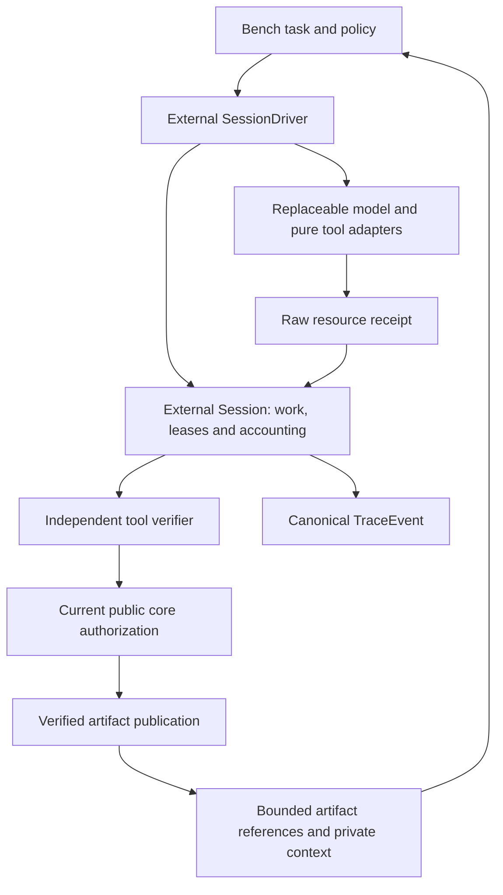

# Experimental runtime candidate: ownership and consumer audit

Status: the experimental OS candidate is accepted by the
[final root review](results/master-goal-audit-v1/MASTER-ACCEPTANCE-v1.json). This document is
an architecture inventory, not a Stable API, efficacy or production-readiness
claim. [The phase map](MASTER-GOAL-status.md) records completed gates and limits.

## Concrete consumer surface

The independent `PheroOS-runtime` package owns
`pheroos_runtime.session_v1.Session` and
`pheroos_runtime.session_driver_v1.SessionDriver`. Both modules are explicitly
experimental and import no model/numerical package by default. The optional
`LocalModelAdapter` reuses the existing local model contract; `ModelAdapter`
allows another implementation through identity, token counting and generation.

| Needed concept | Current owner and exercised behavior |
| --- | --- |
| Agent identity and capability eligibility | Session creation declares stable IDs and each work item's eligible agents/actions; adapter registry availability grants no permission. |
| Lifecycle and work allocation | Dependency-ready work is claimed under a monotonic lease epoch; expiry may release or mark it uncertain. Known reconciled work can be claimed by another eligible agent. |
| Private working context | One bounded checkpoint per declared agent, bound to work/version/permission generation. Context restoration does not restore the old lease. |
| Persistent artifacts | Immutable references bind scope, work/version, settled tool receipt and its independent verification. Model output is a proposal. |
| Addressed communication | Mailbox envelopes carry verified references, with per-recipient count/byte limits, expiration and acknowledgment. |
| Attention | Bench policies choose bounded verified task histories by agent, provenance, expiry and current version; these policies issue no authority. |
| Budget and receipt | One Session ledger reserves prompt plus maximum output and counts zero-token tools as calls. Actual, reserved and dispatched-unknown usage remain distinct. |
| Cancellation and revocation | Direct control fences dispatch and publication; a late receipt may settle accounting without reviving work or permission. |
| Recovery | Reopen committed state, retrieve known receipts without executing again, reject stale leases, retain uncertain dispatches until valid reconciliation. |
| Trace | Durable transitions use public `pheroos.trace.TraceEvent`; no incompatible duplicate event ABI is introduced. |

The lifecycle is currently represented by declared agents and their work/lease
states, not a second independent agent-state database. This avoids two competing
owners of readiness, cancellation or completion. It supports finite admitted
DAGs and eligible-worker replacement; it is not an unbounded agent daemon.

## Evidence and authority remain separate

There are four distinct data paths: private checkpoints, persistent verified
artifacts, bounded attention/history selection, and current authorization.
Attention popularity, model confidence, repeated copies and prior success do
not become evidence or permission. A task-evaluation fact can correctly report
a failed model action. Publishing that fact is different from objective task
success, which the benchmark evaluates separately.

Session publication requires an accepted, settled `tool.evaluate` receipt,
matching artifact bytes, an independent verifier, current work/lease/version,
and fresh public-core authorization. A `model.generate` response cannot publish
as evidence even if it contains an `artifact` field. Resource reconciliation
does not execute these publication steps or recreate a cancelled lease.

The development authority adapter still uses the explicitly documented public
reference Store exception. Its callback is a trusted-host boundary; durable
issuer custody and hostile-host authentication are not established. No core
contract change was needed, and all current core exports remain Draft under
the existing support matrix.

## Compatibility and removal decision

Existing G1 `Store`/engine and R3 `PilotLedger` remain intact for their frozen
consumers and experimental reproduction. New Session consumers use one ledger;
no call is billed to both old and new accounting owners. Existing `Lease` and
public core contracts are reused. There is no automatic database migration or
silent reinterpretation of old schema/version meanings.

`Session` is the path for the new capability/scaling/fault consumers. The older
implementations have explicit historical consumers, so deleting them would
damage reproducibility. A future removal decision needs archived source/wheel
closures, a declared consumer migration and compatibility evidence. The shared
development distribution label `0.1.0.dev1` alone is insufficient identity;
use the source/wheel hashes recorded with each experiment.

## Validation and limits

Wheel and sdist acceptance each passed 131 tests. The original eight runtime
modules and installed historical GPU environment remained unchanged. The new
installed consumer demonstrates addressed reference sharing, checkpoint reopen,
independent tool verification and committed receipt retrieval. The real 3B
readiness call failed its strict output schema with all usage retained; the
separate G5 Session diagnostic completed real code actions with both model sizes.
The installed core also [matches all 613 current package Python/JSON files](results/master-goal-audit-v1/current-installed-core-comparison-v2.json).
The [R4 gate](results/r4-session-scaling-replication-v1/GATE-ADDENDUM.md) accepts
the audited complete-grid replication while retaining its negative efficacy
findings and the original INVALID attempt. The [R5 gate](results/r5-session-faults-v1/GATE-ADDENDUM.md)
accepts 38 finite fault invariants, including ten unresolved calls and an
unavailable damaged ledger. This is safe-disposition evidence, not proof that
every case recovered or completed. The initial audit-label mismatch and its
narrow offline correction remain recorded.

Retention bounds cover current contexts, artifacts per declared work, calls and
mailboxes. They are logical JSON limits, not physical SQLite-file guarantees.
Arbitrarily many trusted-caller checkpoint/send/ack operations can append trace
events; finite work/call counts alone do not bound total lifetime trace growth.
The finite experiment loops provide additional run bounds. No eight-hour or
24-hour soak was performed. No long-soak,
multi-host failover, power-loss recovery, unrestricted external side effects or
general exactly-once guarantee follows. Unknown external dispatch is never
automatically retried merely to make the task finish.

The [master report](results/master-goal-audit-v1/FINAL-REPORT.md) combines this
ownership map with the completed finite phase evidence and unproven claims.
The [finite consumer decision](results/master-goal-audit-v1/consumer-exit-decision-v1.md)
accepts the retained Session v1 compatibility cohort. Exact accepted wheel,
sdist and core packages, receipts and installation instructions are preserved
in the [consumer archive](results/master-goal-audit-v1/consumer-artifacts-v1/INSTALL.md).
The [final preservation check](results/master-goal-audit-v1/final-integrity-v1.json)
passes 3,588 unique retained file identities. A [fresh offline install](results/master-goal-audit-v1/consumer-install-check-v1.json)
of the archived wheels completes the archived two-agent journey. The final root
decision accepts the finite candidate on implementation, measured evidence,
accounting, compatibility and preservation; no efficacy or maturity promotion follows.
